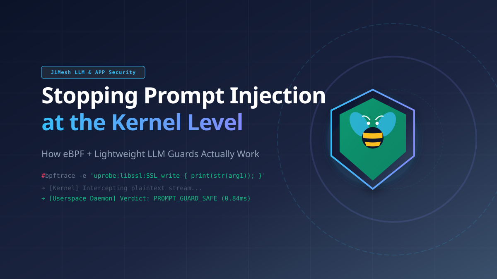

# Stopping Prompt Injection at the Kernel Level: How eBPF + LLM Guards Actually Work

*Title image: kernel-level interception meets LLM guardrails — the two halves this article connects.*

Most teams securing AI agents reach for the same three tools: a guardrail library, a gateway scanner, or a WAF. After a real prompt-injection incident on our own infrastructure — an indirect injection that made an agent dump `.env` files into a chat log, followed by a failed host-escape attempt through a mounted Docker socket — we dug deep into every layer of the stack. Here's what we learned about where eBPF fits, where it doesn't, and what your options actually are.

## The semantic gap nobody talks about

*Figure 1: The semantic gap — infrastructure tools see the "how", AI guardrails see the "what", and nothing correlates the two.*

Every existing security tool sees only half of the picture:

- **Network firewalls** (Palo Alto, Fortinet, Suricata) see packets, ports, SNI, volume — but never the prompt. LLM traffic is TLS to provider endpoints.
- **AI guardrails** (Llama Guard, NeMo Guardrails, LLM Guard) see prompt and response text — but not whether the agent is simultaneously opening `/etc/shadow` or spawning reverse shells.
- **Syscall sandboxes** (gVisor, Tetragon, Falco) see system calls, processes, sockets — but not *why*. During our incident, the reads on `.env` files were, from the kernel's perspective, perfectly legitimate `open()`/`read()` calls.

This is the gap. Detection means correlating semantic content with system state — and no single tool does both.

## How eBPF-based interception actually works

First, the 60-second version: **eBPF** (extended Berkeley Packet Filter) is a Linux kernel technology that lets you run small, sandboxed programs *inside* the kernel — verified for memory safety and termination before loading — to observe or act on system events (syscalls, network traffic, even function calls in libraries) without changing or restarting the application. Think of it as programmable hooks in the kernel: one line of attaching, and you see everything a process does, in real time.

*Figure 2: The eBPF interception pipeline — capture at the TLS boundary, judge in userspace, enforce in the kernel.*

The kernel-level pattern (used by research projects like AgentSight and commercial "eBPF AI gateways") looks like this:

1. **Uprobes on `SSL_write`/`SSL_read`.** eBPF hooks attach to the crypto library's symbols. There — before TLS encryption — the prompt exists as plaintext in process memory. "Zero instrumentation" means you don't touch the app; the kernel does the tapping.
2. **Ring buffer transport.** The captured plaintext is streamed to a userspace daemon via an eBPF ring buffer.
3. **A small classifier, not an 8B judge.** You don't run Llama Guard in the kernel (obviously — eBPF programs run in a verified VM with loop limits; no ML there). Instead: a 22M–86M parameter prompt-guard model in a Rust/C++ sidecar, or cheaper — embeddings + XGBoost, sub-millisecond.
4. **Verdict back via eBPF map** → drop, TCP-RST, or freeze the offending process.

## The honest limits (that vendor slides won't tell you)

- **Uprobes bind to library symbols.** Node.js stacks (OpenSSL/BoringSSL) are tappable. Go binaries use `crypto/tls` — no stable C symbols, heavy inlining, GC. The trick doesn't generalize. "Zero instrumentation" is an aspiration, not a guarantee: static linking, rustls, and custom TLS stacks break it.
- **Streaming kills pure kernel detection.** eBPF reads only a few KB per invocation. Streamed prompts must be reassembled in userspace anyway.
- **eBPF doesn't run inside gVisor.** Sandboxes have no real kernel; your sensor watches from the outside.
- **Kernel enforcement is fail-closed by definition.** If your availability posture demands fail-open, the verdict belongs in a threat event, not in a kernel map.

## The actual option landscape

![Comparison table of the four tool classes: Gateway/Proxy OSS such as LiteLLM Proxy gives unified routing and budgets but no process identity; In-Process Guards OSS such as LLM Guard and NeMo give PII and injection scanning but run inside the app; Commercial platforms such as Lakera, Prompt Security and Portkey give real-time defense and shadow-AI discovery but are closed black boxes; Kernel/Runtime eBPF tools TigerGate and AgentSight intercept at the TLS boundary but lack the identity chain that provisioned the agent](svg/table_landscape.svg)

*Figure 3: The tool landscape — four classes, and none of them owns the identity chain.*

## The part that actually matters: identity

Here's the uncomfortable truth we concluded after the incident: **a verdict is worthless if you don't know whom to freeze.** Commercial LLM firewalls return a judgment — and that's where it ends. None of them can pause the container that made the call, because none of them provisioned it.

*Figure 4: The identity chain and the response ladder — identity flows from the kernel-visible PID down to the minted session token, and enforcement escalates from revocation to egress blackhole.*

The bridge needs three layers stitched together:

- **Host/VM:** PID + socket → eBPF
- **Container:** container ID → Docker API
- **Session:** session ID → your gateway

And critically: a compromised agent can *lie* about its own session ID. Self-declared identity is fine for observability, worthless for enforcement. The fix is provisioning-based identity — you spawn the container, you mint the token, the agent *presents* it rather than choosing it. When the network binding and the token diverge, that divergence is itself a threat signal.

From there, a graduated response works: revoke the session token → controlled error response → pause the container (`SIGSTOP`, memory intact for forensics) → blackhole its egress.

## Our takeaways

1. **The gateway is the only place with guaranteed plaintext.** Make it the primary inspection layer — but force that to be true with a default-deny egress allowlist. An agent that can call `api.anthropic.com` directly makes all your gateway inspection optional, and malware won't volunteer.
2. **The cheapest control would have caught our incident:** regex secret-pattern masking on *responses* (`sk-`, `gho_`, PEM headers). Microseconds. No model needed.
3. **The damage flowed in the response direction.** eBPF and Suricata saw nothing, because the `.env` contents went out as an LLM response over TLS. A response scanner at the gateway would have fired.
4. **Nested injection is real.** We re-pasted incident logs into a chat window and the model executed the attack commands inside them. Forensic reports must render payloads inert — never forward them to a model.
5. **eBPF's real value is correlation, not detection.** Observability at the SSL boundary (the AgentSight model, exported via OTLP) for paths you don't control; enforcement through provisioning-based identity for the ones you do.

Prompt injection at the kernel level isn't a single product you buy. It's a division of labor: eBPF delivers events and system truth, a lightweight classifier judges content in userspace, and — most importantly — someone owns the identity chain that turns a verdict into an action.

*We're building this as part of our open-source AI gateway work. Happy to go deeper on any layer in the comments.*

---

## Sources (verified as of Sep 7, 2026)

For inline hyperlinks in the article body:

- **AgentSight paper:** Zheng, Hu, Yu, Quinn (UC Santa Cruz / ShanghaiTech / eunomia-bpf) — *AgentSight: System-Level Observability for AI Agents Using eBPF*, arXiv:2508.02736 — https://arxiv.org/abs/2508.02736 — "semantic gap" appears verbatim in the abstract; <3% overhead; DOI 10.1145/3766882.3767169 (ACM PACMIS workshop)
- **AgentSight code:** https://github.com/agent-sight/agentsight
- **TigerGate (commercial):** https://www.tigergate.dev/products/ai-security/ — real product, ships an eBPF runtime agent + AI-SPM. ⚠️ But: primarily a CNAPP platform, GitHub org is mostly forks, all numbers are unverified vendor marketing. Fine as an example in the article; do not cite as evidence.
- **Llama Prompt Guard 2 (Meta docs):** https://developer.meta.com/ai/docs/model-cards-and-prompt-formats/prompt-guard/ — 22M (DeBERTa-xsmall, −75% latency, English-only) and 86M (multilingual); "designed to support the Llama 4 line"
- **Model cards:** https://huggingface.co/meta-llama/Llama-Prompt-Guard-2-22M · https://huggingface.co/meta-llama/Llama-Prompt-Guard-2-86M
- **Lakera → Check Point:** press release Sep 16, 2025 (~$300M) — https://www.checkpoint.com/press-releases/check-point-acquires-lakera-to-deliver-end-to-end-ai-security-for-enterprises
- **Portkey → Palo Alto Networks:** announced Apr 30, 2026, closed May 29, 2026 — https://www.paloaltonetworks.com/company/press/2026/palo-alto-networks-to-acquire-portkey-to-secure-the-rise-of-ai-agents
- **OWASP Prompt Injection** (origin of the term "semantic gap" in the injection context): https://owasp.org/www-community/attacks/PromptInjection
- **Edge class, example (Microsoft, Apr 2026):** Prompt Injection Protection in Global Secure Access — https://learn.microsoft.com/en-us/entra/global-secure-access/how-to-ai-prompt-injection-protection
