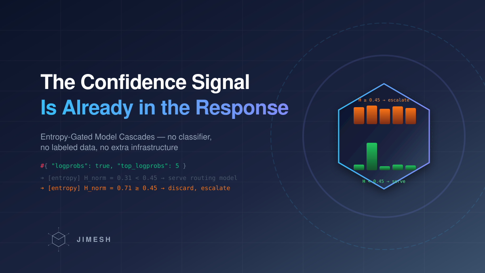

# The Cheapest Confidence Signal Is Already in Your Response: Entropy-Gated Model Cascades

*Title image: the model's own token distribution is the router — no classifier required.*

Every team running LLMs at scale pays the same hidden tax: **you route every request to your best (most expensive) model, because you can't tell the easy ones from the hard ones in advance.** "What's the capital of France?" and "refactor this payment module for double-entry accounting" both hit the reasoning model. The first one is a waste of money you pay thousands of times a day.

Cascades fix this — send everything to a cheap model first, escalate the hard cases. But every production cascade we know of needs a trained component: a confidence scorer, a router model, labeled preference data. That's a whole ML project.

We took a different path, and it fits in one paragraph of math.

## The signal: the model already tells you when it's guessing

*Figure 1: The two-phase entropy gate. Phase 1 is a full normal call — it goes through bandit routing, quota tracking, and the feedback loop like any other request.*

LLM APIs return **logprobs** — and with `top_logprobs: 5`, you get the top-5 token candidates with their probabilities at every position. That is a complete uncertainty signal, and nobody has to train anything to produce it.

The computation, per token:

1. Convert the top-k logprobs back to probabilities `p_i`.
2. Shannon entropy: `H = -Σ p_i · log₂(p_i)`.
3. Normalize: `H_norm = H / log₂(k)` — so 0 means "the model was certain," 1 means "uniform coin flip among the top candidates."
4. Average `H_norm` over **all** output tokens of the response.

Then one decision with one threshold (ours: **0.45**, configurable):

- **Average entropy below threshold** → the cheap model was confident → serve its response directly.
- **At or above threshold** → discard the entire generated answer and re-route the original request through the normal chain to the reasoning model.

No classifier. No labeled data. No second inference system. The uncertainty estimate is a byproduct the API hands you for free.

## The streaming variant: pull the ripcord mid-flight

The two-phase gate needs the *complete* response to average over — so it applies to non-streaming requests. But streaming is where the real traffic (and the real money) is. For that we run a second mechanism:

The cheap model streams to the client normally, while a **sliding window** (10 tokens, signal valid after the first 5) tracks the running average of normalized entropy. The moment the window average crosses the threshold, the stream is cancelled and the request is re-routed to the reasoning model.

This is the same trick that makes speculative decoding fast — *draft optimistically, verify cheaply, fall back when the draft goes off the rails* — applied to cost instead of latency: spend small-model tokens until the small model signals it's out of its depth.

## First, the provider question: does your API even return logprobs?

The whole trick stands or falls on one question most people never ask: **does your provider actually return token probabilities?** "OpenAI-compatible" does not mean logprobs-compatible. Verified as of September 2026:

- **OpenAI, Chat Completions:** yes for the non-reasoning GPT models (`logprobs: true`, `top_logprobs` 0–5). **No for reasoning models** — since o1-preview, no reasoning model (including the GPT-5 class) returns logprobs.
- **OpenAI, Responses API:** `top_logprobs` up to 20 supported since mid-2025 (`include: ["message.output_text.logprobs"]`).
- **Groq:** no — documented as *"not yet supported by any of our models"*, and supplying the parameter is a **hard 400 error**, not a silent ignore.
- **Cerebras:** rejects unsupported parameters with 400s; no usable logprobs signal.
- **Gemini:** the **native** API does expose logprobs (`responseLogprobs` + `logprobs` in the generation config) — but the OpenAI-compatible endpoint doesn't translate them, and the standard developer API has repeatedly been **disabled with a 400 `INVALID_ARGUMENT`**. The working path is **Vertex AI**: initialize the client with a Cloud project instead of a plain API key (Google's $300 new-account credit makes this free to start). Caveat: model-dependent and flaky — newer preview models have had logprobs disabled on Vertex too. For an OpenAI-shaped gateway this lands on the "native param translation required" side.
- **OpenRouter:** depends on the underlying model being proxied.
- **vLLM / self-hosted:** full support — this is where the signal is richest.

Three implications, and why this isn't fatal:

1. **You need exactly one logprobs-capable model — and it can be tiny.** The probe only has to do two things: generate an answer good enough for the *easy* prompts (its answer gets served when entropy is low) and emit logprobs. A nano-class model or a self-hosted vLLM endpoint with an open small model does both for cents. Point the `routing` role at it, and the chain's escalation targets can be anything — frontier models included.
2. **Fail-open saves you.** If phase 1 errors out (400 included), the request falls through to normal routing. A chain whose providers all reject the parameter degrades to "no cascade", never to "no service".
3. **Treat logprobs as a provider capability, not a given.** One probe request at provisioning time can mark a provider logprobs-capable, and the gate only arms on capable routes — that's the robust version of our per-chain `entropy_routing.enabled` setting.

The takeaway: **route the probe to where the signal exists.** The cascade is a property of the route, not of the mesh.

One asymmetry to know about: the **two-phase gate** can decouple probe from server (any tiny logprobs-capable model probes, anyone answers the escalations) — but the **mid-stream cascade** cannot, because probe and server are the same stream. There, the cheap streaming model itself must return logprobs, so streaming chains pick their budget model with that constraint in mind.

## What it actually costs

Be honest about the arithmetic, because the cascade is a dial, not a free lunch:

- **Every request pays phase-1 tokens.** The cheap model always runs. If 90% of your traffic is easy (typical for mixed agent workloads: file reads, status questions, formatting), you pay ~10% of cheap-model price for 90% of requests instead of 100% of big-model price.
- **Escalation pays twice.** The discarded answer is generated and thrown away. That's the price of not having a trained router.
- **Latency is asymmetric.** Easy requests get *faster* (small model). Hard requests get *slower* (you only know they're hard after the cheap model tried). If your SLA is on the tail, this matters.

The threshold is the risk dial. Lower it and you escalate more — more quality, more cost. Raise it and you save more — and quietly keep more marginal answers.

## The honest limits

- **Entropy measures uncertainty, not correctness.** A confidently wrong answer sails through the gate. The research frontier knows this: *semantic entropy* (Farquhar et al., Nature 2024) detects confabulations far better — but needs multiple sampled generations clustered by meaning, which is 5–10× more expensive. Token-level entropy is the cheap approximation of that idea, and it buys a different thing: it catches the cases where the model itself was hedging, which correlates strongly with the answers you'd have wanted the big model to handle.
- **Domains have different entropy baselines.** Code generation is naturally "hotter" per token than factual Q&A. A global threshold of 0.45 that works for mixed chat will behave differently on a coding chain. Tune per chain, not globally.
- **Not every provider returns logprobs**, and quality varies. The gate is only as good as the cheapest model's calibration.
- **Phase-1 failure is fail-open by design:** if the probe errors out, the request falls through to normal routing. Availability beats optimization — the cascade must never be a single point of failure.

## Where this sits in the landscape

*Figure 2: The cascade spectrum. The entropy gate trades a little wasted compute (discarded answers) for the absence of any trained component.*

FrugalGPT showed cascades can cut cost by up to 98% at equal quality — with a learned scoring function. RouteLLM showed routers can be trained on preference data to make the choice per query. Both are strong, and both start with an ML task. The entropy gate starts with a boolean flag.

## Takeaways

1. **You already paid for the confidence signal** — it's in the response you were about to throw away. Read the logprobs.
2. **Average token entropy over the whole answer is a usable router input** — crude compared to semantic entropy, but free, streaming-compatible, and zero-training.
3. **The discard is the feature.** Accepting that you'll sometimes pay twice is what removes the classifier from the architecture.
4. **Fail-open, always.** The optimizer must never become an availability risk. If the gate breaks, the chain routes like it's 2019.
5. **Tune per workload.** The threshold is a risk dial, and code is not chat.

*We're building this as part of our open-source AI gateway — the entropy gate sits in front of the same routing layer that handles failover, key pools, and bandit-based model selection. Happy to go deeper in the comments.*

---

## Sources (verified as of Sep 8, 2026)

- **FrugalGPT:** Chen, Zaharia, Zou — *FrugalGPT: How to Use Large Language Models While Reducing Cost and Improving Performance*, arXiv:2305.05176 — https://arxiv.org/abs/2305.05176 — Cascade mit gelerntem Confidence-Score `g(query, answer)`; bis zu 98% Kostenersparnis; **braucht labeled examples** für den Scorer.
- **RouteLLM:** Ong et al. (LMSYS) — *RouteLLM: Learning to Route LLMs with Preference Data*, **arXiv:2406.18665** — https://arxiv.org/abs/2406.18665 — ⚠️ Korrektur: der Code-Kommentar in `entropy_cascade.go` zitierte falsch `2407.21783`; am 8.9.2026 korrigiert.
- **Semantic Entropy:** Farquhar, Kossen, Kuhn, Gal — *Detecting hallucinations in large language models using semantic entropy*, Nature 630, 625–630 (2024) — https://www.nature.com/articles/s41586-024-07421-0 · DOI 10.1038/s41586-024-07421-0 — Semantic Entropy braucht Multi-Sample + NLI-Clustering (teuer); **Semantic Entropy Probes** (arXiv:2406.15927) nennen die 5–10× Kosten mehrerer Generierungen als Adoptionsproblem — unsere Token-Entropie ist die billigere Approximation.
- **Speculative Decoding (Muster Herkunft):** Leviathan et al. — *Fast Inference from Transformers via Speculative Decoding*, arXiv:2211.17192 — https://arxiv.org/abs/2211.17192 — Draft-then-verify; Ursprung des Mid-Stream-Cascade-Musters.
- **Gemini:** native `GenerateContentConfig` hat `responseLogprobs`/`logprobs` — Standard-Dev-API liefert aber wiederholt 400 `INVALID_ARGUMENT`; funktionierender Pfad: **Vertex AI** mit Cloud-Projekt-Client ($300-Neukundenguthaben), model-abhängig (Gemini 3/3.1 auf Vertex teils auch gesperrt, Apr 2026). Foren-Threads: https://discuss.ai.google.dev/t/openai-api-compatibility-and-logprobs/94970 · https://discuss.ai.google.dev/t/logprobs-is-not-enabled-for-gemini-models/107989 · https://discuss.ai.google.dev/t/get-logprobs-at-output-token-level/54418 · https://github.com/google-gemini/deprecated-generative-ai-js/issues/421
- **OpenAI-compat-Landschaft:** Groq dokumentiert `logprobs`/`top_logprobs` als „not yet supported by any of our models" (400 bei Supply) — https://console.groq.com/docs/openai · API-Reference („This is not yet supported"): https://console.groq.com/docs/api-reference · Cerebras rejected unsupported Params mit 400 (Compatibility-Report Juli 2026): https://plugsky.com/articles/openai-compatibility-report
- **OpenAI Reasoning-Modelle ohne Logprobs** (seit o1-preview, inkl. GPT-5-Klasse): https://community.openai.com/t/logprobs-deprecated-for-gpt-5-models/1355427 · Responses-API `top_logprobs` bis 20 seit Juni 2025: https://community.openai.com/t/why-doesnt-the-responses-api-support-logprobs/1148097 · Cookbook (Chat Completions, `top_logprobs` 0–5): https://developers.openai.com/cookbook/examples/using_logprobs
