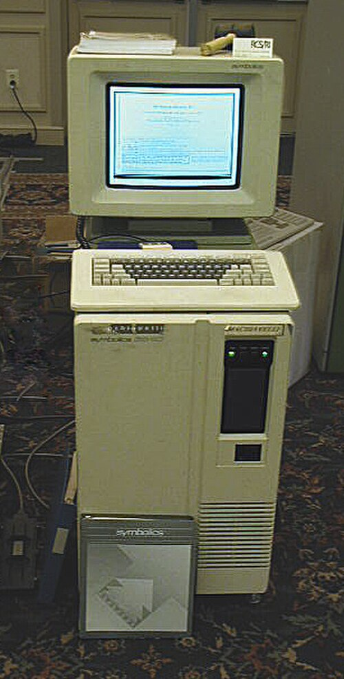
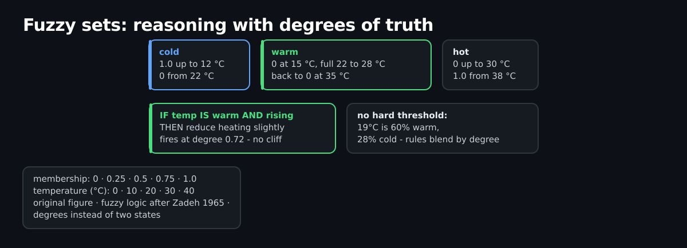
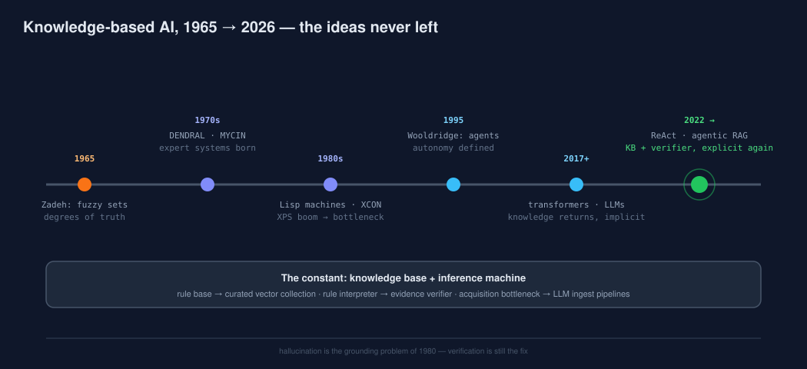

# From Expert Systems to LLM Agents: What 40 Years of Knowledge-Based AI Got Right

In the mid-1980s, expert systems ran on Lisp machines the size of a small fridge. Today they run as hundred-billion-parameter models behind an API. The hardware changed beyond recognition — the core ideas did not. And the oldest idea of all is having a second career: grounding what a system says in what a system knows.

*A Symbolics 3640 Lisp machine — the class of hardware expert systems ran on. (Source: Wikimedia Commons, File:Symbolics3640_Modified.JPG. Michael L. Umbricht and Carl R. Friend, Retro-Computing Society of Rhode Island; edited by Ubcule. CC BY-SA 3.0 / GFDL 1.2+.)*

## Knowledge-Based Systems: The Original Playbook

A knowledge-based system (KBS) is an information system that represents knowledge with explicit methods of knowledge representation and modeling, making it usable — not just storable. The term is often used synonymously with expert systems, but it is the wider family: rule-based systems, expert systems, and software agents all live under it.

Two components carry the whole concept: the knowledge base, and the inference machine that processes it. Everything else is interface.

## Rule-Based Systems and the Inference Machine

A rule-based system consists of a fact base, a set of rules (production rules, business rules), and a control system with a rule interpreter — the inference machine, known in business software as the rule engine. Inference, from the Latin inferre ("to carry in"), is the process of deriving new statements from given premises.

Forward chaining derives conclusions from facts; backward chaining works from a goal back to the facts that support it. Every modern rules engine — and every retrieval verifier, as we will see — is a descendant of this loop.

## Expert Systems: Encoding the Specialist

An expert system (XPS) is a program that supports humans in solving complex problems by deriving recommendations from a knowledge base — one of the classic approaches to implementing AI as a logical decision machine. The canon is well known: DENDRAL inferring molecular structure, MYCIN recommending antibiotics, XCON configuring computer systems at DEC — in XCON's case saving the company millions a year.

They worked because the domains were narrow and the knowledge could be written down. They stalled for the same reason: knowledge acquisition was manual, brittle and expensive, and the systems could not gracefully say "I do not know". The knowledge acquisition bottleneck is the oldest problem in applied AI — and LLM-based ingestion pipelines are its newest attack.

## Fuzzy Logic: Reasoning with Degrees

Classical logic knows two states. Fuzzy logic, introduced by Lotfi Zadeh in 1965, knows degrees of truth: fuzzy sets with membership grades between 0 and 1 instead of crisp boundaries.

*Fuzzy sets for a temperature controller: cold, warm, hot overlap, and one temperature reading carries two partial memberships at once. (Original figure.)*

The classic example is the temperature controller: instead of a hard threshold, "warm" is a membership function that rises and falls, and the rule "if temperature is warm and rising, reduce heating slightly" fires with a degree. Fuzzy logic let early AI systems produce reasonable inferences from vague, rule-encoded knowledge — an early, formal answer to a problem that haunts every LLM system today: reasoning under imprecision.

## From Symbols to Agents

Michael Wooldridge notes there is no universally accepted definition of an agent — only broad agreement that an agent must be autonomous: a computer system situated in an environment, capable of independent action to meet its goals.

Two properties matter for what came next. **Statefulness**: agents store information about past actions and let it shape future decisions — the precondition for anything resembling memory. And a split in temperament: **ReAct agents** are reactive thinkers, waiting for a trigger and looping through reasoning and acting, adapting their plan as new results arrive — inspired by the way humans think in inner monologue rather than by preprogrammed workflows. **Proactive agents** are initiative agents: they analyze patterns and environment data, anticipate needs, and act without being asked — reminders, workflow management, real-time coaching.

*From rule bases to ReAct: the knowledge base and the inference machine never left. (Original figure.)*

## Why This History Matters for RAG

Every ingredient of a modern RAG system has a ancestor with forty years of mileage. The knowledge base is back as the curated vector collection. The inference machine is back as the verifier — and where expert systems chained rules, a retrieval verifier now chains evidence: an answer is accepted only if it follows from the documents that were actually retrieved. Fuzzy logic's degrees of truth survive as relevance scores and membership-style gates on what enters memory. And the expert system's old failure mode — confidently wrong answers outside its competence — now has a new name: hallucination.

The lesson is not nostalgia. It is that the field solved grounding before, with explicit knowledge, explicit rules and explicit verification — and that the current generation works best when it re-imports exactly those three things.

## Takeaways

- Knowledge base plus inference machine: the two-component playbook of 1980s AI is the two-component playbook of agentic RAG.
- The knowledge acquisition bottleneck was the original killer — LLM pipelines are the first credible attack on it.
- Fuzzy logic formalized reasoning under vagueness; relevance scores and confidence gates are its modern descendants.
- ReAct is the reasoning-acting loop with an LLM in the interpreter seat; proactive agents add anticipation.
- Hallucination is the return of the grounding problem — and verification, not vibes, is the fix.

## Sources (to verify at publication)

- Zadeh 1965, Fuzzy Sets — Information and Control 8(3), doi:10.1016/S0019-9958(65)90241-X
- Shortliffe 1976, Computer-Based Medical Consultations: MYCIN — Elsevier
- McDermott 1980, R1: A Rule-Based Configurer of Computer Systems — Artificial Intelligence 14(1)
- Wooldridge 2009, An Introduction to MultiAgent Systems (2nd ed.) — Wiley
- Yao et al. 2022, ReAct: Synergizing Reasoning and Acting in Language Models — https://arxiv.org/abs/2210.03629
- Lewis et al. 2020, Retrieval-Augmented Generation — https://arxiv.org/abs/2005.11401
- spaCy displaCy visualizer (MIT) — https://spacy.io/usage/visualizers

*Image credits: Symbolics 3640 photo — Wikimedia Commons, Michael L. Umbricht and Carl R. Friend (Retro-Computing Society of Rhode Island), edited by Ubcule, CC BY-SA 3.0 / GFDL 1.2+. All other figures are original artwork.*
