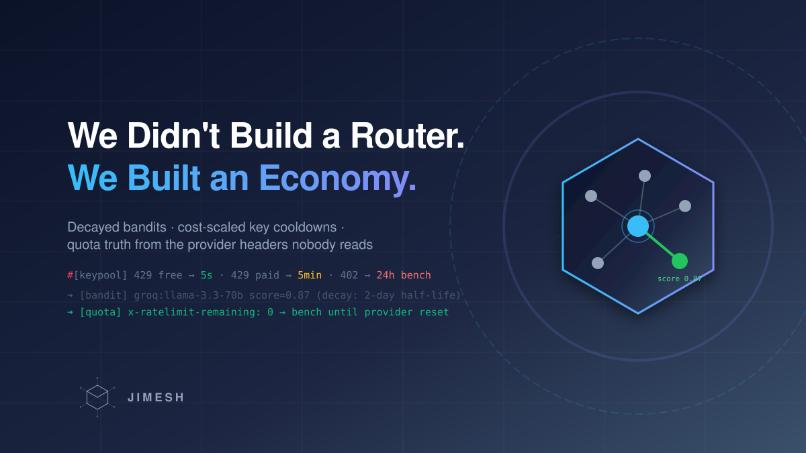

# We Didn't Build a Router. We Built an Economy.

*Title image: every API key is an economic actor — price-dependent penalties, provider-truth quota, and evidence that goes stale.*

Every serious LLM setup ends up in the same place: a dozen providers, dozens of keys, a mix of free tiers and paid accounts, and a routing problem. The standard answers are static: round-robin, least-busy, weighted pick, or a fixed cooldown when a 429 comes back. LiteLLM — the most popular open-source gateway — cools down a deployment for **5 seconds** on a 429, regardless of whether that deployment costs $0 or $15 per million tokens.

After running a multi-provider gateway in production, we think that's the wrong abstraction. **A 429 on a free key and a 429 on a paid key are not the same event.** Treating them identically either burns money (retry-poker against an exhausted paid account) or wastes capacity (parking a free key for minutes).

*(Part 2 of the series — part 1 covered what an LLM mesh is and why your apps shouldn't talk to providers directly: [link einsetzen].)*

So we built three learning layers instead of one static strategy — and the interesting part is how they punish: **always proportional to what the failure costs you.**

## Layer 1: The model bandit (with memory that decays)

*Figure 1: Three learning layers. Outcomes flow down as feedback, provider quota truth flows up as benches.*

For every `platform:model` pair we keep a Beta posterior over success/failure. Two details matter more than the math:

**1. Evidence goes stale, so it decays.** Providers change under you: quota windows get adjusted, models get deprecated, "free" tiers get silently throttled. A reliability score built over six months describes a provider that no longer exists. Our posteriors decay exponentially with a **2-day half-life** — applied lazily, whenever the pair is touched. Recent behavior dominates; a model that was great last month can fall out of favor in days.

**2. Speed is part of reliability.** The score is `0.6 × reliability + 0.4 × speed`, where speed is normalized inverse latency (1s → 1.0, 10s+ → 0.1). A provider that answers correctly but takes 30 seconds is not "reliable" for an agent that's waiting.

Honesty corner: we kept Beta posteriors, but selection is **not** textbook Thompson sampling — it's cold-start probing (every pair gets probed until it has 5 samples), a 10% exploration budget targeting the least-sampled pair, then greedy exploitation of the best score, blended `0.7 × bandit + 0.3 × user preference`. Full Thompson sampling samples from the posterior; we take its mean. We shipped it that way deliberately: the behavior is debuggable from logs, and the user-preference blend gives operators a lever the pure math wouldn't.

## Layer 2: The key pool — punishment scaled to price

Every key carries its own EMA posteriors for reliability and speed, a model whitelist (some keys only work for some models), and a cooldown state. The cooldown table is the economy:

| Model price (per 1M tokens) | Cooldown after 429 |
|---|---|
| free | 5 seconds |
| < $0.50 | 30 seconds |
| < $3.00 | 60 seconds |
| $3.00+ | 5 minutes |

Rationale: a rate-limited free key costs you nothing to re-probe, so probe it again in five seconds. A rate-limited expensive key just told you its window is dry — hammering it burns paid quota for nothing. And **402 (payment/credit exhaustion) benches the key for 24 hours**, not 10 minutes. Retrying an empty paid account on a schedule is poker with your own money.

Two rules make the pool honest:

- **Benches only extend, never shorten.** If the provider's own header says "reset at 14:30", no blind heuristic may let the key back in earlier.
- **A provider-informed bench survives success.** This one took a bug to learn: a request succeeds at 14:29 on a key whose header said "exhausted until 14:30" — success logic would normally clear the cooldown. But *the last drop went through while the window was already empty*. Provider truth beats a lucky 200, so benched keys stay benched until the timer runs out.

And the rule that defines the whole economy: **paid keys route last.** A paid key is never picked while a healthy free key exists for the same model. Free-first failover isn't a cost optimization bolted on top — it's the ordering principle.

## Layer 3: The quota truth (headers nobody reads)

There is no `GET /v1/quota`. OpenAI, Anthropic, Gemini & co. don't expose a quota endpoint — but **every authenticated response carries live quota state in `x-ratelimit-*` headers**, and 429/402 bodies plus `Retry-After` carry more. Most gateways ignore these headers and treat rate limiting as "backoff and hope". We parse them, per provider, with the vendor quirks encoded: NVIDIA swaps the header family order, Cerebras namespaces its windows (`-requests-day`, `-tokens-minute`), Anthropic uses its own `anthropic-ratelimit-*` family.

Three things fall out of parsing headers seriously:

1. **A confidence model over sources.** Header: 1.0. Error body: 0.75. Probe: 0.6. Per `(platform, key, pool, metric)` we keep the most trustworthy observation, not the newest.
2. **Pool inference.** Quota is rarely per key. Groq meters per account, OpenRouter per `:free` vs account, Gemini per Cloud project. Two of your keys on one account share one budget — so we track the pool, not just the key, or you'd "discover" the same exhaustion three times.
3. **Benches from 200s.** A response with `remaining: 0` is a 200 — no error handler fires — but it's precise knowledge. It benches the key until the provider-reported reset, with zero failure-stat pollution.

## Fallback chains: the walk nobody watches

The layers above decide *where to try first*. The chain defines what happens next.

A chain is an ordered graph of nodes — model+key candidates, pools, sub-chains. On failure the proxy walks it, but not blindly. Two failure classes get two different treatments:

- **429 / 402 (quota, payment): the key is done for now.** Bench it (cost-scaled cooldown, 24h for credit exhaustion) and walk to the next node. Retrying the same node is poker.
- **502 / 503 / 529 (transient overload): the provider is hiccuping.** Retry the *same* node up to its per-node retry budget before walking — switching providers mid-blip teaches the bandit the wrong lesson.
- **Deterministic 4xx (your prompt is too long): don't walk, don't learn.** Retrying elsewhere won't help, and feeding it to the learners would poison every posterior.

Failures mark a candidate dead for the remainder of the walk — so the retry actually *re-routes* instead of hammering the same dead node — and every outcome, walked or not, becomes a RouteEvent for the feedback loop. Clients see which node won via response headers (chain, platform, model, key id, attempt, strategy).

One streaming edge case: you can't retry a stream mid-flight. So for streaming requests the failover trigger moves to the header — a 60-second response-header timeout fires *before* the first byte, while you can still cheaply walk. Once the first byte flows, you're committed.

## The feedback loop that ties it together

Every proxied call emits a `RouteEvent` (platform, model, key, latency, tokens, cost, failure reason) onto a capped Redis Stream. A consumer loop applies it to both layers — keypool EMA/cooldowns and the bandit posterior — and periodically publishes score snapshots for the dashboard. If Redis is off, feedback applies inline, because a router that only learns when the bus is up isn't a learning router.

One filter matters more than it looks: **deterministic client errors (4xx that aren't 429/402) never reach the learners.** Your prompt was too long — that's not the model getting worse, and letting it poison the posterior would make the router afraid of good providers.

## Where this sits against the landscape

*Figure 2: The trade. LiteLLM's router is a battle-tested scheduler with static policy. Ours is a smaller machine that learns two things static strategies can't express: that evidence decays, and that failures have prices.*

To be fair to LiteLLM: its fallbacks, retry policies, and per-error-type cooldowns are more mature than anything here, and Redis-shared state across instances is table stakes we don't fully match. What the static approach can't do: make the 429 on a free key and the 429 on a paid key *mean different things* — and learn, continuously, which provider is quietly degrading this week.

## Takeaways

1. **Treat rate limiting as information, not as failure.** The 429/402 and the headers around them tell you when you can come back — at what price tier.
2. **Decay your evidence.** Providers drift weekly. A half-life of days beats a reputation built over months.
3. **Scale punishment to price.** The same error on a free key and a paid key should produce different cooldowns — this single table does more for cost than any clever routing.
4. **Provider truth beats your own heuristics.** When the header and your model disagree, the header wins — even over a fresh success.
5. **Ship the debuggable version.** A greedy bandit with a mean instead of a sample, plus an exploration budget, teaches you the same lessons with logs you can actually read.

*This routing layer is part of our open-source Go gateway — same layer the entropy cascade (previous article) sits on top of. Happy to go deeper on any layer in the comments.*

---

## Sources (verified as of Sep 8, 2026)

- **LiteLLM Router-Doku:** https://docs.litellm.ai/docs/routing — Cooldowns: 429 → sofort, 5s default; >50% failures/min → 5s; Strategien simple-shuffle (default/recommended), least-busy, latency-, usage-, cost-based; Redis für kooldowns/usage shared state; https://docs.litellm.ai/docs/proxy/reliability — Fallbacks/Retry-Policies per error type.
- **Multi-Armed-Bandit-Grundlage:** Beta-Bernoulli-Bandit, Exploitation-vs-Exploration — Standardliteratur, keine spezifische Quelle im Artikel zitiert; der Artikel steht bewusst zur Approximation (Posterior-Mean statt Sampling) — vor Veröffentlichung ggf. Thompson (1933) / Chapelle & Li (2011) als Referenz ergänzen.
- **x-ratelimit-Header-Familien** (OpenAI-Stil, NVIDIA-Quirks, Cerebras-Namespaces, Anthropic-Familie): aus `internal/quota/quota.go` (Code-Verifikation). Provider-Doku-Links vor Veröffentlichung einmal gegenprüfen (OpenAI rate limits page, Anthropic rate limits page).
