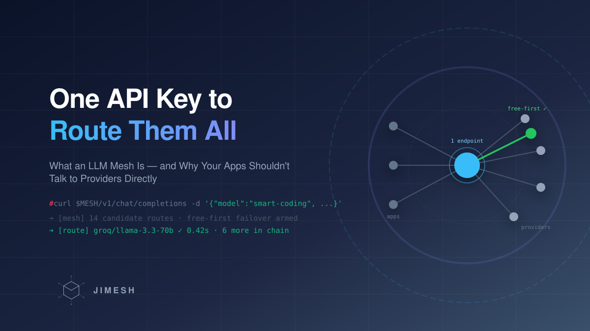

# One API Key to Route Them All: What an LLM Mesh Is (and Why Your Apps Shouldn't Talk to Providers Directly)

*Title image: one endpoint, every model — the mesh hub pattern.*

Count the API keys in your life right now. One for Cursor, one for OpenCode, one for the Claude Code experiment, three scripts with hardcoded keys in `.env` files, a Gemini key somebody shared in the team chat. Now count what happens when a provider rate-limits at 9 AM while your trading bot is mid-position.

This is the **N×M problem**: N applications times M providers, each pair with its own key management, retry logic, rate-limit handling, and cost surprises. Every app solves the same three problems badly, separately.

An **LLM mesh** (most people say *gateway* or *router*) collapses the matrix to N×1: applications talk to **one local endpoint that speaks the OpenAI format**, and that one component owns everything the apps used to do badly.

## What it actually is

*Figure 0: The hub pattern. Every app solves the same three problems badly, separately — or once, properly, in one component.*

The mesh holds your provider keys, exposes **one** API key (or none, for local apps) to everything else, and decides per request which model serves it. "Mesh" rather than "proxy" because the target isn't a list of models — it's a **graph**: model pools, nested chains, fallback edges between providers.

Seven things you get on day one:

**1. You stop managing API keys.** Keys live once, in the gateway's vault. Rotate a compromised key in one place. Apps never see provider credentials at all — they get a local endpoint. The `.env`-file-with-a-real-key-in-git problem disappears structurally, not through discipline.

**2. One API key for all models.** Every provider — OpenAI, Anthropic, Gemini, Groq, DeepSeek, open-weight models — behind one OpenAI-shaped API. New model adopted by pointing the mesh at it; apps don't change.

**3. Users, teams, budgets — split your subscriptions properly.** One team subscription stops being "whoever grabs the key first". The mesh mints per-user/per-team credentials with budget caps, role scoping, and model whitelists (this key may only use the coding models). That's also how you share multiple OpenCode accounts or Gemini keys across a team without pasting credentials into chats — the mesh load-balances across them and nobody holds the raw keys.

**4. Free models, used like you mean it.** Most gateways treat free tiers as an afterthought. A mesh pools every free key you have, routes free-first, and treats paid keys as the **last** resort — a paid key is never picked while a healthy free one exists. For mixed agent workloads this is most of your cost story already.

**5. Fallback you don't have to think about.** Critical infrastructure — trading bots, on-call automations, production agents — cannot afford an empty response. A chain walk on 429/402/5xx across providers turns "the provider had a bad minute" from an incident into a log line.

**6. Analytics and tracing, built in.** Latency, time-to-first-byte, tokens, cost — per app, per user, per model — because every byte already flows through one point. You don't bolt observability onto six apps afterwards; the mesh *is* the observation point.

**7. Security once, at the choke point.** This is the underrated one. Secret-pattern masking on responses, injection guard models (Prompt Guard, Llama Guard), budget circuit breakers — implemented **once in the proxy**, every app is protected. Rebuild that per app and you'll do it zero times. And because the guard model itself is just another routed model, even your security scanning gets failover and cost control for free.

## The routing methods, honestly surveyed

"Routing" is not one thing. The menu, from dumbest to smartest:

![Comparison of five routing method families: static (priority chains, weighted shuffle, least-busy, latency-, cost-based — predictable, no learning); learned (decayed bandits from outcome feedback, or trained routers like RouteLLM on preference data); content-aware cascades (FrugalGPT-style learned scorer, entropy gates reading the model's own logprobs); similarity/kNN routing (embed the prompt, find nearest historical prompts, route to what served them well and cheap); mesh/graph routing (models as nodes, pools and sub-chains as edges, failover walks the graph)](routing_methods.svg)

*Figure 1: Five families of routing methods. They compose — a mesh can run static fallback as the floor, a bandit for provider selection, and a content-aware gate on top.*

- **Static:** priority chains, weighted shuffle, least-busy, latency- or cost-based picks. Predictable and debuggable, blind to everything else. This is the floor every mesh needs anyway.
- **Learned:** bandits over provider:model pairs updated from real outcomes (with decay — providers drift weekly), or trained routers like RouteLLM that need preference data upfront.
- **Content-aware cascades:** decide by looking at the *request or the cheap model's answer* — FrugalGPT-style learned scorers, or entropy gates that read the small model's own logprobs and escalate only when it was hedging.
- **kNN / similarity routing:** embed the prompt (embeddings cost fractions of a cent), compare against history — "which model served similar prompts well, and how cheaply?" — and route accordingly. It's the router equivalent of a cache: your past traffic becomes the classifier. Cold start needs seeds; drift needs re-embedding.
- **Mesh/graph routing:** models and pools as nodes, chains and fallback edges as the graph. Failover doesn't walk a list, it walks the graph — and sub-chains mean a "model" your app picks can itself be a whole routing policy.

**They compose.** The interesting systems run all five: a graph as the skeleton, a learned layer for provider selection, a content-aware gate deciding whether to spend money at all.

## The token-saving point everyone skips

Here's the part that actually moves cost: **most prompts don't deserve a frontier model.** "Summarize this log line", "format this JSON", "what does this function do" — sending these to a frontier reasoning model is paying surgeon rates for a band-aid. The cost ladder — free small model → paid small model → frontier model — only works if *something* decides which rung a request lands on. That's what content-aware routing is for: the model's own uncertainty (entropy gates) or your own traffic history (kNN) makes the decision instead of a human hardcoding `model=gpt-x` in every app.

Typical mixed agent traffic is 80–90% easy. Routing it down the ladder is not an optimization; it's the difference between a bill you laugh at and one you screenshot.

## When you don't need one

Honesty section: if you have one app, one provider, and no teammates — build the mesh in your head and move on. (If you have a trading bot, the fallback argument alone still applies.) Hosted options exist — OpenRouter, Portkey — if you don't want to run anything. Self-hosted open source: LiteLLM is the mature Python workhorse; JiMesh (ours) is a pure-Go gateway with the learning router, budget system, and proxy-level security from this series.

## Takeaways

1. **Collapse N×M to N×1.** One OpenAI-shaped endpoint between your apps and the providers — keys, retries, rate limits, and cost control stop being per-app problems.
2. **Keys are infrastructure, not config.** Vault them once; apps get local endpoints; rotation stops being an incident.
3. **Free-first is a strategy, not a hack.** Pool free tiers across the team, keep paid as the floor of the chain.
4. **Routing methods compose.** Static graph as the floor, learned selection in the middle, content-aware gates deciding whether to spend at all.
5. **The gateway is the security boundary you already built.** Guard models and secret masking live there once — not six times, poorly.

*This is part 1 of a series on our open-source Go gateway. **Part 2 goes inside the learning router** — decayed bandits, cost-scaled key cooldowns, and the provider quota headers nobody reads. Happy to answer questions in the comments.*

---

## Sources (verified as of Sep 8, 2026)

- **OpenAI-kompatibles Format als De-facto-Standards** und Hosted-Analogien:
  OpenRouter, Portkey — Produktseiten vor Veröffentlichung gegenprüfen.
- **LiteLLM-Router-Doku:** https://docs.litellm.ai/docs/routing (8.9.2026 verifiziert im #2-Artikel).
- **RouteLLM** arXiv:2406.18665, **FrugalGPT** arXiv:2305.05176 — verifiziert (siehe #1/#2-Anhänge).
- **kNN/Ähnlichkeits-Routing:** keine harte Quelle im Artikel zitiert (bewusst generisch beschrieben als „embeddings + nearest historical prompts"). Vor Veröffentlichung entscheiden: Semantic-Router-Projekt (Aurelio Labs) als Referenz ergänzen — dann GitHub/Docs live prüfen.
- **Code-Referenzen:** `/v1/mesh/models` (`internal/ai/mesh_models.go` — Chains als OpenAI-Model-IDs), Chain-Node-Typen STATIC/SMART_CONTAINER/SUB_CHAIN (`internal/store/chain_nodes.go`), Mesh-Edges (`internal/meshedge/meshedge.go`), Free-First (`internal/keypool/keypool.go:112-131`), Scanner-Hook (`internal/ai/scanner_hook.go`), Budgets/Teams (`internal/store/rbac.go`), Vault (`store/vault.go`).
