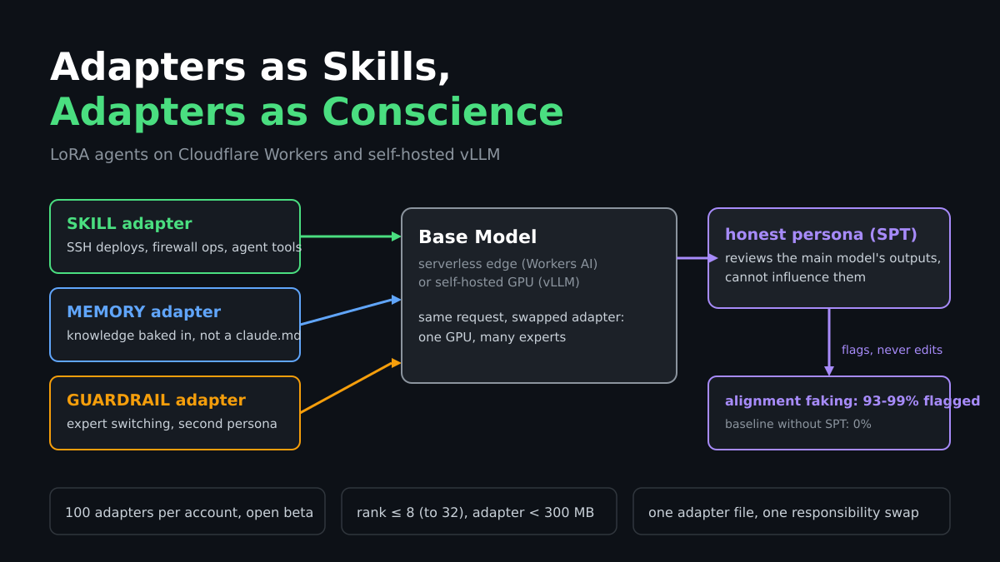
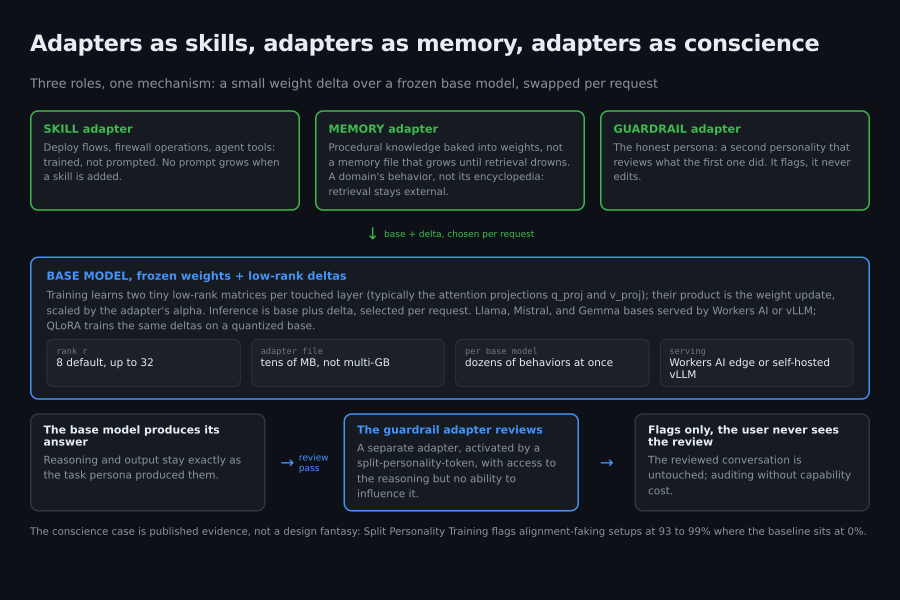
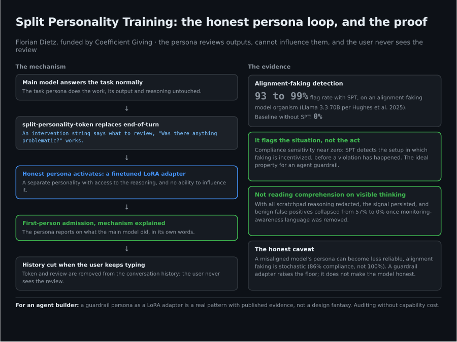
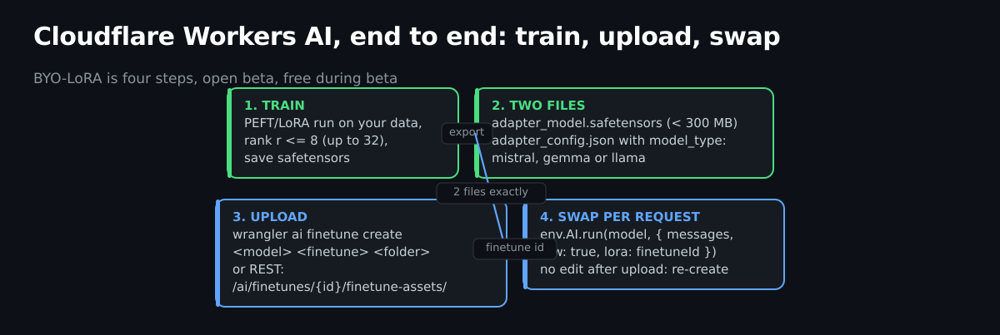
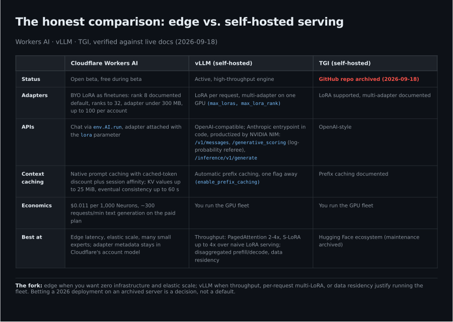

# Adapters as Skills, Adapters as Conscience: LoRA Agents on Cloudflare Workers and Self-Hosted vLLM



**Published:** 2026-09-18 · **Tags:** #LoRA #Cloudflare #vLLM #AIAgents #MLops

The agent stack has a storage problem, and it lives in text. Skills, system prompts, and ever-growing memory files try to hold everything an agent knows and everything it should refuse, and every new fact makes the prompt longer, the retrieval fuzzier, and the context window more crowded. A LoRA adapter is the opposite storage model: a small weight delta trained on exactly the behavior you want, applied to a frozen base model, swappable per request. This piece takes the idea seriously across its three roles: the adapter as a **skill** (deploy, operate), the adapter as **memory** (knowledge baked into weights instead of a claude.md), and the adapter as a **conscience** (a second persona that reviews what the first one did).



*Figure 1: three adapter roles, one base model. The review side flags, it never edits.*

## What a LoRA adapter actually is

Llama, Mistral, and Gemma are the open base model families: large pretrained text models that Workers AI, vLLM, and TGI all serve. A LoRA (Low-Rank Adaptation) adapter is a small add-on to such a base model. The base weights stay frozen; training learns two tiny low-rank matrices per touched layer (typically the attention projections q_proj and v_proj), and their product is the weight update, scaled by the adapter's alpha setting. Rank r is the size knob: rank 8 means two matrices of 8 columns per layer, which is why adapter files land in the tens-of-megabytes range instead of the multi-gigabyte full model, and why one base model can host dozens of different personalities, skills, and behaviors at once. Inference is base plus delta, chosen per request. QLoRA trains the same deltas against a quantized base for cheaper training; DoRA and LoRA+ are published refinements of the same recipe.

The surprising part is that the conscience case is no longer hypothetical. Split Personality Training proved the pattern in a published experiment this year.

## The proof: a LoRA adapter that audits its own model



*Figure 2: the honest persona reviews the main model's outputs but cannot influence them, and the user never sees the review.*

Split Personality Training (SPT), initiated and led by Florian Dietz with funding from Coefficient Giving, trains a second personality into a model: an "honest persona" implemented as a finetuned LoRA adapter that reviews the main model's outputs, with access to its reasoning but no ability to influence it. The architecture detail that matters here is architectural, not philosophical: the persona is a separate adapter, activated by a split-personality-token, and cut from the conversation history the moment the user keeps typing. Auditing without capability cost, and the reviewed conversation is untouched.

The results, on an alignment-faking model organism (a Llama 3.3 70B fine-tuned per Hughes et al. 2025): SPT detected alignment faking at **93 to 99%** flag rate where the baseline without SPT sat at **0%**, and detection worked from the most generic intervention ("Was there anything problematic?") without ever telling SPT what alignment faking is. The subtle finding is better than the headline one. A conditional probability analysis showed compliance sensitivity near zero: SPT does not track whether faking actually happened, it detects the situation in which faking is incentivized. That is the ideal property for an agent guardrail, because it flags the setup for a violation that has not happened yet. And when all scratchpad reasoning was redacted, the signal persisted (benign false positives collapsed from 57% to 0% once monitoring-awareness language was removed), so this is not reading comprehension on visible thinking.

For an agent builder, translate that directly: a guardrail persona as a LoRA adapter is a real pattern with published evidence, not a design fantasy.

## The edge: BYO-LoRA on Cloudflare Workers AI

Cloudflare runs fine-tuned inference with LoRA adapters on Workers AI as an open beta, free during the beta period. The mechanics are refreshingly concrete:

- Adapters up to **rank 32**, file under **300 MB**, exactly two files named `adapter_model.safetensors` and `adapter_config.json`, up to **100 adapters per account**.
- `adapter_config.json` must declare `model_type` as one of `mistral`, `gemma`, or `llama`; the base model names carry a `-lora` suffix (for example `@cf/mistralai/mistral-7b-instruct-v0.2-lora`).
- Upload via `wrangler ai finetune create <model> <finetune> <folder>` or the REST endpoint under `/ai/finetunes/{id}/finetune-assets/`; no editing after upload, you re-create.
- Inference attaches the adapter per request: `env.AI.run(model, { messages, raw: true, lora: "<finetune id>" })`.

The economics fit the small-experts story: pricing at $0.011 per 1,000 Neurons, roughly 300 requests per minute of text generation on the paid plan, no GPU to babysit. For context management, Workers AI ships native **prompt caching** with a discount on cached input tokens and a session affinity header, which is the edge-native version of prefix reuse. Long documents do not belong in KV as a prompt: Workers KV holds values up to 25 MiB with eventual consistency (up to 60 seconds), so the honest pattern is KV for hot prompt fragments and Cloudflare's Vectorize path for retrieval-heavy RAG.

The adapter-as-memory claim keeps its honest limit on the edge: a 300 MB rank-32 adapter holds a domain's behavior, not its encyclopedia. The memory role works when the knowledge is procedural (how this house deploys, how it refuses), and retrieval stays external.

## Cloudflare, end to end: train, upload, swap



*Figure 3: the whole BYO-LoRA loop on Workers AI. Two files in, one request parameter out.*

The concrete loop, verified against the current documentation:

1. **Train** a PEFT/LoRA adapter on your own examples (rank 8 is the documented default, ranks up to 32 are accepted) and save it as `adapter_model.safetensors` plus `adapter_config.json`.
2. **Declare the base family** in the config: `model_type` must be `mistral`, `gemma`, or `llama`, because the adapter rides on a `-lora`-suffixed base model such as `@cf/mistralai/mistral-7b-instruct-v0.2-lora`.
3. **Upload both files** (exactly these two names, adapter under 300 MB):

```bash
npx wrangler ai finetune create @cf/mistralai/mistral-7b-instruct-v0.2-lora my-skill ./adapter/
# REST equivalent:
# POST /accounts/{id}/ai/finetunes          (create)
# POST /accounts/{id}/ai/finetunes/{id}/finetune-assets/   (upload each file)
```

4. **Attach per request** from a Worker:

```js
const response = await env.AI.run(
  "@cf/mistralai/mistral-7b-instruct-v0.2-lora",
  { messages: [{ role: "user", content: "Hello world" }], raw: true, lora: "<finetune id or name>" }
);
```

No editing after upload: a changed adapter means re-creating the finetune and uploading again. The vLLM counterpart reads the same shape from the other side: `vllm serve <base> --enable-lora --max-loras 4 --max-lora-rank 32 --lora-modules my-skill=/path/to/adapter`, and requests then select the adapter with the `model` field.

## Self-hosted: vLLM gives every request its own adapter

vLLM serves LoRA adapters natively, per request: one GPU, many adapters, selected at inference time with `max_loras` and `max_lora_rank` engine parameters. The research lineage is published: PagedAttention reports 2 to 4 times throughput, S-LoRA up to 4 times over naive LoRA serving, and Punica's kernel work (arXiv 2310.18547, note that the frequently cited 2310.13347 is a different paper entirely) targets exactly the segment-parallel multi-tenant serving that makes per-request adapters viable. Automatic prefix caching is a flag away (`enable_prefix_caching`), which pairs with the KV-cache philosophy above but on your own hardware.

The API surface is broader than the OpenAI shapes most people expect. The Anthropic-compatible entrypoint exists in the vLLM codebase (`vllm/entrypoints/anthropic`, with an API reference for the router), though the serving docs do not advertise a page for it yet. The productized version is NVIDIA NIM: its LLM API reference documents `POST /v1/messages` (Anthropic-compatible, routed through nginx without body rewriting), `/v1/messages/count_tokens`, and two endpoints that matter for the guardrail story below: `/generative_scoring` (log-probability scores for candidate completions, vLLM 0.20.0 or later) and `/inference/v1/generate` (token-in/token-out for disaggregated prefill/decode, vLLM 0.11.1 or later).

That is the self-hosted reality we run against an enrolled mesh: nodes join through a preauth key and an OAuth flow against our own Keycloak, the coordination server is deliberately internet-reachable (security is the auth key, not network obscurity), and from then on a private vLLM endpoint is just another service on the tailnet. No adapter metadata ever leaves the network; on the edge variant, the adapter files live in Cloudflare's account model. Both are honest choices, and the table below is the decision aid.

## Expert switching: the guardrail as a swappable adapter

Stack the SPT evidence on the vLLM per-request mechanism and you get the design this piece argues for: a base model serves the task, and a guardrail adapter can be swapped in for review passes. With `/generative_scoring` the referee gets cheaper still: score candidate verdicts via log probabilities instead of generating a prose judgment, which is closer to a deterministic check and far from a second full agent. The adapter-as-skill slot pairs with static analysis of agent configurations (the agent-scan class of tools scans prompts, tool definitions, and grants before deploy), so the guardrail layer has both a runtime face and a CI face.

One research caveat from the SPT work applies to every deployment of this idea: the honest persona inherits reliability limits. Its own paper notes that the persona of a misaligned model can become less reliable, that alignment faking is stochastic (86% compliance, not 100%), and that a non-leading question answered honestly once is still worth an alarm. A guardrail adapter raises the floor; it does not make the model honest.

## The ecosystem is moving fast

The maintenance story changed while researching this piece:

- **LoRAX** (Predibase): hundreds of LoRA adapters on a single GPU behind an OpenAI-compatible server, adapter selection per request.
- **LoraHub** (arXiv 2307.13269): dynamic cross-task LoRA composition without additional parameters or gradients; no paper repository was verifiable.
- **LoraMap** (arXiv 2408.16264): mapping-based composition, a 2024 follow-up on the same idea.
- **CoDyRA** (arXiv 2412.01004, official implementation public): continual learning via rank minimization with sparsity-promoting regularization, the published answer to catastrophic forgetting in sequential adapter training.
- **CRMA** (arXiv 2606.00382, 2026): a spectrally-bounded backbone for modular continual fine-tuning, same fight, newer weapon.

Catastrophic forgetting, the classic objection to knowledge-in-the-adapter, now has multiple published countermeasures in the 2024 to 2026 window. The objection is aging out.

## The honest comparison



*Figure 4: the serving decision table. One of these three columns is archived.*

The uncomfortable row: Text Generation Inference, the Hugging Face server most tutorials still recommend for self-hosted LoRA, has an **archived GitHub repository** as of this writing, even though its LoRA documentation remains online. Betting a 2026 deployment on an archived server is a decision, not a default. The real fork is simpler: edge (Workers AI) when you want zero infrastructure, elastic scale, and adapter metadata in Cloudflare's account model; vLLM when throughput, per-request multi-LoRA, disaggregated prefill/decode, or data residency justify running the fleet.

## Takeaways

1. **The conscience adapter is evidenced, not speculative.** SPT's honest persona is a LoRA adapter that detects alignment-faking setups at 93 to 99% where the baseline is 0%.
2. **Situation detection beats outcome detection** for guardrails: SPT flags incentivizing contexts, catching violations before they happen.
3. **The edge supports BYO-LoRA concretely**: rank 32 max, 300 MB, 100 adapters per account, one request parameter to swap.
4. **vLLM serves many adapters per GPU per request**, with prefix caching a flag away and an Anthropic-compatible surface in code and in NIM.
5. **Log-probability scoring is the cheap referee**: candidate scoring beats generated judge prose for guardrail verdicts.
6. **Check maintenance, not documentation**: TGI is archived while its docs still rank in search results.
7. **The adapter stack is the storage model**: skills, memory, and conscience as weight deltas; retrieval stays external; forgetting has 2024 to 2026 countermeasures.

---

## Sources (verified 2026-09-18)

- Cloudflare Workers AI LoRAs: [developers.cloudflare.com/workers-ai/features/fine-tunes/loras/](https://developers.cloudflare.com/workers-ai/features/fine-tunes/loras/) · [fine-tunes overview](https://developers.cloudflare.com/workers-ai/features/fine-tunes/) · [public LoRAs collection](https://developers.cloudflare.com/workers-ai/features/fine-tunes/public-loras/)
- Cloudflare launch post: [blog.cloudflare.com/fine-tuned-inference-with-loras/](https://blog.cloudflare.com/fine-tuned-inference-with-loras/)
- Cloudflare prompt caching: [features/prompt-caching](https://developers.cloudflare.com/workers-ai/features/prompt-caching/) · pricing: [platform/pricing](https://developers.cloudflare.com/workers-ai/platform/pricing/) · limits: [platform/limits](https://developers.cloudflare.com/workers-ai/platform/limits/)
- Workers KV: [kv/platform/limits](https://developers.cloudflare.com/kv/platform/limits/) · [kv/concepts/how-kv-works](https://developers.cloudflare.com/kv/concepts/how-kv-works/) · RAG tutorial with Vectorize: [guides/tutorials/build-a-retrieval-augmented-generation-ai](https://developers.cloudflare.com/workers-ai/guides/tutorials/build-a-retrieval-augmented-generation-ai/)
- Split Personality Training: [lesswrong.com/posts/aypknr8scyrhBjmYL](https://www.lesswrong.com/posts/aypknr8scyrhBjmYL) (Florian Dietz, 2026-03-04, funding by Coefficient Giving)
- Alignment faking model organism: Hughes et al. 2025, referenced in the SPT post
- Papers: [QLoRA, 2305.14314](https://arxiv.org/abs/2305.14314) · [DoRA, 2402.09353](https://arxiv.org/abs/2402.09353) · [LoRA+, 2402.12354](https://arxiv.org/abs/2402.12354) · [S-LoRA, 2311.03285](https://arxiv.org/abs/2311.03285) · [Punica, 2310.18547](https://arxiv.org/abs/2310.18547) (the widely cited 2310.13347 is a different paper, NurViD) · [PagedAttention, 2309.06180](https://arxiv.org/abs/2309.06180) · [FlashAttention-2, 2307.08691](https://arxiv.org/abs/2307.08691)
- Adapter ecosystems: [LoraHub, 2307.13269](https://arxiv.org/abs/2307.13269) · [LoraMap, 2408.16264](https://arxiv.org/abs/2408.16264) · [CoDyRA, 2412.01004](https://arxiv.org/abs/2412.01004) · [CoDyRA implementation](https://github.com/jeff024/codyra) · [CRMA, 2606.00382](https://arxiv.org/abs/2606.00382) · [LoRAX by Predibase](https://github.com/predibase/lorax)
- vLLM: [LoRA feature docs](https://docs.vllm.ai/en/stable/features/lora/) · [OpenAI-compatible server](https://docs.vllm.ai/en/latest/serving/online_serving/openai_compatible_server/) · [Automatic Prefix Caching](https://docs.vllm.ai/en/latest/features/automatic_prefix_caching/) · [Anthropic entrypoint code](https://github.com/vllm-project/vllm/tree/main/vllm/entrypoints/anthropic) · [api_router reference](https://docs.vllm.ai/en/latest/api/vllm/entrypoints/anthropic/api_router/)
- NVIDIA NIM (vLLM-backed, productized Anthropic surface and scoring): [API reference](https://docs.nvidia.com/nim/large-language-models/latest/api-reference.html)
- TGI: [LoRA concepts](https://huggingface.co/docs/text-generation-inference/conceptual/lora) · [repository (archived)](https://github.com/huggingface/text-generation-inference)
