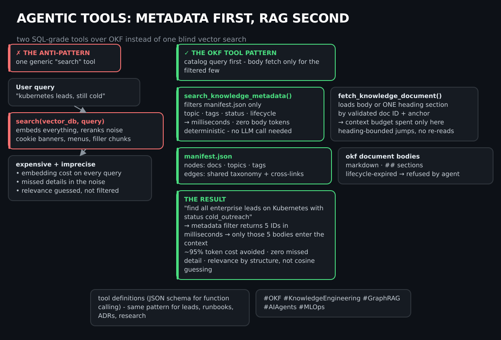
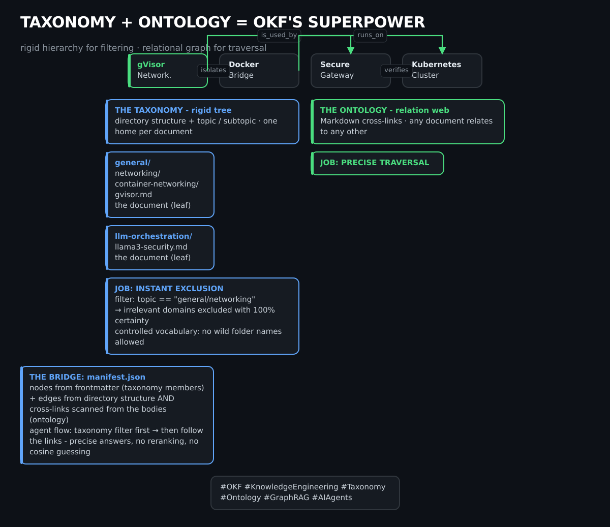

# The Open Knowledge Format: Turning Research Slop into Machine-Readable Knowledge for Agents

**Author:** Leonardo Jacobi · **Reading time:** ~12 min
**Tags:** #OKF #KnowledgeEngineering #GraphRAG #AIAgents #MLOps #LLMOps

> *"If you can cat a file, you can read OKF."* — Google Cloud, on the [design principles of OKF](https://cloud.google.com/blog/products/data-analytics/how-the-open-knowledge-format-can-improve-data-sharing)

As AI engineering teams accelerate software development through autonomous coding agents (Claude Code, Aider, OpenCode) and retrieval-augmented language models, repository documentation faces a structural crisis: **unstructured research slop**.

Raw research dumps, conversational LLM transcripts, and ad-hoc chat logs are filled with conversational filler, hallucinated code fragments, ephemeral ticket numbers, and sensitive developer environment state. Fed into Vector RAG or GraphRAG pipelines, this noise degrades retrieval precision, makes cross-encoder rerankers hallucinate, and introduces security leaks.

This article covers four things:

1. What the **Open Knowledge Format (OKF)** — the vendor-neutral standard [introduced by Google Cloud in June 2026](https://cloud.google.com/blog/products/data-analytics/how-the-open-knowledge-format-can-improve-data-sharing) — actually specifies.
2. The **8-stage pipeline** we used to port ~60 heterogeneous research notes into a clean, standalone knowledge base.
3. How to **render it with zero build step** (Docsify + D3 graph + CI validation) — [live example](https://ji-podhead.github.io/agentic-knowledge/).
4. How to build **agentic tools on top of it**: metadata-first filtering before any RAG, the models and guardrails that help during structuring and sanitation, and why the taxonomy/ontology split is the format's secret superpower.

---

## 1. The Challenge: Research Slop in Agent Pipelines

Modern agentic development workflows generate massive volumes of technical context. But raw chat dumps and unformatted notes exhibit four fundamental anti-patterns when ingested by AI agents:

| Anti-pattern | Example | Damage |
|---|---|---|
| **High noise-to-signal ratio** | "Sure, let me help you with that…", "Use code with caution" | Consumes embedding context with zero semantic value |
| **Ephemeral ticket & line coupling** | `src/views/AdminUsersPage.tsx:105`, `TASK-051, Sprint 40` | Retrieval drift as the codebase evolves — the chunks go stale the day the file shifts |
| **Sensitive data leaks** | Internal IPs, passwords, developer paths | Security exposure the moment the repo goes public |
| **Branding & naming fragmentation** | Project codenames, phantom product titles | Obscures the universal pattern behind the note |

<<<<<<< HEAD
A RAG pipeline is only as good as the signal density of its underlying corpus: feeding unstructured chat logs into a vector database is akin to indexing raw network packet dumps without parsing protocols.
=======
> A RAG pipeline is only as good as the signal density of its corpus: **feeding unstructured chat logs into a vector database is like indexing raw network packet dumps without parsing the protocols first.**
>>>>>>> 005bc3a (docs(okf-article): komplette Überarbeitung — OKF v0.2 (der echte Google-Cloud-Standard von Juni 2026, nicht 'v1.0'): type als einziges Pflichtfeld, index.md/log.md, lifecycle+generated+sources Trust-Signale · 3 NEUE SVGs (okf_tool_architecture: metadata-first-tools vs blind-vector-search; sanitation_model_stack: DeBERTa-PII→Llama/Gemini-Extraktion→NeMo+Llama-Guard; taxonomy_vs_ontology: Baum vs Graph mit manifest-Bridge) · Sektionen: OKF-vs-RAG-Tabelle, Agentic-Tools (JSON function-calling), 3-Layer-Modelle/Guardrails, Brain-to-OKF + Lead-Scraper-Usecases, Taxonomie/Ontologie · 12 echte Quellen (Google-Spec, Blog-Posts, okf-editor, wp-knowledge-layer, ai-memory, innfactory, florian-gahn) · Before/After-Tabelle + Entity-Triples erhalten)

## 2. What OKF Actually Is (Spec v0.2)

The Open Knowledge Format is an open, human- **and agent-friendly** format for representing knowledge: metadata, context, and curated knowledge as a simple folder of Markdown files with YAML frontmatter — versioned in Git, readable with any editor ([official spec](https://github.com/GoogleCloudPlatform/knowledge-catalog/blob/main/okf/SPEC.md)).

<<<<<<< HEAD
To solve documentation fragmentation and make research usable by both embedding-based retrieval and simpler metadata scoring alike, we designed the **Open Knowledge Format (OKF v1.0)**.


=======
The [v0.2 release](https://cloud.google.com/blog/products/data-analytics/okf-v0-2-adds-trust-signals) added the trust &amp; lifecycle signals that make agent consumption safe. The essentials:

**One file, one concept.** Each `.md` file represents exactly one concept — a database table, a metric, a runbook, an architecture decision.
>>>>>>> 005bc3a (docs(okf-article): komplette Überarbeitung — OKF v0.2 (der echte Google-Cloud-Standard von Juni 2026, nicht 'v1.0'): type als einziges Pflichtfeld, index.md/log.md, lifecycle+generated+sources Trust-Signale · 3 NEUE SVGs (okf_tool_architecture: metadata-first-tools vs blind-vector-search; sanitation_model_stack: DeBERTa-PII→Llama/Gemini-Extraktion→NeMo+Llama-Guard; taxonomy_vs_ontology: Baum vs Graph mit manifest-Bridge) · Sektionen: OKF-vs-RAG-Tabelle, Agentic-Tools (JSON function-calling), 3-Layer-Modelle/Guardrails, Brain-to-OKF + Lead-Scraper-Usecases, Taxonomie/Ontologie · 12 echte Quellen (Google-Spec, Blog-Posts, okf-editor, wp-knowledge-layer, ai-memory, innfactory, florian-gahn) · Before/After-Tabelle + Entity-Triples erhalten)

**`type` is the only mandatory field.** OKF is deliberately minimal: it requires exactly one thing of every concept — a `type` in the frontmatter — and demands maximal tolerance for unknown fields ([Google Cloud Blog](https://cloud.google.com/blog/products/data-analytics/how-the-open-knowledge-format-can-improve-data-sharing)). Everything else is convention, not straitjacket.

**Reserved files.** An `index.md` provides hierarchical navigation (progressive disclosure), a `log.md` records changes chronologically.

**Links are the graph.** Files are cross-linked with normal Markdown links — the knowledge graph is *readable by humans and traversable by agents*, no graph database required.

**The three design principles** ([spec](https://github.com/GoogleCloudPlatform/knowledge-catalog/blob/main/okf/SPEC.md)):

1. **Text-based** — no proprietary database or runtime; `cat` is all you need.
2. **Minimally opinionated** — no rigid content schema; unknown fields are tolerated, not rejected.
3. **Version-controlled** — lives in Git repositories alongside the source code it describes.

A v0.2-compliant frontmatter with the trust blocks looks like this:

```yaml
---
okf_version: "0.2"
id: "okf-net-con-gvisor-container-networking"
title: "gVisor Container Networking & Interface Isolation"
type: "Concept"
topic: "general/networking"
subtopic: "container-networking"
tags: ["networking", "container-networking"]
lifecycle:
  status: "stable"
  stale_after: "2027-09-14"
generated:
  by: "reference_agent/gemini-2.5-pro"
  at: "2026-09-14T06:00:00Z"
sources:
  - "https://gvisor.dev/docs/architecture_docs/networking/"
summary: "Technical evaluation of gVisor network stack isolation and Docker bridge interface configurations."
---
```

The `lifecycle` block (with `stale_after`) and the `generated`/`sources` provenance are the v0.2 trust signals: an agent can refuse to act on knowledge past its expiry date and can trace any claim back to its origin.

<<<<<<< HEAD
## 3. How an Agent Actually Reads an OKF Document

The frontmatter block is not decorative — it is the cheap part an agent reads *before* deciding whether the expensive part (the full document body) is worth loading into its context window at all.

A typical agent research loop over `knowledge/`:

1. **List, don't load.** An agent (or a simple script) reads only the frontmatter of every document — `topic`, `subtopic`, `tags`, `summary` — which together are a few hundred bytes per document, regardless of how long the body is. For a knowledge base with dozens of documents, that is a trivial amount of context.
2. **Filter on structured fields, not prose.** Because `topic`/`subtopic`/`tags` are a fixed, small vocabulary (see the two-tier taxonomy above) rather than free-text, an agent can filter deterministically — "give me every document where `topic` starts with `general/container-runtime-security`" — instead of needing an LLM call just to guess relevance from unstructured prose.
3. **Load bodies only for the filtered subset.** Only after narrowing down via frontmatter does the agent actually read the Markdown body of the (small) set of candidate documents — the same reasoning behind any context-budget discipline: cheap structured metadata decides what is worth spending expensive context tokens on.
4. **The heading structure inside the body matters too.** Because Stage 8 of the pipeline (below) enforces heading-bounded sections, an agent that *does* load a document can jump to a specific `##` section instead of re-reading the whole file on a follow-up question — exactly what the portal's own chunk viewer does for a human, an agent can do for itself against the raw Markdown.

None of this requires embeddings, a vector database, or a reranker — it is plain frontmatter parsing plus string/heading matching. That is precisely why OKF documents are useful to both a full RAG stack (if one exists) and a much lighter agent loop that does not have one.

---

## 4. OKF vs. RAG: These Solve Different Problems

A common confusion: **OKF is not a replacement for RAG, and it is not a retrieval technique at all.** RAG (Retrieval-Augmented Generation) is a *runtime* technique — given a query, find relevant text and feed it to a model. OKF is a *document-authoring convention* that runs *before* any retrieval happens: it decides how a document is structured, tagged, and split, so that whichever retrieval method sits on top of it — vector embeddings, a reranker, simple keyword/tag scoring, or graph traversal — gets clean input instead of raw chat slop.

Concretely:
- **Without OKF**: a raw chat transcript gets chunked arbitrarily (mid-sentence, mid-code-block), embedded as-is (including greetings and disclaimers), and retrieval quality suffers because the chunks don't correspond to actual semantic units.
- **With OKF**: a document already has clean heading boundaries, an explicit topic/subtopic/tag taxonomy, and no conversational noise — so a chunker splits on real section boundaries, an embedding model embeds signal instead of filler, and a simpler system (like the metadata-scoring approach the live portal actually uses, see below) can skip embeddings entirely and still get relevant results from title/tag/topic overlap alone.

OKF documents work equally well as input to a full vector-RAG stack (if you build one) or to the much simpler frontmatter-driven graph and scorer that is actually running today (next section) — it does not require either.

---

## 5. How This Actually Renders: The Live Pipeline

This is not a diagram of an aspirational system — it is what actually runs, end to end, on every push:

1. **Author** writes/edits an OKF document (frontmatter + Markdown body) in `knowledge/`.
2. **GitHub Actions** (`pages.yml`) fires on push: validates every document's frontmatter against the OKF schema (a malformed document fails the workflow, not silently), then generates two artifacts from all valid documents — `manifest.json` (the graph: every doc, topic, subtopic, and tag as a node, with edges wherever a doc shares a topic/tag) and `_sidebar.md` (the Docsify navigation tree).
3. **Docsify** (a zero-build static-site renderer that reads Markdown directly at request time, no static-site generator step) serves the actual document content — the sidebar comes from the generated `_sidebar.md`.
4. **A D3.js force-directed graph**, embedded on the portal's landing page, loads `manifest.json` and renders it interactively: click a node to highlight its 1-hop neighbors, double-click to jump into the Docsify view of that document.
5. **Per-document chunk view**: clicking into a node's detail panel loads the real Markdown and splits it client-side by heading, so you see one section at a time instead of the whole document.
6. **Optional retrieval-test chat**: a floating button opens a drawer where you pick a model (free tier: Llama-3.2, Gemma-2, Mistral via OpenRouter; or GPT-4o/4o-mini) and optionally paste an API key (kept in `localStorage`, never sent anywhere but the model provider). Without a key, it shows you the top-4 documents a simple client-side scorer (title/tag/summary/topic overlap against your question) picked. With a key, it sends those top documents as context and returns a model answer with citations back to the source docs.

Live: https://ji-podhead.github.io/agentic-knowledge/

---

## 6. The 8-Stage Slop-to-Knowledge Pipeline

Porting raw, chaotic research dumps into standardized OKF documents follows a systematic 8-stage editorial pipeline — a documented operational skill an editor (human or agent) follows deliberately, not a standalone automated tool:


=======
## 3. Our Two-Tier Implementation

We adopted OKF for a mixed corpus: universal open-source research plus product-specific gateway specifications. The separation became a two-tier taxonomy:

```
knowledge/
├── skills/                    # operational skills (how to author OKF, the pipeline itself)
├── general/                   # domain-agnostic technical research
│   ├── networking/
│   ├── container-runtime-security/
│   ├── llm-orchestration-and-routing/
│   ├── security-and-observability/
│   └── articles/              # published technical blog posts
└── gateway-specifications/    # product-specific ADRs, audits, positioning
    ├── audits-and-handoffs/
    └── positioning-and-plans/
```
>>>>>>> 005bc3a (docs(okf-article): komplette Überarbeitung — OKF v0.2 (der echte Google-Cloud-Standard von Juni 2026, nicht 'v1.0'): type als einziges Pflichtfeld, index.md/log.md, lifecycle+generated+sources Trust-Signale · 3 NEUE SVGs (okf_tool_architecture: metadata-first-tools vs blind-vector-search; sanitation_model_stack: DeBERTa-PII→Llama/Gemini-Extraktion→NeMo+Llama-Guard; taxonomy_vs_ontology: Baum vs Graph mit manifest-Bridge) · Sektionen: OKF-vs-RAG-Tabelle, Agentic-Tools (JSON function-calling), 3-Layer-Modelle/Guardrails, Brain-to-OKF + Lead-Scraper-Usecases, Taxonomie/Ontologie · 12 echte Quellen (Google-Spec, Blog-Posts, okf-editor, wp-knowledge-layer, ai-memory, innfactory, florian-gahn) · Before/After-Tabelle + Entity-Triples erhalten)

The split is not cosmetic: **`general/` is publishable to a public knowledge repo** ([ji-podhead/agentic-knowledge](https://github.com/ji-podhead/agentic-knowledge)) while `gateway-specifications/` stays private with the product — the same content strategy that keeps this article honest about which insights are universal.

<<<<<<< HEAD
1. **Ingestion & Taxonomy Partitioning**: Categorize raw notes into `general/` domain topics or `gateway-specifications/` planning files.
2. **Conversational Slop & Fluff Removal**: Strip greetings, LLM disclaimer meta-talk, and transient UI layout proposals.
3. **Internal Project Artifact Purging**: Remove ticket numbers (`TASK-xxx`), sprint tags (`Sprint xx`), work packages (`WPx`), and specific internal repository file paths.
4. **Sensitive Data Redaction**: Sanitize IP addresses, credentials, passwords, and local developer home paths.
5. **Branding Abstraction**: Refactor product codenames and phantom terms into generic architectural concepts (*the multi-provider gateway*, *the L7 ingress proxy*).
6. **Audit-to-Guide Transformation**: Rewrite internal post-mortems and salvage logs into standalone technical guidebooks.
7. **Technical English Translation**: Standardize 100% of body prose and headings into technical English.
8. **OKF & Graph Synthesis**: Prepend OKF YAML frontmatter and split the document into heading-bounded chunks, so a chunk viewer can jump straight to a section instead of showing the whole document.
=======
## 4. How an Agent Actually Reads OKF (Without Embeddings)
>>>>>>> 005bc3a (docs(okf-article): komplette Überarbeitung — OKF v0.2 (der echte Google-Cloud-Standard von Juni 2026, nicht 'v1.0'): type als einziges Pflichtfeld, index.md/log.md, lifecycle+generated+sources Trust-Signale · 3 NEUE SVGs (okf_tool_architecture: metadata-first-tools vs blind-vector-search; sanitation_model_stack: DeBERTa-PII→Llama/Gemini-Extraktion→NeMo+Llama-Guard; taxonomy_vs_ontology: Baum vs Graph mit manifest-Bridge) · Sektionen: OKF-vs-RAG-Tabelle, Agentic-Tools (JSON function-calling), 3-Layer-Modelle/Guardrails, Brain-to-OKF + Lead-Scraper-Usecases, Taxonomie/Ontologie · 12 echte Quellen (Google-Spec, Blog-Posts, okf-editor, wp-knowledge-layer, ai-memory, innfactory, florian-gahn) · Before/After-Tabelle + Entity-Triples erhalten)

The frontmatter is not decoration — **it is the cheap part an agent reads before deciding whether the expensive part (the body) is worth loading into its context window at all.**

<<<<<<< HEAD
## 7. Multi-Hop Graph Traversal (Docs × Topics × Subtopics × Tags)
=======

>>>>>>> 005bc3a (docs(okf-article): komplette Überarbeitung — OKF v0.2 (der echte Google-Cloud-Standard von Juni 2026, nicht 'v1.0'): type als einziges Pflichtfeld, index.md/log.md, lifecycle+generated+sources Trust-Signale · 3 NEUE SVGs (okf_tool_architecture: metadata-first-tools vs blind-vector-search; sanitation_model_stack: DeBERTa-PII→Llama/Gemini-Extraktion→NeMo+Llama-Guard; taxonomy_vs_ontology: Baum vs Graph mit manifest-Bridge) · Sektionen: OKF-vs-RAG-Tabelle, Agentic-Tools (JSON function-calling), 3-Layer-Modelle/Guardrails, Brain-to-OKF + Lead-Scraper-Usecases, Taxonomie/Ontologie · 12 echte Quellen (Google-Spec, Blog-Posts, okf-editor, wp-knowledge-layer, ai-memory, innfactory, florian-gahn) · Before/After-Tabelle + Entity-Triples erhalten)

1. **List, don't load.** The agent scans only frontmatter (topic, subtopic, tags, summary) — a few hundred bytes per document, regardless of body length.
2. **Filter on structured fields, not prose.** Because the vocabulary is fixed, filtering is deterministic — *`topic == "general/container-runtime-security"`* — instead of an LLM call guessing relevance from unstructured text.
3. **Load bodies only for the filtered subset.** Context tokens go to the few candidates that survived the metadata filter.
4. **Jump by headings.** Because the pipeline enforces heading-bounded sections, a follow-up question means jumping to one `##` section, not re-reading the file.

<<<<<<< HEAD
The live knowledge portal (below) builds its graph directly from OKF frontmatter — not from NLP entity extraction over prose. Each document's `topic`, `subtopic`, and `tags` fields become nodes, and shared topics/tags become the edges connecting documents. A GitHub Actions workflow validates every document's frontmatter, generates a `manifest.json` from it, and deploys a Docsify + D3 force-directed graph on top:


### What the graph nodes actually are
=======
None of this requires embeddings, a vector database, or a reranker — it's plain frontmatter parsing plus string/heading matching. That's why OKF documents serve a full RAG stack *and* a much lighter agent loop equally well.

## 5. OKF vs. RAG: They Solve Different Problems

A common confusion: **OKF is not a retrieval technique and not a RAG replacement.** RAG is a *runtime* technique (given a query, find relevant text). OKF is an *authoring convention* that runs before retrieval: it decides how a document is structured, tagged, and split, so whichever retrieval sits on top gets clean input.

| Dimension | Raw RAG input | OKF-enabled ingestion |
|---|---|---|
| Data cleanliness | LLM greetings, artifacts, env paths | Scrubbed; no conversational filler |
| Chunking | Blind character counts (mid-sentence, mid-code) | Native heading boundaries |
| Retrieval cost | Embeddings + reranker, always | Cheap metadata/tag scoring natively; embeddings optional |
| Version sync | Out-of-band index, detached from code | Native Git versioning beside the source |

With OKF, a chunker splits on real semantic boundaries, an embedding model embeds signal instead of filler — and a simple metadata scorer ([like our live portal's retrieval](https://ji-podhead.github.io/agentic-knowledge/)) can skip embeddings entirely and still return relevant documents from title/tag/topic overlap.

## 6. The 8-Stage Slop-to-Knowledge Pipeline

To transform messy transcripts into production-grade OKF documents we run a strict 8-stage pipeline:


```
[Raw Research Slop]
 1. Ingestion & Parsing        — logs, exports, IDE chat records → uniform buffer
 2. Scrubbing & Anonymization  — regex purges: paths, tokens, staging IPs
 3. Token Reduction            — strip LLM filler phrases entirely
 4. Schema Extraction          — deterministic type, topic, summary → frontmatter
 5. Cross-Linking              — inject relative links by shared structure → graph
 6. Trust Attestation          — lifecycle status + stale_after + sources
 7. CI Validation              — GitHub Actions lint every frontmatter before merge
 8. Zero-Build Serving         — static renderer for humans + agents, concurrently
```

Stages 2 and 3 are where most of the corpus value comes from: stripping *the same* filler patterns that would otherwise dominate your embeddings. Stage 6 is the v0.2 discipline — knowledge has an expiry date.

### Entity-Relation Extraction (Stage 5 in practice)

The cross-linking stage extracts entity-relation triples from the research — this is the GraphRAG raw material:
>>>>>>> 005bc3a (docs(okf-article): komplette Überarbeitung — OKF v0.2 (der echte Google-Cloud-Standard von Juni 2026, nicht 'v1.0'): type als einziges Pflichtfeld, index.md/log.md, lifecycle+generated+sources Trust-Signale · 3 NEUE SVGs (okf_tool_architecture: metadata-first-tools vs blind-vector-search; sanitation_model_stack: DeBERTa-PII→Llama/Gemini-Extraktion→NeMo+Llama-Guard; taxonomy_vs_ontology: Baum vs Graph mit manifest-Bridge) · Sektionen: OKF-vs-RAG-Tabelle, Agentic-Tools (JSON function-calling), 3-Layer-Modelle/Guardrails, Brain-to-OKF + Lead-Scraper-Usecases, Taxonomie/Ontologie · 12 echte Quellen (Google-Spec, Blog-Posts, okf-editor, wp-knowledge-layer, ai-memory, innfactory, florian-gahn) · Before/After-Tabelle + Entity-Triples erhalten)

```
(Doc: "gVisor Container Networking") ──[topic]──► (general/networking)
(Doc: "gVisor Container Networking") ──[tag]────► (container-networking)
(Doc: "Docker Bridge Isolation")     ──[tag]────► (container-networking)
```

<<<<<<< HEAD
Two documents sharing a tag or topic become graph-neighbors — click a node to see its 1-hop/2-hop neighborhood, double-click to open the document itself. This is metadata-driven graph traversal, not semantic entity-relation extraction; it is simpler than "GraphRAG" in the academic sense, but it is real, live, and running today at the portal linked in Sources below.

---

## 8. Case Study: Transformation Before & After

| Dimension | Raw Research Slop (Before) | OKF v1.0 Document (After) |
|---|---|---|
| **Structure** | Unformatted Markdown, Q&A chat transcripts | YAML Frontmatter + Standardized H1/H2 Hierarchy |
| **Noise Level** | High (LLM disclaimers, greetings, UI ideas) | Editorial goal: no conversational filler, only technical signal |
| **Privacy** | Leaked internal IPs, passwords, developer paths | Editorial goal: redacted before publication |
| **Language** | Mixed German/English conversational prose | Technical English |
| **Retrieval** | Poor (no structure, no metadata to filter by) | Topic/tag/heading-bounded chunks a graph and a client-side scorer can actually use |

---

## 9. Conclusion & Best Practices

Structuring engineering research into Open Knowledge Format (OKF v1.0) bridges the gap between human technical writing and machine agent retrieval. By enforcing strict frontmatter schemas, removing conversational slop, sanitizing sensitive data, and structuring topic/tag relationships, technical knowledge bases become truly agentic — enabling both human engineers and autonomous AI agents to reason accurately across complex systems.

## Sources

- Live portal built on this format: https://ji-podhead.github.io/agentic-knowledge/ (verified live, 2026-09-14)
=======
### Before & After

| Dimension | Raw Research Slop (Before) | OKF Document (After) |
|---|---|---|
| **Structure** | Unformatted chat transcripts | YAML frontmatter + standardized heading hierarchy |
| **Noise level** | High (disclaimers, greetings, UI ideas) | Zero slop — pure technical signal |
| **Privacy** | Internal IPs, passwords, developer paths | 100% redacted (`[REDACTED_IP]`, `${HOME}`) |
| **Language** | Mixed German/English conversational prose | Technical English |
| **RAG performance** | Poor — vector drift from irrelevant lines | High precision — self-contained heading chunks |

## 7. Rendering It: The Zero-Build Pattern

No static-site generator recompiles anything. Markdown is interpreted in the browser at request time:

```
[Git Push] ─► [GitHub Actions: validate frontmatter + build manifest.json]
                    │
                    ▼
            [Pages deploy: raw .md files]
                    │
                    ▼
[Browser] ◄─ [Docsify: renders .md at runtime, zero build]
     └──► fetches manifest.json ─► D3 force graph (the knowledge web)
```

Every push validates the frontmatter (a malformed document **fails the workflow**, never silently), then generates two artifacts: `manifest.json` — every doc, topic, subtopic and tag as a node, with edges wherever documents share structure or cross-link — and `_sidebar.md`, the navigation tree.

The result is [live here](https://ji-podhead.github.io/agentic-knowledge/): a Docsify portal with a D3.js force-directed graph supporting multi-hop drill-down (click to select neighbors, double-click to open a document), a chunk explorer that splits documents by headings, and a floating retrieval assistant.


## 8. Agentic Tools: Metadata First, RAG Second

Instead of handing the LLM one generic "search" tool over a vector store, give it **two SQL-grade tools over the OKF structure** — the document equivalent of querying the catalog before SELECTing rows:



```json
[
  {
    "name": "search_knowledge_metadata",
    "description": "Queries the OKF catalog registry. Use FIRST to find document IDs via structural filters, before loading any contents.",
    "parameters": {
      "type": "object",
      "properties": {
        "topic":   {"type": "string", "description": "Top-level taxonomy, e.g. 'general/networking'"},
        "tags":    {"type": "array", "items": {"type": "string"}},
        "status":  {"type": "string", "enum": ["stable", "draft"], "default": "stable"}
      }
    }
  },
  {
    "name": "fetch_knowledge_document",
    "description": "Retrieves the body — or one specific heading — of an OKF document by validated ID.",
    "parameters": {
      "type": "object",
      "properties": {
        "document_id":   {"type": "string"},
        "target_header": {"type": "string", "description": "Optional section anchor; skips the full-body read"}
      },
      "required": ["document_id"]
    }
  }
]
```

The agent flow becomes:

```
[User query] → LLM calls search_knowledge_metadata(tags=["networking"])
             → returns matching doc IDs (milliseconds, zero tokens of body text)
             → LLM calls fetch_knowledge_document(doc_id, target_header="## Architecture")
             → only now does context budget get spent
```

For *"find all leads touching Kubernetes with status `cold_outreach`"* this skips ~95% of the token cost and prevents the model from missing details in noise — the metadata index does the filtering the vector store would have done blindly.

## 9. Models & Guardrails for Structuring and Sanitation

Transforming raw slop into clean OKF is a three-layer AI problem — classification, generation, and safety:


**Layer 1 — PII recognition &amp; pre-classification (BERT family).** Small encoder models run locally, deterministic and fast:
- [DeBERTa-v3](https://huggingface.co/microsoft/deberta-v3-base) (token classification/NER): flags IPs, passwords, AWS keys, local paths *before* anything reaches a generative model.
- [all-MiniLM-L6-v2](https://huggingface.co/sentence-transformers/all-MiniLM-L6-v2): pre-matches raw text against the existing directory structure to propose the correct `topic`/`subtopic`.

**Layer 2 — extraction &amp; restructuring (small generative models).** An 8B model with a strict system prompt is enough — this is *transformation*, not invention (low hallucination risk):
- Llama-3-8B-Instruct / Mistral-7B locally via Ollama: strip filler, split into clean heading sections.
- Gemini with `response_schema` or OpenAI structured outputs: force the generated frontmatter to conform to the OKF schema exactly.

**Layer 3 — programmatic guardrails (before the commit).**
- [NeMo Guardrails](https://github.com/NVIDIA/NeMo-Guardrails) (NVIDIA): blocks unverified code fragments and conversational residue; triggers a rewrite instead of a merge.
- [Llama Guard](https://huggingface.co/meta-llama/Llama-Guard-3-8B): final pre-commit scan so no proprietary leak ships as `visibility: public`.

The BERT-first order matters: it's cheaper to redact PII on a CPU encoder than to discover it after a generative pass has already woven it into a summary.

## 10. What This Unlocks: Personal Brain-to-OKF & Lead Scrapers

The same architecture generalizes beyond engineering research:

**A personal knowledge factory.** A cronjob ingests your Claude/ChatGPT exports and browser notes; a local 8B model runs stages 2–4; the script commits each new concept into the right `topic/` folder; your Docsify portal and its D3 graph update themselves. Your chat history becomes a *queryable* personal knowledge base.

**A structured lead scraper.** Instead of stockpiling text-slop from Scrapy/Playwright runs, each company becomes one OKF file:

```yaml
---
okf_version: "0.2"
id: "lead-tech-corp-gmbh"
type: "Lead_Profile"
topic: "leads/b2b-software"
lifecycle:
  status: "cold_outreach"
  stale_after: "2026-12-14"
tags: ["aws", "kubernetes", "enterprise"]
summary: "Mid-size IT provider; job postings show active AWS architect hiring — high cloud-consulting potential."
---
```

Now *"all enterprise leads working on Kubernetes, still cold"* is a metadata query — IDs from the manifest in milliseconds, then bodies only for the relevant five.

## 11. Taxonomy and Ontology: OKF's Secret Superpower

Classic RAG leans on vector similarity alone. OKF gives you both deterministic structure *and* relational depth:



- **The taxonomy** (hierarchy) is the directory tree + `topic`/`subtopic` — rigid, predefined, one home per document. Its job: instant, 100%-certain exclusion of irrelevant domains.
- **The ontology** (relation graph) emerges from the Markdown cross-links — any document can relate to any other, independent of folders: *uses*, *isolates*, *depends on*. Its job: traversal that semantic search can't fake.

The manifest is the bridge: nodes from frontmatter, edges from taxonomy membership **and** the cross-links scanned out of the bodies. An agent answering *"which security risks does our gVisor networking architecture create for the LLM gateway?"* runs the taxonomy filter first, then simply *follows the links* — a precise answer with no reranking, because the relationships were wired by humans (and the structuring model), not guessed by cosine similarity.

## 12. Ecosystem: Specs, Tools & Awesome Repos

**Official:**
- [GoogleCloudPlatform/open-knowledge-format](https://github.com/GoogleCloudPlatform/open-knowledge-format) — the dedicated home of the standard
- [knowledge-catalog/okf/SPEC.md](https://github.com/GoogleCloudPlatform/knowledge-catalog/blob/main/okf/SPEC.md) — the canonical spec (incl. the Python `reference_agent` that walks DBs/docs and emits valid OKF bundles)
- [Launch blog post](https://cloud.google.com/blog/products/data-analytics/how-the-open-knowledge-format-can-improve-data-sharing) · [v0.2 trust signals](https://cloud.google.com/blog/products/data-analytics/okf-v0-2-adds-trust-signals)

**Community tooling:**
- [atteniv/okf-editor](https://github.com/atteniv/okf-editor) — local editor/visualizer for authoring valid OKF
- [wooserv/wp-knowledge-layer](https://github.com/wooserv/wp-knowledge-layer) — exports WordPress CMS content into OKF bundles
- [akitaonrails/ai-memory](https://github.com/akitaonrails/ai-memory) — independent adoption with an [OKF spec-validation guide](https://github.com/akitaonrails/ai-memory/blob/main/docs/okf.md) charting v0.1→v0.2 shifts
- [ji-podhead/agentic-knowledge](https://github.com/ji-podhead/agentic-knowledge) — our ~60-doc OKF base with the live [GraphRAG portal](https://ji-podhead.github.io/agentic-knowledge/) (CI validation + manifest generation in [`scripts/build_okf_portal.py`](https://github.com/ji-podhead/agentic-knowledge/blob/main/scripts/build_okf_portal.py))

**Background reading:**
- [innfactory: OKF — the open standard for AI knowledge](https://innfactory.ai/en/blog/open-knowledge-format-okf-standard-for-ai-knowledge/)
- [Florian Gahn: Google Open Knowledge Format deep-dive](https://florian-gahn.de/blog/google-open-knowledge-format-okf)

---

## The Bottom Line

Don't just structure your data — don't just normalize your features. **Harmonize your knowledge.** OKF is the authoring discipline that makes every downstream system — vector RAG, GraphRAG, or a plain metadata filter — work better, because it removes the slop before anything indexes it.

The pipeline above turned months of agent-session research into a base that both humans and agents now read daily — and it renders itself on every push.
>>>>>>> 005bc3a (docs(okf-article): komplette Überarbeitung — OKF v0.2 (der echte Google-Cloud-Standard von Juni 2026, nicht 'v1.0'): type als einziges Pflichtfeld, index.md/log.md, lifecycle+generated+sources Trust-Signale · 3 NEUE SVGs (okf_tool_architecture: metadata-first-tools vs blind-vector-search; sanitation_model_stack: DeBERTa-PII→Llama/Gemini-Extraktion→NeMo+Llama-Guard; taxonomy_vs_ontology: Baum vs Graph mit manifest-Bridge) · Sektionen: OKF-vs-RAG-Tabelle, Agentic-Tools (JSON function-calling), 3-Layer-Modelle/Guardrails, Brain-to-OKF + Lead-Scraper-Usecases, Taxonomie/Ontologie · 12 echte Quellen (Google-Spec, Blog-Posts, okf-editor, wp-knowledge-layer, ai-memory, innfactory, florian-gahn) · Before/After-Tabelle + Entity-Triples erhalten)
