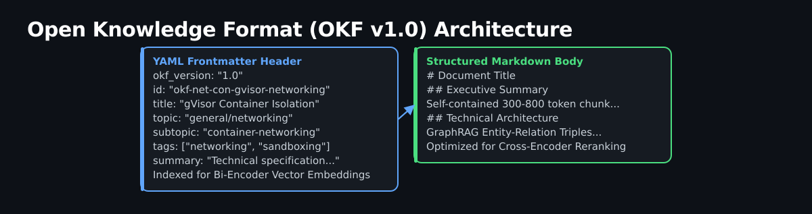
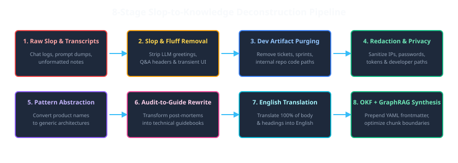
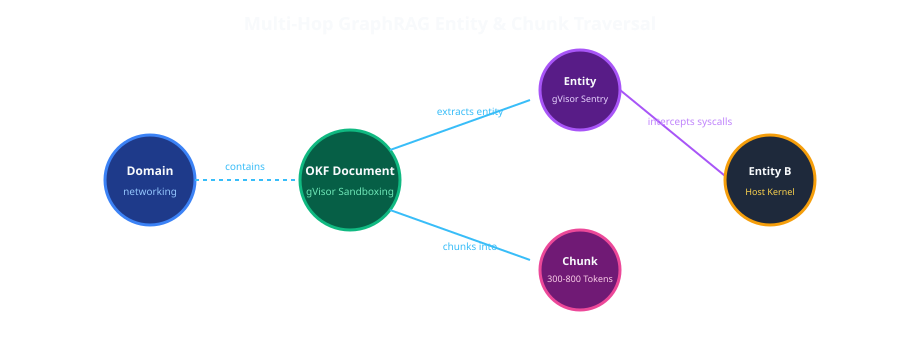

# Porting Heterogeneous Engineering Research into Open Knowledge Format (OKF v1.0) for Autonomous Agents & GraphRAG

## Executive Summary

As AI engineering teams accelerate software development through autonomous coding agents (Claude Code, Aider, OpenCode) and retrieval-augmented language models, traditional repository documentation faces a critical structural crisis: **unstructured research slop**.

Raw research dumps, conversational LLM transcripts, and ad-hoc chat logs are filled with conversational filler, hallucinated code fragments, ephemeral ticket numbers, and sensitive developer environment state. When fed into Vector RAG or GraphRAG pipelines, this noise severely degrades retrieval precision, causes cross-encoder rerankers to hallucinate, and introduces security leaks.

This article details the architectural design of the **Open Knowledge Format (OKF v1.0)** specification and the **8-Stage Slop-to-Knowledge Pipeline** used to port heterogeneous research notes into a clean, standalone, machine-readable knowledge base.

---

## 1. The Challenge: Unstructured Research Slop in Agent Pipelines

Modern AI development workflows generate massive volumes of technical context during exploratory research phases. However, raw chat dumps and unformatted markdown notes exhibit four fundamental anti-patterns when ingested by AI agents:

1. **High Noise-to-Signal Ratio**: Conversational fluff (*"Here is a draft...", "Use code with caution"*) consumes valuable embedding context windows without adding semantic value.
2. **Ephemeral Ticket & Line Coupling**: Hardcoded line numbers (`src/views/AdminUsersPage.tsx:105`) and sprint tickets (`TASK-051`, `Sprint 40`) pollute vector representations, causing retrieval drift as codebases evolve.
3. **Sensitive Data Leaks**: Internal IP addresses (`88.198.67.200`), passwords, and developer paths (`/home/username`) risk accidental public exposure.
4. **Branding & Naming Fragmentation**: Project-specific codenames or phantom product titles obscure the underlying universal architectural patterns.

A RAG pipeline is only as good as the signal density of its underlying corpus: feeding unstructured chat logs into a vector database is akin to indexing raw network packet dumps without parsing protocols.

---

## 2. The Open Knowledge Format (OKF v1.0) Architecture

To solve documentation fragmentation and make research usable by both embedding-based retrieval and simpler metadata scoring alike, we designed the **Open Knowledge Format (OKF v1.0)**.



### 2.1 The Two-Tier Directory Taxonomy

OKF decouples universal open-source research from product-specific gateway specifications across a clear two-tier layout:

```
knowledge/
├── skills/                               # Knowledge Management Operational Skills
│   ├── okf-document-creation.md
│   └── research-slop-to-knowledge-pipeline.md
├── general/                              # Domain-Agnostic Technical Research
│   ├── networking/
│   ├── container-runtime-security/
│   ├── llm-orchestration-and-routing/
│   ├── security-and-observability/
│   ├── agent-systems-and-browser-automation/
│   ├── identity-and-access-control/
│   ├── frontend-and-ui-architecture/
│   ├── analytics-and-telemetry/
│   └── articles/                        # Published Technical Blog Posts
└── gateway-specifications/               # Gateway Technical Specifications & ADRs
    ├── audits-and-handoffs/
    └── positioning-and-plans/
```

### 2.2 YAML Frontmatter Schema

Every OKF Markdown file begins with a mandatory, machine-readable YAML frontmatter block:

```yaml
---
okf_version: "1.0"
id: "okf-net-con-gvisor-container-networking"
title: "gVisor Container Networking & Interface Isolation"
topic: "general/networking"
subtopic: "container-networking"
status: "published"
visibility: "public"
created_at: "2026-09-14"
tags:
  - networking
  - container-networking
summary: "Technical evaluation of gVisor network stack isolation and Docker bridge interface configurations."
---
```

---

## 3. How an Agent Actually Reads an OKF Document

The frontmatter block is not decorative — it is the cheap part an agent reads *before* deciding whether the expensive part (the full document body) is worth loading into its context window at all.

A typical agent research loop over `knowledge/`:

1. **List, don't load.** An agent (or a simple script) reads only the frontmatter of every document — `topic`, `subtopic`, `tags`, `summary` — which together are a few hundred bytes per document, regardless of how long the body is. For a knowledge base with dozens of documents, that is a trivial amount of context.
2. **Filter on structured fields, not prose.** Because `topic`/`subtopic`/`tags` are a fixed, small vocabulary (see the two-tier taxonomy above) rather than free-text, an agent can filter deterministically — "give me every document where `topic` starts with `general/container-runtime-security`" — instead of needing an LLM call just to guess relevance from unstructured prose.
3. **Load bodies only for the filtered subset.** Only after narrowing down via frontmatter does the agent actually read the Markdown body of the (small) set of candidate documents — the same reasoning behind any context-budget discipline: cheap structured metadata decides what is worth spending expensive context tokens on.
4. **The heading structure inside the body matters too.** Because Stage 8 of the pipeline (below) enforces heading-bounded sections, an agent that *does* load a document can jump to a specific `##` section instead of re-reading the whole file on a follow-up question — exactly what the portal's own chunk viewer does for a human, an agent can do for itself against the raw Markdown.

None of this requires embeddings, a vector database, or a reranker — it is plain frontmatter parsing plus string/heading matching. That is precisely why OKF documents are useful to both a full RAG stack (if one exists) and a much lighter agent loop that does not have one.

---

## 4. OKF vs. RAG: These Solve Different Problems

A common confusion: **OKF is not a replacement for RAG, and it is not a retrieval technique at all.** RAG (Retrieval-Augmented Generation) is a *runtime* technique — given a query, find relevant text and feed it to a model. OKF is a *document-authoring convention* that runs *before* any retrieval happens: it decides how a document is structured, tagged, and split, so that whichever retrieval method sits on top of it — vector embeddings, a reranker, simple keyword/tag scoring, or graph traversal — gets clean input instead of raw chat slop.

Concretely:
- **Without OKF**: a raw chat transcript gets chunked arbitrarily (mid-sentence, mid-code-block), embedded as-is (including greetings and disclaimers), and retrieval quality suffers because the chunks don't correspond to actual semantic units.
- **With OKF**: a document already has clean heading boundaries, an explicit topic/subtopic/tag taxonomy, and no conversational noise — so a chunker splits on real section boundaries, an embedding model embeds signal instead of filler, and a simpler system (like the metadata-scoring approach the live portal actually uses, see below) can skip embeddings entirely and still get relevant results from title/tag/topic overlap alone.

OKF documents work equally well as input to a full vector-RAG stack (if you build one) or to the much simpler frontmatter-driven graph and scorer that is actually running today (next section) — it does not require either.

---

## 5. How This Actually Renders: The Live Pipeline

This is not a diagram of an aspirational system — it is what actually runs, end to end, on every push:

1. **Author** writes/edits an OKF document (frontmatter + Markdown body) in `knowledge/`.
2. **GitHub Actions** (`pages.yml`) fires on push: validates every document's frontmatter against the OKF schema (a malformed document fails the workflow, not silently), then generates two artifacts from all valid documents — `manifest.json` (the graph: every doc, topic, subtopic, and tag as a node, with edges wherever a doc shares a topic/tag) and `_sidebar.md` (the Docsify navigation tree).
3. **Docsify** (a zero-build static-site renderer that reads Markdown directly at request time, no static-site generator step) serves the actual document content — the sidebar comes from the generated `_sidebar.md`.
4. **A D3.js force-directed graph**, embedded on the portal's landing page, loads `manifest.json` and renders it interactively: click a node to highlight its 1-hop neighbors, double-click to jump into the Docsify view of that document.
5. **Per-document chunk view**: clicking into a node's detail panel loads the real Markdown and splits it client-side by heading, so you see one section at a time instead of the whole document.
6. **Optional retrieval-test chat**: a floating button opens a drawer where you pick a model (free tier: Llama-3.2, Gemma-2, Mistral via OpenRouter; or GPT-4o/4o-mini) and optionally paste an API key (kept in `localStorage`, never sent anywhere but the model provider). Without a key, it shows you the top-4 documents a simple client-side scorer (title/tag/summary/topic overlap against your question) picked. With a key, it sends those top documents as context and returns a model answer with citations back to the source docs.

Live: https://ji-podhead.github.io/agentic-knowledge/

---

## 6. The 8-Stage Slop-to-Knowledge Pipeline

Porting raw, chaotic research dumps into standardized OKF documents follows a systematic 8-stage editorial pipeline — a documented operational skill an editor (human or agent) follows deliberately, not a standalone automated tool:



### Pipeline Stages Breakdown

1. **Ingestion & Taxonomy Partitioning**: Categorize raw notes into `general/` domain topics or `gateway-specifications/` planning files.
2. **Conversational Slop & Fluff Removal**: Strip greetings, LLM disclaimer meta-talk, and transient UI layout proposals.
3. **Internal Project Artifact Purging**: Remove ticket numbers (`TASK-xxx`), sprint tags (`Sprint xx`), work packages (`WPx`), and specific internal repository file paths.
4. **Sensitive Data Redaction**: Sanitize IP addresses, credentials, passwords, and local developer home paths.
5. **Branding Abstraction**: Refactor product codenames and phantom terms into generic architectural concepts (*the multi-provider gateway*, *the L7 ingress proxy*).
6. **Audit-to-Guide Transformation**: Rewrite internal post-mortems and salvage logs into standalone technical guidebooks.
7. **Technical English Translation**: Standardize 100% of body prose and headings into technical English.
8. **OKF & Graph Synthesis**: Prepend OKF YAML frontmatter and split the document into heading-bounded chunks, so a chunk viewer can jump straight to a section instead of showing the whole document.

---

## 7. Multi-Hop Graph Traversal (Docs × Topics × Subtopics × Tags)

Vector-only RAG relies on semantic proximity, which often fails at multi-hop reasoning (e.g. *"Which container runtime sandbox mitigates UFW firewall bypass risks when using custom Docker bridges?"*).

The live knowledge portal (below) builds its graph directly from OKF frontmatter — not from NLP entity extraction over prose. Each document's `topic`, `subtopic`, and `tags` fields become nodes, and shared topics/tags become the edges connecting documents. A GitHub Actions workflow validates every document's frontmatter, generates a `manifest.json` from it, and deploys a Docsify + D3 force-directed graph on top:



### What the graph nodes actually are

```
(Doc: "gVisor Container Networking") ──[topic]──► (general/networking)
(Doc: "gVisor Container Networking") ──[tag]────► (container-networking)
(Doc: "Docker Bridge Isolation")     ──[tag]────► (container-networking)
```

Two documents sharing a tag or topic become graph-neighbors — click a node to see its 1-hop/2-hop neighborhood, double-click to open the document itself. This is metadata-driven graph traversal, not semantic entity-relation extraction; it is simpler than "GraphRAG" in the academic sense, but it is real, live, and running today at the portal linked in Sources below.

---

## 8. Case Study: Transformation Before & After

| Dimension | Raw Research Slop (Before) | OKF v1.0 Document (After) |
|---|---|---|
| **Structure** | Unformatted Markdown, Q&A chat transcripts | YAML Frontmatter + Standardized H1/H2 Hierarchy |
| **Noise Level** | High (LLM disclaimers, greetings, UI ideas) | Editorial goal: no conversational filler, only technical signal |
| **Privacy** | Leaked internal IPs, passwords, developer paths | Editorial goal: redacted before publication |
| **Language** | Mixed German/English conversational prose | Technical English |
| **Retrieval** | Poor (no structure, no metadata to filter by) | Topic/tag/heading-bounded chunks a graph and a client-side scorer can actually use |

---

## 9. Conclusion & Best Practices

Structuring engineering research into Open Knowledge Format (OKF v1.0) bridges the gap between human technical writing and machine agent retrieval. By enforcing strict frontmatter schemas, removing conversational slop, sanitizing sensitive data, and structuring topic/tag relationships, technical knowledge bases become truly agentic — enabling both human engineers and autonomous AI agents to reason accurately across complex systems.

## Sources

- Live portal built on this format: https://ji-podhead.github.io/agentic-knowledge/ (verified live, 2026-09-14)
