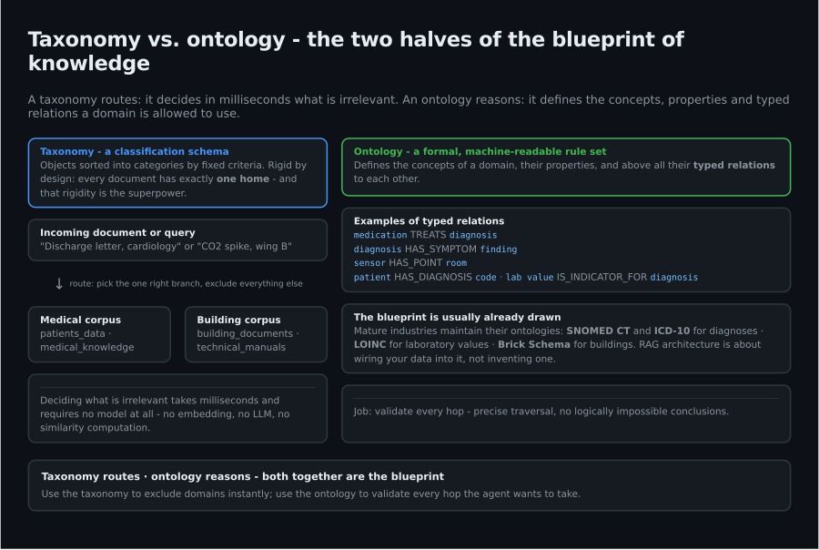
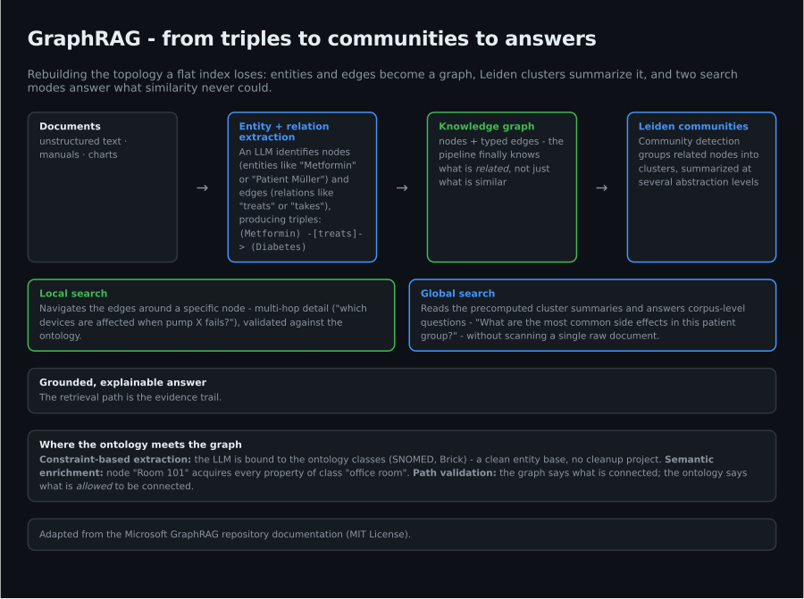
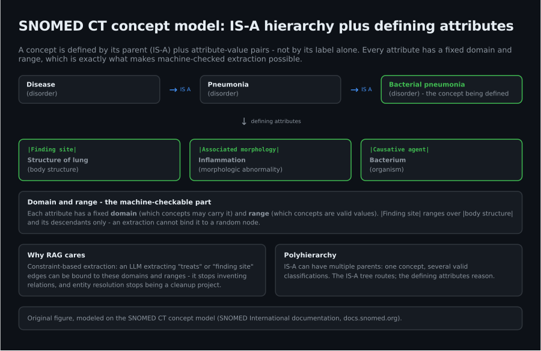
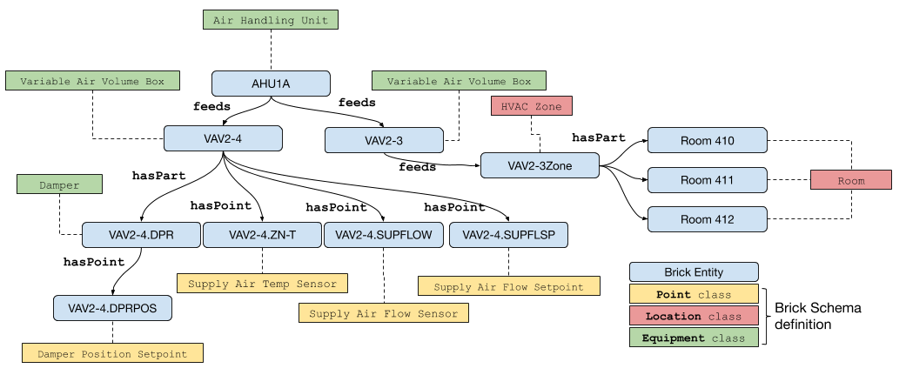

# The Blueprint of Knowledge: Why RAG Needs an Ontology, Not Just a Vector Store

Your RAG pipeline retrieved five chunks, and the answer sounded right. Sounding right is not being right — and no amount of cosine similarity will tell you the difference. What separates a demo from a production system is not a better embedding model. It is structure: a taxonomy to route, an ontology to reason with, and a graph to walk.

*Taxonomy routes, ontology reasons — the two halves of the blueprint of knowledge. (Original figure.)*

## The Flatness Problem

Classic RAG operates on a flat plane: text is split into chunks, vectorized, and recovered by mathematical similarity. The price of this simplicity is the loss of topological structure. Chunks are isolated information units — the pipeline knows what is *similar*, never what is *related*.

Ask a flat RAG system which devices are affected when pump X fails, and it will confidently return chunks about pumps. None of them are wrong. None of them answer the question.

## Taxonomy vs. Ontology: The Blueprint of Knowledge

A taxonomy is a classification schema: objects are sorted into categories by fixed criteria. It is rigid — every document has exactly one home — and that is precisely its superpower: deciding what is irrelevant takes milliseconds and requires no model at all.

An ontology is more than a list of categories. It is a formal, machine-readable rule set that defines the concepts of a domain, their properties, and above all their *relations* to each other: a medication TREATS a diagnosis, a sensor HAS_POINT in a room, a diagnosis HAS_SYMPTOM a finding.

The good news: you rarely have to invent one. Mature industries already maintain them — SNOMED CT and ICD-10 for diagnoses, LOINC for laboratory values, the Brick Schema for buildings. The blueprint of knowledge is usually already drawn; RAG architecture is about wiring your data into it.

## The Vector Database Is the Foundation — Payloads Are the Filter

A vector database stores text chunks as embeddings and answers with semantic similarity. The naive implementation stops there. The production pattern adds structured payload metadata to every vector — patient_id, document_type, timestamp, device_id — and uses those payloads as the primary, exact filter. The vector search then only ranks within an already-correct subset.

Three search modes coexist in a well-built system: vector search for meaning, semantic search for intent, and fuzzy search (Levenshtein distance) for identifiers, error codes and names with typos. And remember the asymmetry: word embeddings are holistic — they capture the context of a whole passage — while entity extraction is selective — it labels the specific things in the text and ignores the rest. Retrieval needs both.

## Two Ingestion Processes, One Synthesis Engine

How data lands in the database has two very different answers, depending on the data:

**Process A — building the knowledge base** (expensive once, reused forever). Unstructured expert knowledge — textbooks, guidelines, studies — goes through a curated, LLM-intensive pipeline: intelligent chunking along semantic boundaries, entity extraction per chunk, relevance reranking to filter the junk, and only then embedding and storage of the high-value remainder.

**Process B — ingesting instance data** (cheap, repeatable). A single document — a discharge letter, a maintenance log — is classified and its metadata extracted against the ontology schema (patient_id, document_type, date). No open-ended entity extraction. Simple chunking, embedding, stored together with the rich payload.

RAG is the synthesis engine between the two: precise, filtered queries against instance data, enriched with deep context from the knowledge base. The expensive investment in A is what makes every cheap document in B retrievable with surgical precision.

*From triples to communities to answers. (Adapted from the Microsoft GraphRAG repository documentation, MIT License — confirmed.)*

## GraphRAG: Rebuilding the Topology

GraphRAG transforms unstructured data into a knowledge graph. An LLM identifies nodes (entities such as "Metformin" or "Patient Müller") and edges (relations such as "treats" or "takes"), producing triples: subject — predicate → object. Community detection (the Leiden algorithm) then groups related nodes into clusters, summarized at several abstraction levels.

This restores the two search modes a flat index cannot provide. **Local search** navigates the edges around a specific node — multi-hop detail. **Global search** reads the precomputed cluster summaries and answers corpus-level questions ("What are the most common side effects in this patient group?") without scanning a single raw document.

## Where the Ontology Meets the Graph

Combining GraphRAG with an ontology yields a system that is semantically flexible (LLM, vectors) and logically precise (graph, rules) at the same time. Three mechanisms do the work:

**Constraint-based extraction.** The LLM no longer extracts entities freely; it is bound to the ontology classes (SNOMED, Brick). This guarantees a clean entity base — entity resolution stops being a cleanup project.

**Semantic enrichment.** The graph inherits along the ontology hierarchy: node "Room 101" automatically acquires every property of class "office room".

**Multi-hop reasoning with path validation.** When the agent walks the graph ("find all devices affected by the failure of pump X"), the ontology validates the paths. This is what prevents logically impossible conclusions — the graph says what is connected, the ontology says what is *allowed* to be connected.

## Use Case A: The Medical Assistant

A physician faces a patient with a rare condition and needs the best evidence-based strategy. The anamnesis is inconclusive; the case is uncommon.

The ontology runs on established standards: ICD-10-GM codes every diagnosis ("I10.0 — Essential hypertension"), LOINC gives every lab value a global identity regardless of which lab produced it, and defined relations connect them: patient HAS_DIAGNOSIS code, lab value IS_INDICATOR_FOR diagnosis, medication TREATS diagnosis.

*SNOMED CT concept model: IS-A hierarchy plus defining attributes (finding site, associated morphology, causative agent). (Original figure, modeled on the SNOMED CT concept model — SNOMED International documentation, docs.snomed.org.)*

The Qdrant collections mirror the two ingestion processes: patients_data — the digital twin of the chart, every chunk tagged with ICD-10 codes, LOINC IDs, patient_id and date — and medical_knowledge — curated guidelines and systematic reviews. The agent's toolset closes the loop: it reads the exact diagnosis and the relevant lab parameters from patients_data, formulates a precise English query for PubMed or the Cochrane Library, and returns a synthesis of the newest evidence. When the anamnese runs dry or the case is rare, that tool bridges the gap between static internal data and the current state of research.

## Use Case B: The Building That Explains Itself

A facility manager faces recurring energy spikes in one wing. The cause is an unknown fault code that appears in none of the internal documents.

Here the ontology is the Brick Schema: classes like HVAC_System, VAV, Temperature_Sensor, Room, Floor, Building, and relations like feeds (an air duct supplies a room), hasPoint (a room has a sensor) and isLocationOf (a sensor is located in a room).

*Brick Schema example model: AHU feeds VAVs, VAVs have points and feed zones/rooms — the same feeds/hasPoint/hasPart pattern used in the BrickSchema/Brick GitHub examples. (Source: brickschema.org, BSD-3-Clause.)*

The collections again follow the pattern: building_documents as the digital twin (maintenance logs, system logs, device manuals, energy reports — each chunk tagged with device_id, location, system_type, timestamp), technical_manuals as generic expert knowledge, and a separate timeseries database for the raw high-frequency sensor data. The same payloads that power diagnosis power analytics: CO2 trends across years, inefficiency detection, failure prediction.

The agent's toolset mirrors the medical case with an external twist: it identifies all affected devices over the Brick knowledge graph, filters the internal documents for prior attempts and specifications, and in parallel runs a web search for the unknown fault code — manufacturer forums, documentation, blog posts — and reconciles the external findings with the internal history. The system combines what the building knows with what the world knows.

## Takeaways

- Similarity is not relatedness. Flat RAG answers "what is like this", never "what is connected to this".
- Taxonomy routes, ontology reasons: use the taxonomy to exclude domains instantly, the ontology to validate every hop.
- Payloads are the primary filter; the vector search only ranks within an already-correct subset.
- Ingest twice: invest heavily once in a curated knowledge base (A), keep instance ingestion cheap and schema-driven (B).
- The use cases are one architecture. Swap ICD-10/LOINC for Brick and the medical assistant becomes the building analyst.

## Sources (to verify at publication)

- Lewis et al. 2020, Retrieval-Augmented Generation for Knowledge-Intensive NLP Tasks — https://arxiv.org/abs/2005.11401
- Edge et al. 2024, From Local to Global: A Graph RAG Approach to Query-Focused Summarization — https://arxiv.org/abs/2404.16130
- Traag, Waltman & van Eck 2019, From Louvain to Leiden — https://arxiv.org/abs/1810.08473
- Malkov & Yashunin, HNSW — https://arxiv.org/abs/1603.09320
- Brick Schema — https://brickschema.org
- LOINC — https://loinc.org
- ICD-10 — https://www.who.int/standards/classifications/icd
- SNOMED CT Concept Model — SNOMED International documentation — https://docs.snomed.org/snomed-ct-practical-guides/snomed-ct-starter-guide/6-snomed-ct-concept-model
- Qdrant documentation — https://qdrant.tech/documentation/
- W3C Semantic Web — https://www.w3.org/2001/sw/

*Image credits: SNOMED CT figure is original artwork modeled on SNOMED International's published concept model. Brick Schema figure follows the public brickschema.org/BrickSchema-GitHub example pattern (BSD-3-Clause). GraphRAG pipeline figure is adapted from the Microsoft GraphRAG repository documentation (MIT). All other figures are original artwork. Verified 2026-09-14.*
