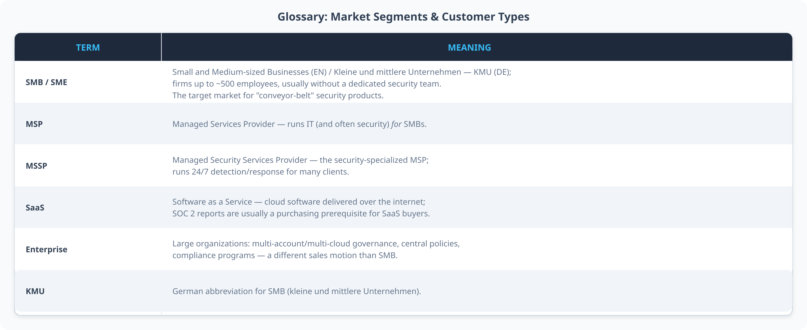
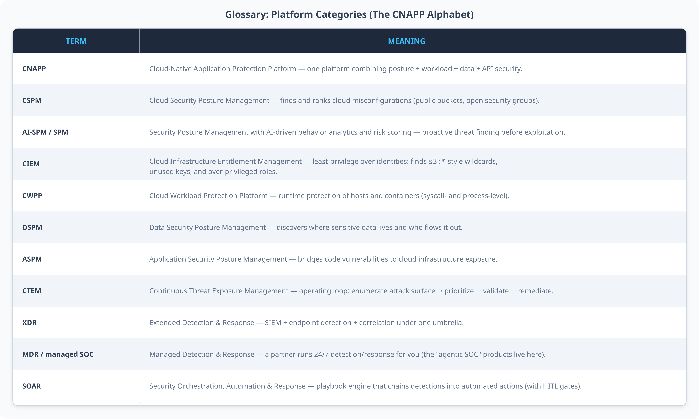
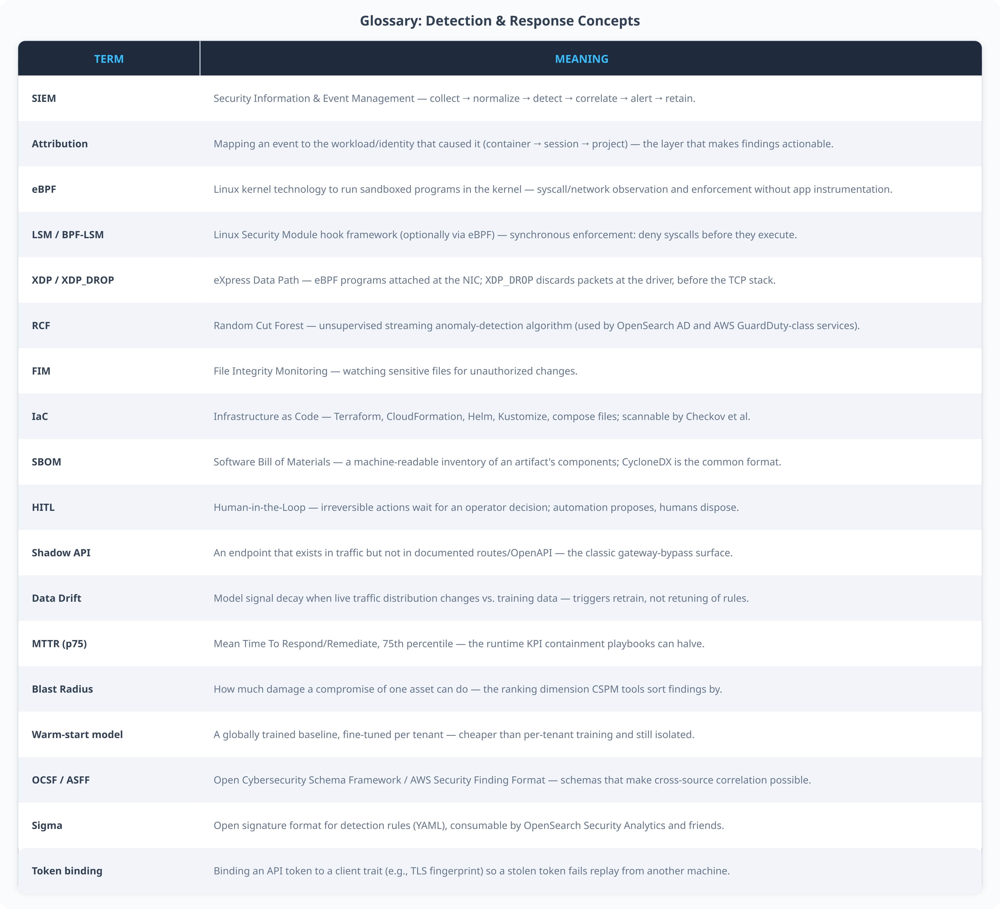
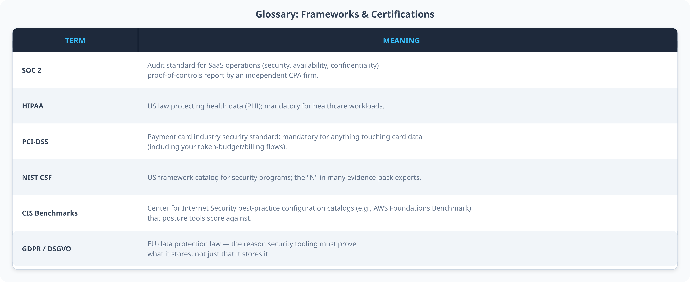

# You Have Logs. You Don’t Have a SIEM. — How to Build One: AWS-Native vs. Open Source (2026)


*Title image: same job, several ways to build it — this article walks through all of them.*

At some point every growing team hits the same wall. You've got a handful of `iptables`/`ufw` rules, a dashboard that shows CPU and memory, and a gut feeling that you'd notice if something bad happened. Then something almost happens — a scan you can't explain in the access log, a port you didn't remember opening, an alert from a tool you installed eighteen months ago and forgot existed — and you realize you have logs, but you don't have a **SIEM**. You have data. Nobody is looking at it, nothing is correlating it, and nothing would tell you if three small, individually-boring events were actually one attack.

This is the point where most small and mid-sized teams start Googling "SIEM for SMB" and get buried in vendor marketing. So let's do the un-marketed version: what a SIEM actually is, which components do the real work (Suricata, eBPF sensors, firewalls, WAF, log correlation), what specifically breaks for small teams, and — because this is the question everyone eventually asks — whether to build it yourself with open source or hand it to AWS.

## What a SIEM actually does (the 60-second version)

"SIEM" gets used loosely, so first the honest definition: a SIEM (Security Information and Event Management system) is not a scanner and not an alert generator. It's a **correlate-and-retain engine** that sits over every log source you point at it, with the alert as the *output*, not the feature.


*Figure 1: The seven stages every SIEM performs, whether you host it yourself or rent it from a cloud provider.*

Three stages people consistently underestimate:

- **Normalization is the hard part, not detection.** Five log sources speak five dialects — a firewall drop, a web server access log, and a Suricata alert don't share a schema by default. The industry's answer is [OCSF](https://schema.ocsf.io/) (AWS's own finding format, ASFF, is OCSF-compatible). Whatever schema you pick, detection rules and ML models only compose across sources once everything has the same shape.
- **Attribution is what turns noise into an incident.** "A dropped connection happened" is nothing. "Container `checkout-api`, three seconds after an unusual outbound connection, followed by a shell spawned inside the same container" is an incident. If your pipeline can't chain events back to one workload, you're collecting logs, not detecting threats.
- **Triage has to be a ranked queue, not a wall of red alerts.** The formula that shows up in every serious CNAPP and CSPM product, because it's genuinely the right shape:

```
Risk Score = Exposure × Privilege × Data Sensitivity × Exploitability × Confidence
```

Is it reachable from the internet? What can it actually do? Does it touch PII/PCI/PHI? Is there a known exploit? How confident is the detector? Weights should be configurable per workload — a payments service should weight PCI-relevant findings much higher than a marketing site does.

## What small and mid-sized teams are actually defending against

Teams running production on one or two clouds with a handful of engineers face a narrower but very real threat surface. A recent CloudMatos piece on AI-driven SMB cloud security ("The Power of AI-Driven Automation in SMB Cloud Security," LinkedIn, Sept 2025) frames it well as two buckets:

**API attack surface:** endpoints with no rate limits or weak auth, "shadow APIs" that quietly bypass the gateway because someone exposed a service directly, credential stuffing and token replay against old handlers, and data exfiltration through overly broad response objects or chatty error messages.

**Misconfiguration and drift:** public storage buckets, security groups that allow more than they should, IAM sprawl (unused keys, wildcard `s3:*` policies), and container/Kubernetes risks — `hostPath` mounts, privileged containers, node ports exposed straight to the internet.

Both buckets show up constantly in vendor terminology as the **CNAPP alphabet** — worth knowing because every serious security tool you evaluate will describe itself using some subset of these letters:

- **CSPM** (Cloud Security Posture Management) — finds and ranks misconfigurations.
- **CIEM** (Cloud Infrastructure Entitlement Management) — least-privilege over identities and roles.
- **CWPP** (Cloud Workload Protection Platform) — runtime protection of hosts and containers.
- **DSPM** (Data Security Posture Management) — where sensitive data actually flows and exits.
- **API security** — shadow-endpoint discovery, schema enforcement, abuse detection.
- **CNAPP** (Cloud-Native Application Protection Platform) — the umbrella term when a vendor bundles several of the above.

None of these are separate products you strictly need to buy — they're *layers*, and the rest of this article maps each one to something you can actually run.

## The building blocks: what each sensor is actually for

Before comparing stacks, it helps to know what each piece of the puzzle does and doesn't do, because vendors love bundling them and the bundling hides real gaps.

- **Suricata** is a network intrusion detection/prevention engine. It watches raw packets against a signature ruleset — known exploit patterns, malicious payloads, protocol anomalies — and can run in inline (IPS, blocking) or passive (IDS, alert-only) mode. Its modern [XDP/eBPF capture mode](https://docs.suricata.io/en/suricata-8.0.5/capture-hardware/ebpf-xdp.html) drops matched packets at the network card before they reach the kernel's normal network stack, which is what makes line-rate inspection possible without a dedicated appliance. What it *can't* see: anything inside an encrypted TLS session, or what happens inside a process once a connection is already accepted.
- **eBPF-based runtime sensors** (the best-known open-source one is [Falco](https://falco.org/docs/), a CNCF project) fill exactly that gap from the other side: they watch **syscalls** inside the Linux kernel, per container, without needing a sidecar or code change. This is how you catch a shell spawned inside a container that should never spawn a shell, a process trying to escape its namespace, or a crypto-miner quietly burning CPU. eBPF runs in the kernel with verified, sandboxed bytecode — it's the mechanism that made "watch everything, cheaply, safely" possible on Linux without a kernel module.
- **Host agents** (file-integrity monitoring, vulnerability scanning, native container-engine visibility) close the remaining gap between "network" and "syscall": did a system binary change unexpectedly, is there a known-vulnerable package installed, did someone start a privileged container.
- **Firewall logs** are the most underrated signal of the four. A firewall that only *blocks* and never *logs* throws away the exact data you'd want during an investigation: which ports were probed, from where, how often. Both `nftables`/`ufw` (self-hosted) and cloud security groups can log drops — most teams simply never turn it on.
- **The correlation engine** — this is the actual "SIEM" part — takes all four of the above, normalizes them, and answers the one question none of them can answer alone: is this one incident or four unrelated events?

## Four ways to build it: self-hosted, managed cloud-native, managed SaaS, or minimal

Once you know the building blocks, there are, realistically, four ways to assemble them — two full architectures worth understanding in depth, plus a fully managed SaaS path and a genuinely minimal on-ramp.

### Approach A: the open-source stack


*Figure 2: The open-source stack. Every box here is a real, separately maintained open-source project — nothing here is a single vendor's product.*

The pattern is consistent across most open-source SIEM setups: sensors feed a manager, the manager correlates and writes structured alerts, and an indexer/dashboard layer (usually OpenSearch under the hood — [Wazuh](https://wazuh.com/platform/overview/) bundles exactly this as manager + indexer + dashboard, and ships a [documented Docker deployment](https://documentation.wazuh.com/current/docker/index.html)) gives you search, retention, and pre-built compliance views for PCI-DSS, GDPR, and HIPAA.

**What you get for free:** compliance dashboards, a maintained detection ruleset, full-text search over months of history, and — this matters more than it sounds — every byte of it stays in infrastructure you control, which is the simplest possible answer to a data-residency or GDPR question.

**What it costs you:** roughly 4 GB of RAM for a single-node stack, the discipline of applying updates, and the fact that you are now the one operating something Elasticsearch-adjacent. None of that is exotic, but it's real, ongoing work.

"Elasticsearch-adjacent" is worth unpacking, because the history explains why Wazuh runs on OpenSearch rather than the **Elastic Stack** (Elasticsearch + Logstash + Kibana, still commonly called "ELK") you'll hear about everywhere else. Elastic changed Elasticsearch's and Kibana's license in 2021 (away from Apache 2.0, to the SSPL and later the dual-licensed Elastic License), which is precisely the kind of licensing risk a project like Wazuh can't build a commercial product on top of. [OpenSearch](https://opensearch.org/) is AWS's Apache-2.0 fork of the pre-license-change Elasticsearch/Kibana code, and it's what both Wazuh and Amazon OpenSearch Service actually run today. If you've never deployed the Elastic Stack yourself: functionally it does the same job as OpenSearch (index, search, visualize) — Logstash is the ingest/transform pipeline, Elasticsearch the search engine, Kibana the UI — and Elastic still sells a genuinely strong SIEM product (Elastic Security) on top of it. The practical decision point for a small team is licensing and vendor relationship, not capability: Apache-2.0/OpenSearch if you want zero ambiguity about self-hosting and reselling, the Elastic Stack if you're fine depending on Elastic directly (including their own managed Elastic Cloud offering, which sidesteps the self-hosting question entirely).


*Figure 2b: What the OSS dashboard actually looks like — Wazuh's Incident Response module. (Illustrative third-party screenshot of the open-source product UI, not our own deployment.)*

#### The transport layer underneath: do you need Kafka?

At small scale, sensors ship straight to the SIEM manager (as in Figure 2) and that's genuinely fine. Once you have enough sensors, enough volume, or enough distinct consumers of the same log stream (the SIEM, a cost-monitoring job, a compliance export — all wanting the same events), teams reach for a message queue in between shippers and the indexer, mainly for two reasons: **durability** (the indexer being briefly down shouldn't mean lost events) and **fan-out** (one stream, several independent consumers, without shipping the same logs twice).

- **[Apache Kafka](https://kafka.apache.org/documentation/)** is the default answer at real volume — a distributed, partitioned, replicated log built exactly for this: high-throughput ingestion, configurable retention (replay the last 7 days if a consumer falls behind), and an enormous ecosystem of connectors (including a Kafka Connect sink straight into OpenSearch). The cost is operational: Kafka is its own distributed system to run, with its own failure modes.
- **[Redis Streams](https://redis.io/docs/latest/develop/data-types/streams/)** does a smaller version of the same job — an append-only log with consumer groups — and is the pragmatic choice if you already run Redis for caching/queues elsewhere and don't want to operate a second distributed system for log volume that doesn't actually need Kafka's scale. It doesn't replicate or partition the way Kafka does, so it's a "good enough up to a point" choice, not a drop-in replacement at high volume.

Where this **doesn't** apply: the AWS-native stack. CloudWatch Logs and Kinesis Data Firehose/Data Streams already *are* AWS's durable, buffered transport layer — you would not put Kafka in front of CloudWatch, you'd reach for Kinesis Data Streams directly if you needed Kafka-style partitioned fan-out on AWS. The other detail worth knowing cold: AWS's log formats are proprietary to AWS (CloudWatch Logs events, VPC Flow Log records, CloudTrail's JSON event structure) — they are not Kafka messages or a generic format, which is exactly why Security Hub's ASFF and Security Lake's OCSF normalization exist: something has to translate AWS's own shapes into one schema before cross-source correlation works at all.

### Approach B: the AWS-native stack

![Architecture diagram of an AWS-native security stack, using official AWS architecture icons — an ingest-and-edge row (CloudWatch Logs plus Kinesis Firehose, VPC Flow Logs, and WAF plus Shield at the edge) feeding five managed detection and modeling services (GuardDuty for ML threat detection, Inspector for vulnerability scanning, CloudTrail for signed API audit, Config for configuration drift, and SageMaker for custom ML models), all aggregating into a dark AWS Security Hub card that scores everything against compliance frameworks, branching into an OpenSearch Service dashboard and a Security Lake for long-term OCSF storage](stack_aws.png)

*Figure 3: The AWS-native stack (official AWS Architecture icons). Every self-hosted component in Figure 2 has a directly managed counterpart here — the trade is operational effort for a usage-based bill.*

Now the part most explainers skip: what each service in that diagram actually *does*, in enough detail that you could describe it in an interview.

**Getting the data in, first:**

- **[Amazon CloudWatch Logs](https://docs.aws.amazon.com/AmazonCloudWatch/latest/logs/WhatIsCloudWatchLogs.html)** is where your application and infrastructure logs land by default — every Lambda invocation, every ECS task's stdout, every EC2 log file you point the CloudWatch agent at. On its own it's just storage plus metrics and alarms; it becomes part of the SIEM pipeline once you attach a **subscription filter** that streams matching log events onward in near real time.
- **[Amazon Kinesis Data Firehose](https://docs.aws.amazon.com/firehose/)** is the delivery mechanism that actually moves those log events somewhere useful — it batches, optionally transforms, and reliably delivers streaming data to OpenSearch Service, S3, or Security Lake without you operating a single piece of streaming infrastructure yourself.
- **[VPC Flow Logs](https://docs.aws.amazon.com/vpc/latest/userguide/flow-logs.html)** capture metadata about every packet that crosses a network interface in your VPC — source/destination IP, port, protocol, bytes, accept/reject — without capturing payload content. This is the raw material GuardDuty's network-based ML detection actually runs on, and it's also directly queryable on its own for "who talked to what, when" during an investigation.

**The detection and aggregation layer:**

- **[Amazon GuardDuty](https://docs.aws.amazon.com/guardduty/)** is a continuously running, ML-based threat detector. It reads VPC Flow Logs, DNS query logs, CloudTrail management events, and — critically for anyone running containers — **runtime monitoring** for ECS and EKS workloads, watching for the same class of syscall-level anomalies eBPF sensors catch on your own boxes. You never train or tune it; you subscribe to it. The API you'll actually call is [`GetFindings`](https://docs.aws.amazon.com/guardduty/latest/APIReference/API_GetFindings.html), which returns the detailed alerts for your own dashboard.
- **[AWS Security Hub](https://docs.aws.amazon.com/securityhub/latest/userguide/what-is-securityhub.html)** is the aggregator and the single pane of glass. It pulls findings from GuardDuty, Inspector, and your own application (via `BatchImportFindings`, using the [ASFF](https://docs.aws.amazon.com/securityhub/1.0/APIReference/Welcome.html) format), scores your account against CIS, PCI-DSS, and other benchmarks, and normalizes every finding into one consistent shape. This is the AWS equivalent of the Wazuh dashboard, except you don't run it.
- **[Amazon OpenSearch Service](https://docs.aws.amazon.com/opensearch-service/)** is the managed search/retention layer — the same engine that powers the open-source stack's indexer, minus the operational burden. Its **Security Analytics** plugin ships pre-built [Sigma](https://sigmahq.io/) detection rules out of the box.
- **[AWS CloudTrail](https://docs.aws.amazon.com/cloudtrail/)** is the forensic backbone: a cryptographically signed, immutable log of every API call in your account — who stopped which instance, from which IP, at what time. `LookupEvents` gives you a 90-day searchable window without any extra setup.
- **[AWS Config](https://docs.aws.amazon.com/config/)** continuously tracks resource state and evaluates it against rules you define — it's what catches a security group that got opened to `0.0.0.0/0` or a drifted IAM policy *before* it becomes an incident, not after.
- **[Amazon Inspector](https://docs.aws.amazon.com/inspector/)** handles CVE scanning across EC2 instances, container images in ECR, and Lambda functions — the vulnerability half of the picture GuardDuty's threat detection doesn't cover.
- **[Amazon Security Lake](https://docs.aws.amazon.com/security-lake/)** is worth knowing about even if you don't need it on day one: it's OCSF-normalized, long-term storage purpose-built for security logs, queryable with Athena, for when your retention requirements outgrow a hot search index.
- **[AWS WAF](https://docs.aws.amazon.com/waf/) + Shield** sit at the network edge — more on this below.
- **[Amazon Bedrock](https://docs.aws.amazon.com/bedrock/)** is the newest piece of this puzzle: teams increasingly point an LLM at raw GuardDuty/Security Hub findings to generate a readable incident summary for a human analyst — the "agentic SOC" pattern. It's worth being skeptical of this in isolation (more on that in the AI section below), but it's a real and increasingly common addition.

**What you get:** zero patching, zero cluster babysitting, and detection that scales automatically as you add workloads — genuinely valuable if your team is three engineers and none of them wants to own an Elasticsearch cluster.

**What it costs:** GuardDuty and OpenSearch Service are volume-based — the bill grows with your log volume, which can get expensive at real scale — and you are, by definition, deeper into one vendor's ecosystem. Moving off it later means rewriting shippers and dashboards, not just changing a config file.

One real-world example worth knowing: [CloudiQS](https://cloudiqs.com/solution/security-assessment-solution/), an AWS Advanced Tier partner founded by ex-AWS engineers, builds almost exactly this stack for SMB and startup clients as a managed security assessment service — GuardDuty + Security Hub + Config + CloudTrail, evaluated against PCI-DSS, HIPAA, and CIS benchmarks, with Bedrock layered on top for the "agentic SOC" pattern. It's a useful reference for how this actually gets assembled in practice, not just in an AWS diagram.

### A quick side-by-side

![Table mapping eight security functions to their AWS-native and open-source implementations: network intrusion detection (GuardDuty vs Suricata+Falco/eBPF), central findings and scoring (Security Hub vs Wazuh Manager+OpenSearch), long-term log storage (OpenSearch Service+Security Lake vs self-hosted OpenSearch/ELK), signed API audit trail (CloudTrail vs auditd+syslog), configuration drift detection (AWS Config vs Checkov+periodic checks), vulnerability scanning (Inspector vs Trivy/Grype), web application firewall (AWS WAF+Shield vs Coraza/ModSecurity+OWASP CRS), and AI-assisted triage (Bedrock+SageMaker vs OpenSearch ML Commons+MLflow)](table_mapping.png)

*Figure 4: The same eight functions, two ways to get them. Nothing on the open-source side is a toy — every entry is a production-grade project used at real scale.*

### A third path: fully managed, cloud-agnostic SaaS SIEM

There's a real third option this framing so far skips: **pay a vendor to run the correlation engine and the dashboard, and just point your logs at them.** [Datadog Cloud SIEM](https://www.datadoghq.com/product/cloud-siem/) is the best-known example, alongside Splunk and Sumo Logic — and its appeal is specifically that it doesn't care whether your workloads are on AWS, GCP, on-prem, or all three at once, which neither Approach A nor B fully solves on its own.

The operational reality worth understanding before you budget for one of these: **you still have to deploy something, per data source.** Datadog doesn't magically see your AWS account — for CloudTrail and other AWS logs, the standard pattern is the [Datadog Forwarder](https://docs.datadoghq.com/logs/guide/forwarder/) (an AWS Lambda function, deployed via CloudFormation) subscribed to the S3 bucket CloudTrail already writes to, or to a CloudWatch Log Group directly; Datadog also accepts logs pushed straight from Kinesis Data Firehose to their HTTP log intake endpoint if you'd rather skip the Lambda. So the "it just reads the bucket" mental model is close but not quite right: something (the Forwarder Lambda) is *triggered* by new objects landing in the bucket and *pushes* them onward — it's event-driven, not a poller. Every additional AWS service you want visibility into (RDS logs, Lambda logs, ECS) is its own integration to enable, one at a time.

On GCP the equivalent friction is more expensive by default: **Cloud Logging and Cloud Monitoring** (the services that replaced the old "Stackdriver" branding) cover managed services automatically, but for a Compute Engine VM you have to install the **Ops Agent** yourself — an actual process running on an actual VM you're paying for, not a zero-footprint managed feature. That agent, plus the VM's own compute cost, is a real budget-line item most cost estimates for "GCP monitoring" quietly leave out.

**The budget-planning point that applies everywhere, not just GCP:** shipping logs off-cloud to a third-party SIEM (Datadog, Splunk, or your own self-hosted stack in a different account/region) crosses a network boundary, and crossing that boundary costs money on every major cloud — AWS charges for data transfer **out** of a region/VPC (and NAT Gateway processing if that's in the path), GCP charges egress similarly. At real log volume this is not a rounding error: budget for per-GB ingestion at the SIEM vendor *and* per-GB egress at the cloud provider as two separate line items, because vendor pricing pages almost never mention the second one.

### A fourth, lighter option: start smaller than any of these

If all of the above still sounds like more than a three-person team needs on day one, there's a genuinely minimal starting point: just the firewall logs and Suricata, shipped through a lightweight log agent (Promtail/Fluent Bit) into a hosted Grafana Loki instance, with Grafana as the dashboard. No correlation engine, no Wazuh, no OpenSearch cluster, no per-GB SaaS bill — just visibility and alerting rules on top of two sensors. It's not a SIEM in the full sense (no real correlation, no compliance module), but it beats "no logs are being looked at," and it's a sane on-ramp before you commit to any of the three heavier paths above.

## Controlling traffic: ports, IP allowlists, and the WAF layer

This is the part most SIEM explainers skip, and it's the one operators actually lose sleep over: which ports are open, to whom, and what happens at the edge before traffic ever reaches your application.

![Traffic-control flow diagram — a client on the internet reaches an edge layer combining a firewall (only required ports open, source-IP allowlist for admin ports) and a WAF (OWASP Core Rule Set, rate limits, geo/IP blocking), which forwards allowed traffic to the application/gateway (identity check, payload inspection, per-user rate limits — the only point that sees decrypted content) and on to the backend, while rejected traffic is blocked and logged rather than silently dropped; a note calls out that a published container port can bypass host firewall rules via NAT as a classic pitfall](traffic_control.png)

*Figure 5: Two layers of traffic control, doing two different jobs — the firewall decides who gets to knock, the WAF decides which knocks look malicious.*

**Firewalls and IP allowlisting.** The principle is the same everywhere: default-deny, then explicitly allow only what needs to be reachable. On a self-hosted box that's `nftables` or `ufw` — a rule that says "port 22 accepted only from `10.0.0.0/8`" is an IP allowlist. On AWS it's Security Groups (stateful, attached to instances/ENIs) plus Network ACLs (stateless, at the subnet boundary) — functionally the same idea, enforced by the cloud provider instead of your kernel.

There's a specific, well-documented gotcha worth knowing regardless of which side you're on: **published container ports and host firewalls don't always agree.** Docker's default networking uses NAT (`iptables`'s `nat` table) to publish a container port onto the host, and that traffic traverses the `FORWARD` chain — not `INPUT`. Many firewall front-ends (`ufw` is the classic example) only manage the `INPUT` chain by default, which means a port your firewall UI proudly reports as "blocked" can be sitting wide open because Docker's own NAT rule routes around it entirely. The only reliable fix is to verify **actual** reachability — cross-check what's genuinely listening (`ss -tlnp`) against what Docker has published (`docker ps` port bindings) — rather than trusting the firewall's stated configuration.

**The WAF layer.** A WAF operates one level up from the firewall: it terminates TLS and inspects HTTP/L7 traffic specifically — OWASP Top 10 patterns (SQL injection, XSS, path traversal), rate limiting, and geo/IP-based blocking. Open source: [Coraza](https://coraza.io/) (a modern, Go-native WAF engine, Apache-2.0 licensed) or classic [ModSecurity](https://github.com/SpiderLabs/ModSecurity), both typically paired with the [OWASP Core Rule Set](https://coreruleset.org/). Managed: AWS WAF + Shield, with managed rule groups maintained by AWS and marketplace vendors.

The one nuance worth internalizing: a WAF only ever sees what's in the HTTP request — for an API-heavy or LLM-adjacent application, the *application/gateway layer itself* is often the only place with guaranteed visibility into fully decrypted, fully parsed payload content. That's why the division of labor in Figure 5 matters: the WAF blocks the loud, generic attacks; the application enforces identity and inspects content it understands better than any generic rule can.

## Catching misconfiguration before it ships: IaC scanning

Everything above assumes the infrastructure is already running. The cheaper fix is catching a bad configuration *before* it goes live — a Terraform module that creates a public S3 bucket, a Kubernetes manifest that mounts the Docker socket into a pod, a `docker-compose.yml` that runs a container as privileged.

This is what Infrastructure-as-Code (IaC) scanners like [Checkov](https://www.checkov.io/) (Bridgecrew/Prisma Cloud, Apache-2.0, fully open source) do: they statically analyze Terraform, CloudFormation, Kubernetes manifests, and Dockerfiles/`docker-compose.yml` against a large library of policies mapped to CIS benchmarks and best practices, and fail the pipeline before the misconfiguration exists anywhere but in a diff. The CloudMatos framing calls this "shift-left" — infrastructure into code, hooks before you commit, no risky defaults like public buckets or `0.0.0.0/0` security groups — and it's the cheapest possible security control per finding, because nothing has to be scanned at runtime to catch it.

The natural place to run it is twice: once pre-commit or in CI against your infra repo, and again as a **quarantine gate** immediately before a deployment goes live — scanning the actual manifest that's about to be applied, not just the one that was last reviewed. AWS Config plays a similar role at runtime (catching drift *after* something changes live); Checkov's value is catching the same class of problem *before* anything changes at all.

## Attributing a threat to one deployment, not "the platform"

If you run more than one application, "something suspicious happened" is not useful — "something suspicious happened **in the checkout service**" is. This is the attribution problem, and it's solved the same way on both sides of the fence: consistent tagging, all the way down.

On AWS, this means resource tags (project, environment, team) applied consistently to every EC2 instance, ECS task, and Lambda function — GuardDuty and Security Hub findings carry the resource ARN, so a finding is filterable by tag from the moment it's created, and a per-application dashboard is just a filtered view of Security Hub, not a separate system. On the open-source side, the equivalent discipline is enriching every log line with container name, Docker/Kubernetes labels, and namespace *before* it's shipped to the SIEM — Suricata's flow metadata can be correlated with `conntrack`/container network namespaces to tie a network event back to the container that generated it, and the indexer (OpenSearch/Kibana) can then facet by that label the same way Security Hub facets by tag.

The uncomfortable truth: this only works if the tagging/labeling discipline is enforced from day one. A SIEM cannot retroactively attribute an event to a deployment that was never tagged — "no owning tag" just becomes its own bucket, and a large one if the discipline slips.

## The Two-Stage AI Security Response: Cheap Detection, Expensive Thinking

Rules catch known patterns. They don't catch a valid, un-revoked API key quietly exfiltrating 40 GB at 3 a.m., because nothing about that traffic trips a signature — it's *behaviorally* wrong, not *structurally* wrong.

To solve this cheaply and accurately, modern Security Operations Centers (SOCs) converge on a two-stage architecture (often called **edge-to-core triage**). The core idea: a small, always-on statistical model does the initial sorting, and the expensive LLM agent only wakes up when the sorter flags something.

![Large two-stage AI security response flowchart with official AWS architecture icons inlined — Stage 1: log streams via CloudWatch feed the always-on anomaly detector (GuardDuty icon, dark card: RCF / embeddings+KNN / SLM distills, statistical not generative), with the normal 99.9% archiving to S3 for retention; Stage 2 (fired only on anomalies): EventBridge-to-Step-Functions orchestration wakes the reasoning agent (SageMaker icon, dark card: DeepSeek-R1 / Claude 5-gen chain-of-thought, Bedrock Agent on AWS, agents-tools+DeepSeek connectors on OSS, RAG over runbooks plus context tools for IP reputation, maintenance windows, identity history and FIM state); verified attacks execute a scoped Lambda playbook — attacker IPs into an eBPF kernel map with XDP_DROP at the NIC, or execve intercepted via LSM returning EACCES/SIGKILL while the container survives for forensics — while false positives feed a red dashed retrain loop back into detector thresholds; includes the cost-math card, the red note that the LLM is the orchestrator never the sensor, and the guardrail band (read-mostly tool catalog, policy-gated irreversible actions, confidence+model_version on every ML finding)](ai_response_flow.png)

*Figure 6: The two-stage model (official AWS Architecture icons, large format). Stage 1 (RCF/embedding/SLM sorting — statistical and ~free) runs 24/7; Stage 2 (the reasoning agent, costing cents per call) fires only on the ~0.1% of events that get flagged. The sorter knows "pod B is sending 400× its 14-day baseline" — it has no idea what an SQL injection *is*; the agent provides the semantics.*

### Stage 1: The Statistical & Anomaly Detection Engine

At Stage 1, we want maximum coverage at minimum cost. We model a mathematical baseline of your traffic and raise alerts when live patterns deviate from it. This stage is unsupervised, statistical, and runs per-event at ~zero marginal cost.

![Pipeline diagram of an anomaly-detection MLOps lifecycle — six steps from features extracted from gateway/app logs (bytes sent, unique destination IPs) through model training (Isolation Forest / Random Cut Forest via SageMaker or MLflow) and an evaluation stage gated on false-positive rate below 1%, into a model registry awaiting manual approval, then a realtime inference endpoint emitting anomaly scores, into a model monitor comparing live traffic against training distributions, with a continuous-retrain loop closing back to feature extraction and a note that findings carry confidence and model version and only ever add to the rule layer](mlops_pipeline.png)

*Figure 6a: Anomaly detection as a managed lifecycle. The false-positive gate and the retrain loop are what separate this from a one-off notebook.*

Mechanically, this is built using:
- **AWS-Native:** [GuardDuty's built-in ML](https://docs.aws.amazon.com/guardduty/) gives you instant, zero-configuration anomaly detection. For custom behavior monitoring, [Amazon SageMaker](https://docs.aws.amazon.com/sagemaker/) manages the full MLOps lifecycle: a **Feature Store** transforms logs (rolling bytes, unique destinations), **SageMaker Pipelines** automate the training DAG, and **Model Monitor** detects data drift.
- **Open Source:** [OpenSearch's ML Commons](https://opensearch.org/docs/latest/ml-commons-plugin/) plugin runs anomaly detection directly inside the indexing cluster using algorithms like **Random Cut Forest** or embedding-based distance (K-Means/KNN). No separate training infrastructure required. [MLflow](https://mlflow.org/) acts as the model registry.

The golden rule here: an ML-generated finding carries a `confidence` score and a `model_version`, and it **adds** to the rule layer — it never replaces it. A detector that can't explain why it fired is an alert-spam generator with extra steps.

### Stage 2: The Agentic Reasoning & Semantic Triage

Stage 2 is where the reasoning happens. The expensive LLM agent only spends tokens on events flagged by Stage 1.

- **The Reasoning Engine:** We utilize 2026-class models like **DeepSeek-R1** (open source, deployable anywhere) or the latest **Claude 5-generation**. These models do not just generate text; they utilize internal chain-of-thought step-by-step reasoning ("unusual binary called → no git pipeline change → high anomaly score → exploit").
- **Semantic Correlation:** The agent correlates the numeric anomaly with everything the math alone couldn't understand: Is the source IP a Tor exit node? Is there an active maintenance window? Does this identity usually call this API?
- **Scope & Safety:** AWS's Bedrock Agent, OpenSearch's [agents-tools framework](https://docs.aws.amazon.com/agents), and **Elastic's AI Assistant** (powered by Bedrock) all implement plan-execute-reflect loops with registered tool catalogs. Access is strictly read-mostly (e.g., query findings, read policies) to ensure agentic operations remain safe rather than reckless. An LLM watching raw log streams directly would be too slow, too expensive, and too hallucination-prone for JSON triage — which is why nobody serious builds it that way, and why "the LLM is the orchestrator, never the sensor" is the sentence to internalize.
- **Declarative Containment:** Advanced integrations like **Elastic Workflows** use declarative, YAML-based playbooks to turn the agent's findings into immediate action—automatically revoking compromised IAM access keys or isolating a node from the network, providing automated containment within seconds.

### How the wiring actually looks, end to end

It's one thing to name the services, another to describe how a finding actually travels from a detector to a human. Two concrete wiring diagrams, in words:

**On AWS**, the built-in path needs no wiring at all: GuardDuty runs continuously and writes directly into Security Hub — nothing to deploy. The *custom* path looks like this: a SageMaker endpoint scores incoming events → a small Lambda function calls the endpoint (`InvokeEndpoint`) and, above the confidence threshold, calls Security Hub's `BatchImportFindings` to insert a properly-shaped ASFF finding → that finding now shows up next to GuardDuty's own findings, indistinguishable in the UI except for its `ProductArn` and confidence field. The agentic-triage layer sits one step further out: a [Bedrock Agent](https://docs.aws.amazon.com/bedrock/latest/userguide/service_code_examples_bedrock-agent.html) can be given `GetFindings` as a callable action, so an analyst asks it a question in plain language ("summarize today's high-severity findings for the checkout service") and the agent calls the real AWS API, not a static export — the LLM narrates, Security Hub still holds the ground truth.

**On-prem/OSS**, the equivalent chain: OpenSearch's ML Commons anomaly detector runs against a specific index pattern (e.g., firewall-logs-*), writes its anomaly results into a dedicated results index, and a Kibana/OpenSearch Dashboards alerting rule watches that results index and fires the same way a rule-based detection would — from the SIEM's perspective, an ML finding and a Sigma rule match are just two rows in the same alerts index, distinguished by a `detector_type` field you define yourself. There is no equivalent of "Bedrock Agent calling a live API" out of the box in the open-source stack; the closest pattern is self-hosting an LLM (or calling one via API) with a small tool-calling layer of your own in front of the OpenSearch query API — which is exactly the kind of narrow, read-mostly tool-scoping (specific queries only, no arbitrary index deletion) that makes agentic access to security infrastructure safe rather than reckless.


### The AWS-published version of this exact pattern

This is not a hypothetical architecture — AWS itself published it as a buildable reference ("Automate cloud security vulnerability assessment and alerting using Amazon Bedrock", ML Blog, Nov 2024 — saved locally at `docs/reference/aws/ai_security.md`), and its workflow steps are worth knowing cold:


*Figure 6a: AWS's own published pattern (source: AWS Machine Learning Blog, Nov 2024 — used with attribution). The workflow: GuardDuty invokes an EventBridge rule (severity-filterable — their example filters level 8+), findings are also exported to S3 for retention, the rule invokes a Step Functions workflow, which calls a Lambda that builds a prompt from the finding details and calls Claude via Bedrock APIs for a summarization-plus-remediation response, then notifies the operations team through SNS. Note what this reference pattern deliberately does: it stops at triage-by-notification — the LLM summarizes and recommends, and a human acts.*

That last point is the design line between AWS's reference architecture and the "agentic SOC" variants: AWS's own example treats the LLM as an **analyst's assistant** (summarize → recommend → notify), while the Marketplace "agentic SOC" products extend the same chain with an execution tool (our eBPF kill path above). Both are valid; the second one earns the automation with read-mostly tool scoping and audit trails. IAM-wise, the reference needs exactly three least-privilege grants: Step Functions may invoke Lambda and publish to SNS, the Lambda gets `bedrock:InvokeModel` plus a basic execution role, and the SNS topic accepts publishes only from the workflow.

### Elastic Security + Amazon Bedrock Agentic AI

To see this Two-Stage AI architecture in action at an enterprise scale, we can look at the recently published joint reference architecture by AWS and Elastic: **"Automate security and observability with Elastic and Amazon Bedrock"** (June 2026). This integration represents the managed, commercial equivalent of the two-stage AI-SOC pattern we detailed above.


*Figure 2a: Joint AWS & Elastic reference architecture for AI-powered security operations (Source: AWS Partner Network Blog, June 2026 — used with attribution).*

The architecture divides the security operations lifecycle into three clean steps:

- **Ingestion & Indexing:** Raw telemetry (VPC Flow Logs, CloudTrail, and Security Hub findings) is streamed continuously into Elastic Cloud on AWS. This serves as **Stage 1 (statistical detection and indexing)**.
- **Agentic Analysis (Amazon Bedrock):** The Elastic AI Assistant and Elastic Agent Builder communicate with **Amazon Bedrock** (specifically Anthropic's Claude models) via a secure LLM connector. The Bedrock-powered agents act as the **Stage 2 (reasoning engine)**, performing natural-language investigations, mapping findings to historical alerts, and summarizing risk scores.
- **Automated Workflows & Remediation:** Once a threat is classified by the reasoning agent, **Elastic Workflows** executes YAML-based playbooks to contain it in real time—for instance, automatically revoking compromised IAM access keys or isolating a compromised EC2/ECS node using AWS PrivateLink and Security Groups.

### The OpenSearch-native wiring (Stage 1 + Stage 2 in one cluster)

On-prem, the whole two-stage flow can live inside ONE OpenSearch cluster — no Bedrock, no external agent runtime:

1. **Ingest:** egress logs → `jimesh-egress-logs` index.
2. **Stage 1:** create an [Anomaly Detection detector](https://docs.opensearch.org/latest/observing-your-data/ad/api/) over it (RCF built in) — features `bytes_sent`, `unique_destination_ips`, 1-minute windows, emitting `anomaly_grade` continuously. Zero tokens, native in the cluster.
3. **Zündung:** an [Alerting monitor](https://github.com/opensearch-project/anomaly-detection) watches the detector results index and fires when `anomaly_grade > threshold` — its webhook destination calls the agent instead of sending an email.
4. **Stage 2:** register a reasoning model over the [DeepSeek connector blueprint](https://opensearch.org/blog/opensearch-now-supports-deepseek-chat-models/) (protocol `http` to api.deepseek.com, or `aws_sigv4` to Bedrock/SageMaker; the Flow Framework can provision connector+model+pipeline in one call). Register it as an agent with tools: a RAG query tool over your runbook index, an IP-reputation lookup against a threat-intel index, and a Lambda-backed tool for enforcement.
5. **Enforcement:** the agent's tool call reaches Tetragon/Tracee on the node — the eBPF filter drops the destination IP (XDP) and SIGKILLs the compromised process.

The pattern to remember: **connector → model → agent → tools** is OpenSearch's entire LLM integration surface, and one Flow Framework call provisions all of it. Model names rotate every quarter (R1 today, whatever ships next quarter) — the two-stage cost architecture is the durable part.

### The response path: how an attack actually gets stopped — end to end

Naming services is interview-table-stakes. The question that actually gets asked is: *"an anomaly fires at 3 a.m. — what happens, mechanically, and what stops the attack?"* Here is the verified chain on AWS (this pattern is what AWS-partner "agentic SOC" products — like CloudiQS's Marketplace offering — assemble):

1. **Detection fires.** On AWS this is GuardDuty — and since **July 2026, GuardDuty AI Protection** specifically covers AI workloads: it detects *anomalous model invocations* (an identity suddenly calling Bedrock from an unusual IP or an unseen model), *cost-harvesting attacks* (forcing expensive inference to burn your token bill), and *direct prompt-injection attempts* — the last one via integration with **Bedrock Guardrails**. GuardDuty's Foundational plan additionally catches the evasion moves: removal of Bedrock guardrails, changes to training-data sources (data poisoning), disabled invocation logging, and exfiltrated EC2 credentials. Every finding publishes automatically to **EventBridge** — that's the documented integration point, no polling needed.
2. **The EventBridge rule triggers a Step Functions state machine.** This is the AWS-published pattern ("Automate cloud security vulnerability assessment and alerting using Amazon Bedrock"): EventBridge delivers the finding JSON to a state machine, not directly to an LLM.
3. **A Bedrock Agent does the triage.** The agent receives the raw finding JSON plus context and uses RAG over your internal runbooks/policies to classify it. The model split that works in practice: a large "thinker" (Claude Sonnet-class or Amazon Nova Pro) for the analysis — they hold structured JSON context well and hallucinate less on it — and a small fast model (Haiku/Nova Micro class) as a **pre-filter** that discards known-noise findings before they ever reach the expensive call.
4. **A Lambda tool executes the response.** The agent's approved action list is deliberately narrow, and this is where two enforcement paths exist:

- **Network kill (kernel level):** the Lambda writes the attacker IP into an **eBPF map** — kernel memory the packet path reads. An XDP program attached to the interface checks that map on every packet and returns `XDP_DROP`: the packet dies at the NIC, before the TCP stack or your application sees it. This is how you cut an exfiltration channel in microseconds without touching the app.
- **Syscall kill (LSM level):** for a compromised process trying to `execve` a payload (say, downloading more malware), an eBPF-LSM sensor (Tetragon-class) intercepts the call in the kernel and returns `EACCES`, or SIGKILLs the offending PID. The malicious process dies; the container itself survives — which matters for forensics.

5. **The guardrails that make this safe rather than reckless** — the part interviewers actually probe: agents get a **read-mostly tool catalog** (query findings, read policies — never generic delete/backup shells, and the real-world FortiGate SandboxAgent howto is a good reference for how narrowly this should be scoped); every automated action writes an audit trail; the enforcement is **fail-closed for commit-critical paths only**; and the graduated response (observe → alert → throttle → block) keeps a human in the loop for anything irreversible. On our own stack this maps 1:1 to the freeze ladder — token revoke → controlled error response → SIGSTOP → egress blackhole — where the *decision* can be agentic but the irreversible step stays policy-gated.

Two things worth knowing cold (both documented, both easy to get wrong in an interview):

- **Our Golden Rule of Two-Stage Triage holds firm:** As established in the Stage 1 vs. Stage 2 cost breakdown, the LLM is purely the orchestrator, never the sensor. GuardDuty's ML (and any eBPF sensor) detects; the agent classifies, correlates context, and picks a playbook. The architecture deliberately places classical detection in front of generative reasoning.
- **GuardDuty itself now has an AI investigation agent** (preview, June 2026) that does on-demand threat assessment — meaning even the "an analyst asks a plain-language question and gets a grounded answer" layer is becoming a managed service. Worth knowing in an interview: the agentic-SOC pattern is being productized by the cloud vendor itself, so the differentiator for consultancies is the runbook layer and cross-account operations, not the raw detection.


## The CNAPP playbook: what the AI-security vendors actually automate

Vendor decks (CloudMatos, Wiz, Prisma) describe the same playbook. After CloudMatos' "AI for SMB Cloud Security" ([LinkedIn, 2025](https://www.linkedin.com/pulse/ai-smb-cloud-security-2025-cloudmatos-exxxc/)), here is the full playbook with the five worked examples worth stealing — each mapped to what we already built above:

**1. The three-plane architecture** (this is how every CNAPP vendor structures it):

- **Ingestion plane:** cloud APIs, EDR/agent telemetry, K8s audit logs, API-gateway logs, code/IaC scanners — exactly the four sensor sources from Figure 1, plus cloud-config APIs.
- **AI/analytics plane:** feature stores for the **cloud graph** (asset inventory), the **identity graph** (who can do what), and the **data graph** (where PII/PCI/PHI lives) — models on top for anomaly, classification, and reinforcement policies. A lightweight version of the identity graph is exactly what attribution discipline (tag everything, per deployment) gives you for free.
- **Control plane:** policy as code (**OPA/Rego**), orchestration to cloud providers/K8s/gateways, and SIEM/SOAR coupling.

**2. Five worked examples** (after CloudMatos, mapped to the building blocks above):

- **CIEM least-privilege with HITL:** a Lambda holds `s3:*` on all buckets. The AI reads CloudTrail, finds only `GetObject` on `invoices-bucket`, and proposes the minimal policy. *"Operator flow: PR is made automatically, the reviewer approves it, it is applied in stages, and then actions that are denied are watched."* — The entitlement pattern is the same shape as scoped, minted API keys: entitlements are never wildcards.
- **WAF auto-tuning:** learned paths/verbs/payload-shapes → block rules for injection sequences, throttle rules for anomalous POST bursts — exactly the WAF learned-baseline loop from the traffic-control section.
- **DSPM geo-fencing with OPA:** find where PHI/PII is stored, map flows to egress points, enforce with an OPA/Rego snippet. A payload scanner plus egress default-deny is the enforcement half; the tagging/graph half is what a CNAPP adds.
- **CI/CD impact-aware gating:** the pipeline gate stops risky changes and posts an AI impact analysis in the PR — the Checkov quarantine stage plus a findings audit trail.
- **The runtime containment playbook (SOAR)** — the closest cousin of a graduated freeze response: *"Trigger: eBPF detector sees a rare chmod +s from a container. Automations: label pod quarantine=true → NetworkPolicy stops egress. Take away the service account token for the workload. Take a picture of the filesystem and memory. Open a Jira ticket with artifacts and add them to the evidence set for PCI DSS 10.x logging."* Note the last line: memory is preserved instead of killing the container, because the PCI DSS 10.x logging requirement needs the forensic artifacts.

**The risk-scoring context** (defensible in an audit): Here, vendors utilize the exact same 5-factor risk-score formula we established in the first chapter (factoring in Exposure, Privilege, Sensitivity, Exploitability, and Confidence) with tenant-configurable weights (e.g., FinTech weights PCI sensitivity much higher) and automatic ticket-grouping when one root cause hits several services.

**Compliance automation with AI** — how the posture layer closes the loop between policy and enforcement, per CloudMatos' own diagram: a **Compliance Engine** (HIPAA, PCI, NIST) ↔ an **AI Policy Mapper** (matches controls to findings) ↔ a **Cloud Resource Scanner** (IaC + runtime assets) → **audit-ready Compliance Reports**. The AI's job is the mapping, not the magic: automatically linking detections and fixes to controls, and generating auditor-readable narratives with linked evidence (controls → assets → logs → changes).


*Figure 7a: Compliance automation with AI (source: CloudMatos, "AI for SMB Cloud Security" — used with attribution). This is how AWS resources get scanned from both directions: IaC files before deployment and live runtime assets after — and how every finding gets mapped back to the control frameworks the auditor asks about.*

**Auditor-ready outputs** (the part that sells to enterprises):

- Continuous control coverage: the percentage of assets with enforced encryption, segmentation, MFA, least privilege.
- Change lineage: PRs → tickets → runtime actions → controls, linked.
- **Attestation packs:** HIPAA/PCI/NIST evidence exports with signed hashes — controls, in-scope assets, detections, remediation timestamps.
- Tenant roll-ups for MSP/MSSP: per-client dashboards plus fleet posture.

**Cost levers for small teams** (the part vendor pricing pages skip):

- Adaptive telemetry: capture syscalls only for critical namespaces.
- Batch inference for posture jobs; streaming only for live signals.
- **Warm-start models:** share global baselines, fine-tune per tenant — cheaper and keeps tenants separate.
- Policy-drift budgets: alert when a tenant's exception count crosses a line.

**The four common mistakes** (quoted nearly verbatim, because they are the whole discipline):

1. *"Don't treat AI like a black box; always show the model's reasoning and let operators have the final say."*
2. Over-collecting telemetry — start narrow, grow where signal-to-noise is good.
3. Policy sprawl — use catalogs and parameterization, not copy-pasted one-offs.
4. No change management — every automated action leaves a ticket or comment trail.

Note how mistake #1 is the same rule enforced everywhere in this guide: an ML finding carries `confidence` + `model_version`, adds to the rule layer, and the operator holds the final say. The vendor decks and the open-source stack agree on that one sentence.

**And the daily runbook** (quoted after CloudMatos — the operating rhythm that makes the stack real instead of a shelf-ware deployment):

- *Morning triage (15–20 min):* look over the top 10 risks by score and compare tenant drift to the baseline.
- *Remediation queue:* auto-generated PRs first; manual changes with AI-impact notes after.
- *API watchlist:* new endpoints and strange behavior; keep contracts current.
- *Compliance delta:* export proof that controls changed in the last 24 hours.
- *Weekly:* review the exception list and turn repeats into policy or training.
- *Monthly:* threat simulation (token replay, exfil tests) and SOAR response checks.

## Takeaways

1. **A SIEM's job is correlation and attribution, not collection.** If your pipeline can't chain a container to a session to an application, you have a log archive, not a SIEM.
2. **The four sensor types answer different questions and none of them substitute for another.** Suricata sees the network, eBPF sees the kernel, host agents see the filesystem and the container engine, and firewall logs see what got refused — you need all four, not the "best" one.
3. **Ports and firewalls lie if you only trust their configured intent.** Always verify actual reachability, especially on Docker hosts — NAT-based port publishing is a well-known way for a "blocked" port to still be open.
4. **Shift misconfiguration checks as far left as they'll go.** Checkov on a manifest before it's applied is cheaper than any runtime detector catching the same mistake after the fact.
5. **Tag everything from day one.** Attribution to a specific deployment is a discipline problem, not a tooling problem, and it can't be retrofitted after an incident.
6. **AI adds a confidence score to the rule layer — it doesn't replace it.** A model that can't explain its own finding, on either AWS or open source, is a liability dressed up as a feature.

What does your team actually run today — self-hosted, managed, or the "we'll get to it" tier? Curious what's worked and what's bitten people in the comments.

---

## Sources 

- **Suricata:** [XDP/eBPF capture mode](https://docs.suricata.io/en/suricata-8.0.5/capture-hardware/ebpf-xdp.html)
- **Falco:** [The Falco Project](https://falco.org/docs/) — CNCF, modern eBPF driver, container-attributed syscall events
- **Wazuh:** [Platform overview](https://wazuh.com/platform/overview/) · [Docker deployment guide](https://documentation.wazuh.com/current/docker/index.html)
- **OCSF (Open Cybersecurity Schema Framework):** https://schema.ocsf.io/
- **CloudMatos, "AI for SMB Cloud Security in 2025" (LinkedIn):** https://www.linkedin.com/pulse/ai-smb-cloud-security-2025-cloudmatos-exxxc/ — CNAPP playbook, three-plane architecture, worked examples, risk scoring, runbook, and compliance-automation diagram (Figure 7a) quoted with attribution
- **Sigma rules:** https://sigmahq.io/
- **Coraza (OSS WAF):** https://coraza.io/ · **ModSecurity:** https://github.com/SpiderLabs/ModSecurity · **OWASP Core Rule Set:** https://coreruleset.org/
- **Checkov (OSS IaC scanner):** https://www.checkov.io/
- **OpenSearch:** https://opensearch.org/ · **ML Commons plugin:** https://opensearch.org/docs/latest/ml-commons-plugin/ · **MLflow:** https://mlflow.org/
- **Apache Kafka:** https://kafka.apache.org/documentation/ · **Redis Streams:** https://redis.io/docs/latest/develop/data-types/streams/
- **Datadog Cloud SIEM:** https://www.datadoghq.com/product/cloud-siem/ · **Datadog Forwarder (Lambda):** https://docs.datadoghq.com/logs/guide/forwarder/
- **Google Cloud Ops Agent:** https://cloud.google.com/logging/docs/agent/ops-agent
- **Amazon GuardDuty AI Protection:** https://docs.aws.amazon.com/guardduty/latest/ug/ai-protection.html (findings: https://docs.aws.amazon.com/guardduty/latest/ug/findings-ai-protection.html) · announcement July 14, 2026: https://aws.amazon.com/about-aws/whats-new/2026/07/amazon-guardduty-ai-protection-aws
- **GuardDuty findings via EventBridge:** https://docs.aws.amazon.com/guardduty/latest/ug/guardduty_findings_eventbridge.html
- **Bedrock automated security assessment pattern:** https://aws.amazon.com/blogs/machine-learning/automate-cloud-security-vulnerability-assessment-and-alerting-using-amazon-bedrock/ · **Nova for AI-powered incident response:** https://aws.amazon.com/blogs/mt/using-amazon-bedrock-and-amazon-nova-for-ai-powered-incident-response/
- **eBPF enforcement paths:** https://www.oligo.security/academy/ebpf-security-top-5-use-cases-challenges-and-best-practices · https://www.fierce-network.com/security/how-aws-uses-ebpf-identify-security-risks
- **GuardDuty investigation agent (preview, June 2026):** https://aws-news.com/article/2026-06-24-amazon-guardduty-ai-powered-investigations-accelerate-threat-response-preview
- **AWS Bedrock Agents — code examples:** https://docs.aws.amazon.com/bedrock/latest/userguide/service_code_examples_bedrock-agent.html
- **AWS-Elastic Bedrock Security Automation (June 2026):** https://aws.amazon.com/blogs/apn/automate-security-and-observability-with-elastic-and-amazon-bedrock/
- **Amazon CloudWatch Logs:** https://docs.aws.amazon.com/AmazonCloudWatch/latest/logs/WhatIsCloudWatchLogs.html
- **Amazon Kinesis Data Firehose:** https://docs.aws.amazon.com/firehose/
- **VPC Flow Logs:** https://docs.aws.amazon.com/vpc/latest/userguide/flow-logs.html
- **AWS GuardDuty:** [User Guide](https://docs.aws.amazon.com/guardduty/) · [API Reference](https://docs.aws.amazon.com/guardduty/latest/APIReference/Welcome.html) · [GetFindings](https://docs.aws.amazon.com/guardduty/latest/APIReference/API_GetFindings.html)
- **AWS Security Hub:** [User Guide](https://docs.aws.amazon.com/securityhub/latest/userguide/what-is-securityhub.html) · [API Reference](https://docs.aws.amazon.com/securityhub/1.0/APIReference/Welcome.html)
- **Amazon OpenSearch Service:** https://docs.aws.amazon.com/opensearch-service/
- **AWS CloudTrail:** [User Guide](https://docs.aws.amazon.com/cloudtrail/) · [API Reference](https://docs.aws.amazon.com/awscloudtrail/latest/APIReference/Welcome.html)
- **AWS Config:** [Developer Guide](https://docs.aws.amazon.com/config/) · [API Reference](https://docs.aws.amazon.com/config/latest/APIReference/Welcome.html)
- **Amazon Inspector:** https://docs.aws.amazon.com/inspector/
- **Amazon Security Lake:** https://docs.aws.amazon.com/security-lake/
- **AWS WAF:** https://docs.aws.amazon.com/waf/
- **Amazon Bedrock:** https://docs.aws.amazon.com/bedrock/
- **Amazon SageMaker:** https://docs.aws.amazon.com/sagemaker/ · [Model Monitor](https://docs.aws.amazon.com/sagemaker/latest/dg/model-monitor.html)
- **CloudiQS (AWS Advanced Tier Partner) — Security Assessment methodology:** https://cloudiqs.com/solution/security-assessment-solution/ — referenced as a real-world assembly pattern of the AWS-native services above, not as an endorsement.
- **CloudMatos — "The Power of AI-Driven Automation in SMB Cloud Security," LinkedIn, Sept 11, 2025** — referenced for the SMB threat-class framing and the CNAPP architecture overview.

## Glossary — the alphabet soup, explained once

**Market segments / customer types**



**Platform categories (the CNAPP alphabet)**



**Detection & response concepts**



**Frameworks / certifications**



The terms in this glossary are the ones every vendor deck, every partner assessment, and every SOC interview will assume you know — the guide uses them deliberately, so that the open-source path and the AWS path can be discussed in one language.
