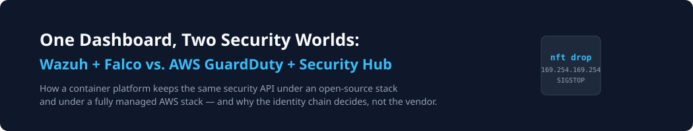

# One Dashboard, Two Security Worlds: Wazuh + Falco vs. AWS GuardDuty + Security Hub



*Title image: the question this article answers — how does a container platform keep one security API under two completely different provider worlds?*

Every team that operates containerized AI agents eventually hits the same wall. The homegrown security chain (egress deny, identity, scanners, freeze) produces real findings — but nobody can afford to hand-build retention, full-text search, correlation, and compliance dashboards on top of a Postgres table. So you reach for a SIEM. And then the question splits: **host Wazuh and own everything, or go all-in on AWS-native services and manage nothing?**

We are building both paths for JiMesh (an open-source AI gateway and container platform). This article walks through both architectures completely — with the honest trade-offs and the architectural trick that keeps them compatible without rewriting the dashboard for each.

## What a SIEM actually does (for an SMB team)

First, the 60-second version, because "SIEM" gets used loosely. A SIEM is not a scanner — it is a **correlate-and-retain engine** over every log source you point at it, with the alert as the output, not the feature.

![Pipeline diagram of how a SIEM works in seven stages — collect (logs, network flow, identity, runtime syscalls, posture) → normalize into one schema (OCSF/ASFF or your own) → detect via rules (signatures, regex, FIM, allowlist violations) and via ML/behavior baselines carrying confidence and model version → correlate and attribute through the identity chain so chained events become one incident → alert to a risk-score-ranked triage queue where an operator decides → respond (revoke, SIGSTOP, blackhole) and retain for the long term](siem_basics.svg)

*Figure 1: The seven stages every SIEM performs — collection, normalization, rule detection, behavioral detection, correlation with attribution, ranked triage, response + retention.*

The stages that SMB teams underestimate:

- **Normalization is the hard part, not detection.** Five log sources speak five dialects; the industry's answer is [OCSF](https://schema.ocsf.io/) (AWS ASFF is OCSF-compatible). Whatever you use — detection rules and ML models only compose when events share a schema.
- **Attribution is the correlation layer that actually matters for container platforms.** "A leak happened" is noise; "container jimesh-ws-42, session minted for project X, 3 seconds after an egress drop" is an incident. If your SIEM cannot resolve that chain, you collect — you do not detect.
- **Triage is a queue ranked by risk score, not a wall of alerts:**

```
Risk Score = Exposure × Privilege × Data Sensitivity × Exploitability × Confidence
```

  (Is it internet-reachable? What can it do? Does it touch PII/PCI/PHI? Is there a public PoC? How certain is the detector?) Weights are tenant-configurable — a FinTech deployment weights PCI sensitivity higher than a marketing blog does.

## What an SMB is actually defending against

Small and medium security teams run production on multiple clouds and Kubernetes with a handful of people. The recurring threat classes (mirrored in the [CloudiQS assessment methodology](https://cloudiqs.com/solution/security-assessment-solution/) and the [CloudMatos CNAPP framing](https://www.cloudmatos.com/blog/ai-driven-automation-in-smb-cloud-security)):

- **API attack surface:** exposed endpoints without rate limits or auth, **shadow APIs** that bypass the gateway, credential stuffing and token replay, exfiltration through overly broad responses.
- **Misconfiguration and drift:** public S3 buckets, permissive security groups, IAM sprawl (`s3:*` wildcards, unused keys), hostPath mounts and privileged pods.
- **The CNAPP alphabet** you will meet in every vendor deck — each is a *layer question*, not a product question:

| Acronym | Means | Covers it (OSS) | Covers it (AWS) |
|---|---|---|---|
| **CNAPP** | Cloud-Native Application Protection Platform — everything under one roof | the combination itself | GuardDuty + Security Hub + Config |
| **CSPM** | Cloud Security Posture Management — finds and ranks misconfigurations | IaC scan (Checkov) + exposure scan | Security Hub + AWS Config |
| **CIEM** | Cloud Infrastructure Entitlement Management — least-privilege over identities | JiMesh RBAC (OPA) + vault tokens | IAM Access Analyzer + GuardDuty |
| **CWPP** | Cloud Workload Protection — runtime protection of hosts/containers | Falco + socket-guard | GuardDuty runtime monitoring |
| **DSPM** | Data Security Posture Management — where sensitive data flows out | payload scanner + DSGVO redaction rules | Macie + Security Lake |
| **API security** | shadow-API discovery, schema enforcement, abuse detection | the gateway IS the API control point | WAF + API Gateway schemas |

## The three-layer model underneath everything

Before the stacks: the foundation that makes them exchangeable. JiMesh already runs a provisioning-based identity chain — every workspace container exists because JiMesh spawned it, and every event it produces carries `container_id → session_id → project_id`. Commercial SIEMs return verdicts and stop there; none of them can pause the container that made the call, because none of them provisioned it. Attribution is not a feature of your SIEM choice — it decides whether a finding is actionable at all.

## Architecture 1: the open-source stack

![Architecture diagram of the OSS stack — four sensor cards (Falco modern eBPF watching syscalls per container, Suricata XDP packet IDS writing eve.json, Wazuh Agent for FIM and Docker-engine monitoring, JiMesh built-in scanner/egress/RBAC) flowing into a dark Wazuh Manager card fed by the redacted JiMesh shipper on TCP 1514 and returning alerts.json through an fsnotify tail into the Ingest Mapper, which enriches rows with project_id and feeds the JiMesh Security Sidebar showing one threat feed with source badges](oss_stack.svg)

*Figure 1: The OSS stack — JiMesh ships redacted metadata to the Wazuh Manager, Wazuh ships alerts back, and the ingest mapper attributes both directions before anything reaches the dashboard.*

How it works end to end:

1. **The sensors.** Falco (modern eBPF) watches syscalls per container — shell-in-container, container escapes, crypto miners — and is container-attributed out of the box. Suricata in XDP mode drops known exploit patterns at the NIC before the kernel stack sees them. The Wazuh Agent adds file integrity monitoring, rootkit detection, vulnerability detection, and native Docker-engine monitoring (privileged containers, volume changes).
2. **The core.** The Wazuh Manager correlates everything, applies its ruleset, and writes `alerts.json` — a single-node docker-compose stack of three containers (manager, indexer, dashboard) at roughly 4 GB RAM. No Kubernetes required.
3. **The bridge.** Two small, deliberate paths: JiMesh ships its own findings (secret leaks, freeze/release actions, RBAC denials, consumer-key anomalies) as **redacted JSON metadata** to the manager — attribution fields travel inside the payload. In the other direction, a backend tailer reads `alerts.json` (fsnotify, the same discipline as our agent-log tailer), maps each alert through the identity chain, and writes rows into `security_events`.
4. **The UI.** The dashboard shows ONE threat feed with source badges (`scanner | wazuh | falco | suricata | firewall`). Deep-dive analysis stays in the Wazuh dashboard — a link, not an embedded widget.

**What you get for free:** compliance dashboards (PCI DSS, GDPR, HIPAA), a maintained ruleset, full-text search over months of findings.
**What it costs:** ~4 GB RAM, updates, and the acceptance that you are running an Elasticsearch-adjacent cluster.

## Architecture 2: the AWS-native stack


*Figure 2: The AWS-native stack (official AWS Architecture icons, inlined from `repo-assets/providers/aws_svg/`) — managed detection replaces every self-hosted component, and Security Hub becomes both the aggregator and the single findings interface.*

The component-by-component mapping, with what each service actually does:

| Service | What it does | In the JiMesh context |
|---|---|---|
| **[GuardDuty](https://docs.aws.amazon.com/guardduty/)** | ML-based threat detection over VPC flow logs, DNS, CloudTrail, and **runtime monitoring for containers** (ECS/EC2) | Replaces the Wazuh Manager's threat ruleset and part of the socket-guard; API: [GuardDuty API Reference](https://docs.aws.amazon.com/guardduty/latest/APIReference/Welcome.html) |
| **[Security Hub](https://docs.aws.amazon.com/securityhub/)** | Central aggregation of all findings, scored against CIS, PCI-DSS, GDPR; standardized finding format (ASFF) | The aggregator AND the interface: `GetFindings` feeds the dashboard, `BatchImportFindings` receives JiMesh's own findings; [API Reference](https://docs.aws.amazon.com/securityhub/1.0/APIReference/Welcome.html) |
| **[OpenSearch Service](https://docs.aws.amazon.com/opensearch-service/)** | Managed indexer with the Security Analytics plugin (Sigma rules) | The Wazuh Indexer+Dashboard, without running it |
| **[CloudTrail](https://docs.aws.amazon.com/cloudtrail/)** | Cryptographically signed audit log of every API call — who stopped which container, from where | The forensic backbone; `LookupEvents` for 90-day investigations |
| **[AWS Config](https://docs.aws.amazon.com/config/)** | Continuous resource-state and compliance rules | Catches a changed security group or an unprotected docker socket BEFORE it goes live |
| **[Inspector](https://docs.aws.amazon.com/inspector/)** | CVE scanning for EC2, ECR images, Lambda | The vulnerability-detection suite |
| **[Security Lake](https://docs.aws.amazon.com/security-lake/)** | OCSF-normalized long-term storage for security logs | Retention measured in years, queried with Athena |
| **[WAF + Shield](https://docs.aws.amazon.com/waf/)** | L7 rule enforcement and DDoS shielding at the gateway | The network edge JiMesh's egress allowlist cannot cover |
| **[Bedrock](https://docs.aws.amazon.com/bedrock/)** | LLM agents for finding triage | The "agentic SOC" pattern: raw findings → readable incident reports |

**What is NOT replaced:** the K-LAF identity chain, the in-payload secret scanner, the freeze mechanic, the workspace egress ruleset. These keep running exactly as before — they simply report their findings through Security Hub instead of a local table. And the hardening rules that transfer unchanged: the metadata deny (`169.254.169.254`, `fd00:ec2::254`) is already enforced in the workspace egress ruleset — on AWS, that endpoint *is* the instance's credential vault, so the deny is even more critical there.

## The WAF layer — and how a WAF learns

A WAF is the classic piece SMBs buy first — and the one most often left dumb. Two layers matter:

![WAF flow diagram — clients hit a dark WAF/Shield edge card (OWASP rulesets, rate limits, IP/geo allowlists, bot control, blocking injection sequences and throttling anomalous POST bursts), which forwards to the dark JiMesh /v1 gateway card (minted session identity, budgets, payload scanning, JWT/mTLS, per-consumer rate limits) and on to egress-allowlisted upstream models, with a feedback loop from both the WAF and the gateway into a learned-baseline card that updates WAF rules — block injection sequences, throttle anomalous POST bursts, detect shadow APIs by diffing gateway traffic against documented routes](waf_flow.svg)

*Figure 4: WAF in the path — the edge blocks the noisy attacks, the gateway (the only guaranteed plaintext) checks identity and content, and the learned baseline feeds rule updates back into the WAF.*

The nuance: a WAF sees TLS-terminated L7 traffic, but for AI platforms **the gateway is the only place with guaranteed plaintext** (the TLS-boundary insight from our eBPF article). The division of labor:

- **WAF edge:** OWASP API Top 10 rulesets, rate limits, IP/geo allowlists (this is where "only Tailscale-IP allowed" inbound rules live), bot control. OSS: ModSecurity/Coraza with OWASP CRS as containers. AWS: WAF + Shield managed rule groups.
- **Gateway:** identity (provisioned session tokens, never self-declared), budgets, payload-level DLP (the secret scanner), per-consumer rate limits — things a WAF cannot do because it never sees the decoded LLM payload.
- **The learned baseline** closes the loop: paths, verbs, and payload shapes observed at the gateway become WAF block rules for injection sequences and throttle rules for anomalous bursts. Shadow-API detection is a diff — gateway traffic vs. documented routes — and both stacks can run it.

## The trick: one dashboard, swappable sensors


*Figure 3: The architecture kniff — the dashboard never talks to a SIEM directly, only to JiMesh's own schema; providers differ only in ingest/sink adapters.*

This is the part that prevents the "completely new UI" trap:

```go
// Where do JiMesh findings go? (shipper)
type FindingSink interface {
    Name() string // "builtin" | "wazuh" | "securityhub"
    Ship(e store.SecurityEventRow) error
}

// Where do external findings come from? (ingest)
type FindingSource interface {
    Name() string
    Poll(ctx context.Context) ([]store.SecurityEventRow, error)
}
```

A single setting (`security_pipeline: builtin | wazuh | aws`) switches source/sink pairs. The dashboard API — `/api/security/events`, freeze/release, the forensics report, the ports panel — stays byte-identical. Switching provider costs one mapper and one setting, not a second dashboard. ASFF is OCSF-compatible and our rows map onto OCSF, so a third provider later is another mapper, not a migration.

**The honest limits:** deep-dive UIs (Wazuh dashboard vs. AWS console) are links, never embedded widgets. GuardDuty's ML is a black box — which is exactly why the `builtin` path keeps a deterministic, testable rules layer underneath. And the AWS sink costs per event, so sampling and severity gates are configuration, not features.

## The MLOps layer: anomaly detection as a lifecycle, not a script

Rules find known patterns. They do not find a compromised API key quietly exfiltrating 40 GB at 3 a.m., because nothing in that behavior trips a regex. This is where the machine-learning layer earns its keep — and where MLOps discipline decides whether it works in six months.

![Pipeline diagram of the MLOps layer — six steps from features extracted from request_log frames (bytes_sent_rolling, unique_dest_ips_10m) through Isolation-Forest training and an evaluation stage with a hard FPR-below-1% gate into a dark model-registry card (v1.0.0, pending manual approval), then a realtime endpoint emitting anomaly scores, into a model monitor comparing live against training distributions, with a red continuous-retrain loop closing back to step 1 and a note that findings carry confidence plus model_version and add to the rule layer](ml_pipeline.svg)

*Figure 4: Anomaly detection as a managed lifecycle — the FPR gate and the retrain loop are what separate MLOps from a Python script.*

- **AWS path:** GuardDuty's built-in ML (instant, black-box) plus [SageMaker](https://docs.aws.amazon.com/sagemaker/) for custom detectors: pipeline → evaluation gate → versioned registry → endpoint → [Model Monitor](https://docs.aws.amazon.com/sagemaker/latest/dg/model-monitor.html) → automatic retrain when the live distribution drifts. The feature set comes straight from `request_log` frames: `bytes_sent_rolling`, `unique_dest_ips_10m`.
- **Open-source path:** [OpenSearch ML Commons](https://opensearch.org/docs/latest/ml-commons-plugin/) runs anomaly detectors inside the SIEM cluster; [MLflow](https://mlflow.org/) handles the experiment-to-registry lifecycle. Same DAG, no lock-in.
- **Bedrock-style triage** maps findings into readable incident reports — the "agentic SOC" pattern that CloudiQS productized for the SMB market ([their security assessment methodology](https://cloudiqs.com/solution/security-assessment-solution/) is a useful reference for how AWS partners assemble exactly these services).

The no-mock rule applies with force: an ML finding carries `confidence` and `model_version`, and it *adds* to the rule layer — it never replaces it. A detector that cannot explain why it fired is an alert-spam generator.

## Which one, when


*Figure 5: The same dashboard under both provider worlds — the only row that must not differ is attribution.*

- **Single operator, constrained hardware:** the OSS stack. It is fast, costs ~0, and everything stays in your account.
- **Scaling, B2B, multi-account:** the AWS-native stack buys maintenance freedom at the price of volume-based logging and API lock-in. This is precisely what AWS-partner consultancies like CloudiQS sell as managed SOC — and their marketplace "agentic SOC" (GuardDuty + Bedrock + Security Hub) is a reasonable blueprint.
- **JiMesh ships both as a provider option**, with the same identity chain underneath — which is exactly why the findings are exchangeable, not the security.

## The MSP/MSSP view (and what "good" looks like after 90 days)

If you operate this stack for customers (the CloudiQS/managed-SOC business model), two requirements change:

- **Tenant model:** global policy catalogs with per-tenant overrides, logical data separation, fleet-wide posture rollups — with tenant-drift alerts when exceptions exceed a budget.
- **Auditor-ready evidence:** detections linked to controls, controls linked to assets, changes linked to PRs and tickets. "Continuous compliance" means the evidence pack exports itself.

What a working deployment looks like after a quarter — the same checklist CNAPP-grade products sell, grounded in our stack:

1. **Discovery:** 100% of assets inventoried, no shadow VPCs/containers, all APIs documented at the gateway.
2. **Posture:** high-risk misconfigurations cleared, IAM wildcards cut by >80%.
3. **Runtime:** median time-to-respond halved — the freeze ladder (revoke → error → SIGSTOP → blackhole) runs in minutes, not tickets.
4. **Compliance:** evidence packs exportable — controls mapped, current status, linked artifacts.
5. **Multi-tenant:** global policies applied fleet-wide, <5% of tenants needing exceptions.

## Our takeaways

1. **Attribution before correlation.** A SIEM that cannot resolve `container_id → session → project` produces alerts about machines, not attacks. The identity chain is what makes both stacks actionable.
2. **Payload discipline is non-negotiable in both worlds.** Only redacted metadata enters the index — whether it is Wazuh's indexer or OpenSearch. Prompts never reach a SIEM.
3. **HITL gates everywhere.** GuardDuty finding → JiMesh freeze is a ticket with an operator, not an auto-play. The response ladder (token revoke → controlled error → SIGSTOP → egress blackhole) stays operator-governed.
4. **Beware the two-firewall trap.** On AWS, Security Hub tells you nothing about the nftables on the box, and vice versa. The dashboard must show *actual* reachability — our own exposure scan lied once because ufw said "restricted" while the port was open.
5. **Scan the manifests too.** Checkov on Terraform/compose before the app even starts — misconfiguration gates belong at quarantine time, before the first packet.

*We're building both pipelines as part of JiMesh's open-source security stack. Happy to go deeper on any layer in the comments.*

---

## Sources (verified as of Sep 9, 2026)

- **Wazuh:** [Platform overview](https://wazuh.com/platform/overview/) · [Docker deployment](https://documentation.wazuh.com/current/docker/index.html) · single-node compose `wazuh/wazuh-docker` v4.14.7 (stable; 5.1.0 is alpha without published images)
- **Falco:** [The Falco Project](https://falco.org/docs/) — modern eBPF driver, container-attributed syscall events
- **Suricata:** [XDP/eBPF capture mode](https://docs.suricata.io/en/suricata-8.0.5/capture-hardware/ebpf-xdp.html)
- **AWS:** [GuardDuty](https://docs.aws.amazon.com/guardduty/) / [API](https://docs.aws.amazon.com/guardduty/latest/APIReference/Welcome.html) · [Security Hub](https://docs.aws.amazon.com/securityhub/1.0/APIReference/Welcome.html) · [OpenSearch Service](https://docs.aws.amazon.com/opensearch-service/) · [CloudTrail](https://docs.aws.amazon.com/awscloudtrail/latest/APIReference/Welcome.html) · [AWS Config](https://docs.aws.amazon.com/config/latest/APIReference/Welcome.html) · [Inspector](https://docs.aws.amazon.com/inspector/) · [Security Lake](https://docs.aws.amazon.com/security-lake/) · [WAF](https://docs.aws.amazon.com/waf/) · [Bedrock](https://docs.aws.amazon.com/bedrock/) · [SageMaker Model Monitor](https://docs.aws.amazon.com/sagemaker/latest/dg/model-monitor.html)
- **OpenSearch ML Commons:** https://opensearch.org/docs/latest/ml-commons-plugin/ · **MLflow:** https://mlflow.org/
- **CloudiQS (AWS Advanced Partner, ex-AWS engineers) security assessment methodology:** https://cloudiqs.com/solution/security-assessment-solution/ — referenced as a real-world assembly pattern of these services, not as evidence
- **Wazuh + Falco official integration guide:** https://wazuh.com/blog/cloud-native-security-with-wazuh-and-falco/
- Internal sources: `docs/research/R26_Siem.md`, `docs/sprints/SPRINT-32-SIEM-FOUNDATION.md`, `docs/sprints/SPRINT-33-KLAF-AWS-MULTI-PROVIDER.md`
